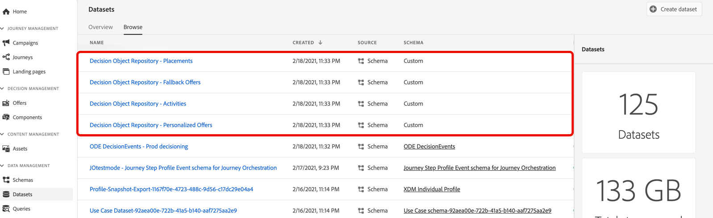

# 存取匯出的產品建議目錄 {#access-exported-catalog}

可在Adobe Experience Platform **[!UICONTROL 資料集]**&#x200B;功能表中存取匯出的優惠目錄。 系統會為您選件資料庫的每個物件建立一個資料集。

按一下資料集以存取其詳細資料。

**[!UICONTROL 預覽資料集]**&#x200B;按鈕可讓您顯示資料集中最近成功的批次。

如需如何瀏覽及使用資料集的詳細資訊，請參閱[此頁面](../../data/get-started-datasets.md)。
