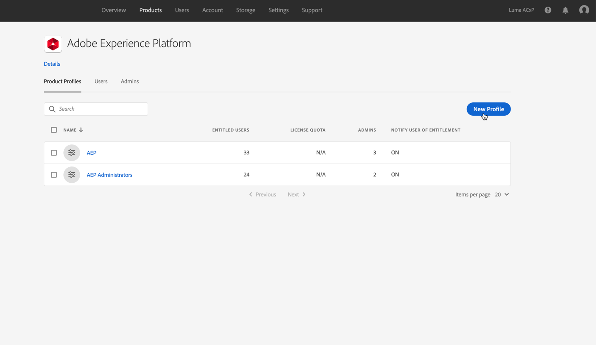

# 授予對決策管理的訪問權限 {#granting-acess-to-decision-management}

訪問和使用offer decisioning權能的權限使用 [Adobe Admin Console](https://helpx.adobe.com/tw/enterprise/managing/user-guide.html){target=&quot;_blank&quot;}。

要授予對「決策管理」功能的訪問權限，您需要建立 **[!UICONTROL Product profile]** 並將相應權限分配給用戶。 瞭解有關管理的更多資訊 [!DNL Journey Optimizer] 用戶和權限 [此部分](../../administration/permissions.md)。

「Decision Management」（決策管理）的特定權限列於 [此部分](../../administration/high-low-permissions.md#manage-decisioning)。

<!--If you are a [!DNL Journey Optimizer] user leveraging the **Decision Management** functionality, you need to have the [Decision management permissions](../../administration/high-low-permissions.md#decisions-permissions) enabled to acces all related capabilities. Learn more on managing [!DNL Journey Optimizer] users and permissions in [this section](../../administration/permissions.md).

If you are an [Adobe Experience Platform](https://experienceleague.adobe.com/docs/experience-platform/landing/home.html){target="_blank"} user leveraging the **Offer Decisioning** application service, follow the steps [below](#granting-acess-to-offer-decisioning) to grant access to [!DNL Offer Decisioning].

Grant access to Offer Decisioning

The steps below only apply to **Experience Platform users** leveraging the [!DNL Offer Decisioning] service.-->

1. 開啟 [Admin Console](https://helpx.adobe.com/enterprise/managing/user-guide.html)，然後選擇 **[!UICONTROL Adobe Experience Platform]**。

   <!---->

1. 服務顯示的產品配置檔案。 要建立新產品配置檔案，請按一下 **[!UICONTROL New Profile]** 按鈕

   

   >[!NOTE]
   >
   >您可以根據需要擁有盡可能多的產品配置檔案，這些配置檔案對應於要為組織設定的各種角色。

1. 指定產品配置檔案的名稱和說明，然後按一下 **[!UICONTROL Next]**。

   

   <!--To access the product profile’s permissions, select the **[!UICONTROL Permissions]** line.-->

1. 選擇要為產品配置檔案啟用的服務。 預設情況下，會選擇所有服務，這是為了確保所有Experience Platform功能都可用。

   

1. 在 **[!UICONTROL Decision Management]** 的 **+** 按鈕，然後按一下 **[!UICONTROL Save]**。

   

   可用權限包括：

   **[!UICONTROL Manage Decisioning Activities]**：

   * 讀、寫、刪除優惠
   * 讀、寫、刪除決定（以前稱為聘用活動）
   * 讀、寫、刪除放置

   **[!UICONTROL Execute Decisioning Activities]**：

   * 閱讀優惠
   * 閱讀決定
   * 讀取放置

   **[!UICONTROL Manage Decisioning Options]**：

   * 讀、寫、刪除優惠
   * 閱讀決定
   * 讀、寫、刪除放置

1. 此時將顯示產品配置檔案權限的摘要。 您現在可以將用戶分配給產品配置檔案，以便他們訪問這些權限。

   

>[!NOTE]
>
>有關如何管理用戶權限的詳細資訊，請參閱 [Admin Console文檔](https://helpx.adobe.com/enterprise/managing/user-guide.html){target=&quot;_blank&quot;}。

