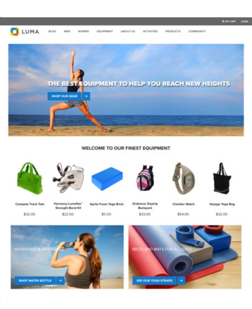

# 開始使用決策管理 {#about-decision-management}

>[!TIP]
>
>[!DNL Adobe Journey Optimizer] 的新決策功能「決策」現在可透過程式碼型體驗和電子郵件管道使用！[了解更多](../../experience-decisioning/gs-experience-decisioning.md)

使用 [!DNL Journey Optimizer] 可在適當的時間為所有接觸點的客戶提供最佳產品建議和體驗。設計完成後，透過個人化產品建議目標定位客群。

決策管理透過集中行銷產品建議庫和決定引擎輕鬆實現個人化，該決策引擎將規則和限制套用於 Adobe Experience Platform 建立的豐富即時輪廓，以幫助您在適當的時間向客戶傳送合適的產品建議。

「決定管理」功能由兩個主要元件組成：

* **集中式產品建議庫**&#x200B;是您建立和管理不同元素的介面，這些元素會組成產品建議，並定義其規則和限制。
* **產品建議決策引擎**&#x200B;運用 Adobe Experience Platform 資料、即時客戶輪廓以及產品建議庫，以選擇即將提供產品建議的適當時間、客戶和管道。

效益包括：

* 透過跨多管道提供個人化產品建議，改善行銷活動績效；
* 改善工作流程：行銷團隊可以建立單一傳遞，並在範本的不同部分提供不同產品建議，藉此改善工作流程，而無須建立多個傳遞或行銷活動；
* 控制在電子郵件行銷活動中和向客戶顯示產品建議的次數。

➡️ [在這些影片中了解有關決策管理的更多資訊](#video)

>[!NOTE]
>
>如果您是 [Adobe Experience Platform](https://experienceleague.adobe.com/docs/experience-platform/landing/home.html?lang=zh-Hant){target="_blank"} 使用者且正在利用 **Offer Decisioning** 應用程式，本節中介紹的所有決策管理功能也適用於您。

## 關於產品建議和決定 {#about-offers-and-decisions}

**產品建議**&#x200B;由內容、適用規則和限制組成，這些限制定義了向客戶展示產品建議的條件。

它是使用&#x200B;**產品建議庫**&#x200B;所建立，提供集中式的產品建議目錄，讓您可利用適用規則和限制與多項內容連結，以建立和發佈產品建議 (請參閱[產品建議庫使用者介面](../get-started/user-interface.md))。

一旦產品建議庫已有足夠豐富的產品建議，您可以將產品建議整合至 **決定**&#x200B;中。

決定是產品建議的容器，可運用產品建議決策引擎，根據傳送的目標定位來挑選最佳產品建議。

## 常見使用實例 {#common-use-cases}

配合 Adobe Experience Platform 的決定管理功能與整合可讓您涵蓋許多使用實例，協助您提高客戶參與度和轉化率。

* 在您網站首頁顯示的產品建議，將會根據 Adobe Experience Platform 的資料以符合造訪客戶的興趣。

  

* 如果客戶靠近某家商店，請傳送推播通知，可依其屬性 (忠誠度、性別、之前的購物內容……) 提醒他們可使用的產品建議。

  

* 決定管理也可協助您在聯絡支援團隊時增強客戶體驗。 API 可讓您在呼叫中心代理的入口網站中顯示客戶的兌換資訊，以及下一個最佳產品建議。

  

## 授予決策管理的存取權限 {#granting-acess-to-decision-management}

使用 [Adobe Admin Console](https://helpx.adobe.com/tw/enterprise/managing/user-guide.html){target="_blank"} 管理存取及使用決策功能的權限。

要授予對決策管理功能的存取權限，您需要建立&#x200B;**[!UICONTROL 產品輪廓]**，並將對應權限指派給使用者。在[本節](../../administration/permissions.md)了解有關管理[!DNL Journey Optimizer]使用者及權限的更多資訊。

[本節](../../administration/high-low-permissions.md#decisions-permissions)列出了決策管理的特定權限。

## 字彙 {#glossary}

您可以在下方找到使用決定管理時，將使用的主要概念清單。

* **上限**&#x200B;或&#x200B;**頻率上限**：上限是用來作為限制，定義產品建議的顯示次數。 共有兩種上限，分別是可在合併的目標客群間建議的產品建議次數 (也稱為「限定總數」)，以及可向同一位一般使用者建議的產品建議次數 (也稱為「輪廓上限」) 的次數。

* **集合**：集合是行銷人員根據產品建議類別等預先定義的條件，定義的產品建議子集。

* **決定**：決定包含通知選擇活動內容的邏輯。

* **決定規則**：決定規則是新增至個人化產品建議的限制，並可套用至輪廓以判斷適用性。

* **合格的產品建議**：合格的產品建議方案符合上游定義的限制，並可持續地提供給輪廓。

* **決定管理**：可讓您使用商業邏輯和決定規則，跨頻道和應用程式建立並提供使用者個人化的產品建議體驗。

* **後備產品建議**：當一般使用者不具集合中任何個人化產品建議的資格時，後備產品建議會是顯示的預設產品建議。

* **產品建議**：產品建議是行銷訊息，其內容可能包含與其相關聯的規則，指定誰有資格檢視產品建議。

* **產品建議庫**：產品建議庫是一個中央資料庫，用來管理個人化和後備產品建議、決定規則和活動。

* **個人化產品建議**：個人化產品建議是根據適用性規則和限制的可自訂行銷訊息。

* **位置**：位置是為一般使用者所顯示產品建議的所在位置和/或內容。

* **優先順序**：優先順序用於將符合所有限制的產品建議排名，例如適用性、行事曆和上限。

* **表示方式**：表示方式是管道所使用的資訊，例如要顯示產品建議的位置或語言。

## 作法影片{#video}

### 什麼是決定管理？ {#what-is-offer-decisioning}

下面的影片介紹了決定管理的重要功能、結構和使用案例：

>[!VIDEO](https://video.tv.adobe.com/v/326961?quality=12&learn=on)

### 定義和管理產品建議 {#use-offer-decisioning}

以下影片說明如何使用決定管理來定義和管理您的產品建議，並運用即時客戶資料。

>[!VIDEO](https://video.tv.adobe.com/v/326841?quality=12&learn=on)

