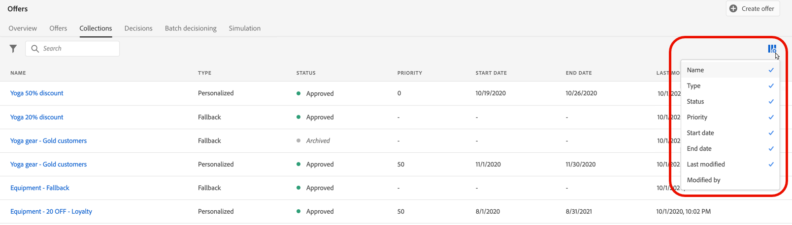

# 優惠資料庫使用者介面 {#user-interface}

左側邊欄中的&#x200B;**[!UICONTROL 決定管理]**&#x200B;區段提供兩個功能表，可讓您存取決定管理功能：

使用&#x200B;**[!UICONTROL 優惠方案]**&#x200B;功能表管理和傳遞您的優惠方案：

* **[!UICONTROL 總覽]**：[!DNL decision management]的新手嗎？ 依照熒幕上的步驟開始設定位置、優惠和集合。 熟悉[!DNL decision management]後，即可取得您最近優惠、集合和決定的概觀。 [了解更多](#overview)
* **[!UICONTROL 優惠]**：建立並存取您的個人化和遞補優惠。 瞭解如何建立[優惠](../offer-library/creating-personalized-offers.md)和[遞補優惠](../offer-library/creating-fallback-offers.md)
* **[!UICONTROL 集合]**：將優惠方案組織成靜態和動態集合。 [了解更多](../offer-library/creating-collections.md)
* **[!UICONTROL 決定]**：建立並管理決定，以傳遞您的優惠。 [了解更多](../offer-activities/create-offer-activities.md)
* **[!UICONTROL 批次決策]**：將優惠決策傳遞至指定Adobe Experience Platform對象中的所有設定檔。 [了解更多](../batch-delivery.md)
* **[!UICONTROL 模擬]**：模擬哪些優惠將傳遞到指定位置的測試設定檔，以驗證您的決定邏輯。 [了解更多](../offer-activities/simulation.md)

使用&#x200B;**[!UICONTROL 元件]**&#x200B;功能表來建立和管理建立優惠和決定所需的元件：

* **[!UICONTROL 版位]**：建立並管理您的優惠將顯示的版位。 [了解更多](../offer-library/creating-placements.md)
* **[!UICONTROL 集合限定詞]**：建立並管理集合限定詞（先前稱為「標籤」），以組織及篩選您的優惠。 [了解更多](../offer-library/creating-tags.md)
* **[!UICONTROL 規則]**：管理提供您優惠的條件。 [了解更多](../offer-library/creating-decision-rules.md)
* **[!UICONTROL 排名]**：建立並管理排名公式，以決定應先針對指定位置顯示哪個優惠。 [了解更多](../ranking/create-ranking-formulas.md)

>[!NOTE]
>
>如果您在存取決策管理或其部分功能時遇到問題，請向管理員使用者確認您已獲得所需許可權。 請參閱[授與決策管理的存取權](starting-offer-decisioning.md#granting-access-to-decision-management)。

## 概觀 {#overview}

第一次使用[!DNL decision management]時，**[!UICONTROL 總覽]**&#x200B;索引標籤會引導您完成開始建立第一個優惠決定所需的主要步驟。 依照熒幕上的步驟開始建立位置、優惠和集合。 完成這些第一個步驟後，系統會提示您建立優惠決定。

>[!NOTE]
>
>建立優惠並在決定中使用優惠的主要步驟會顯示在[本節](../offer-library/key-steps.md)中。

當您更熟悉[!DNL decision management]，並且已建立至少一個優惠決定時，**[!UICONTROL 總覽]**&#x200B;標籤會顯示您最近的優惠、集合和決定。

按一下優惠或決定，直接存取所選專案的詳細資料。

按一下&#x200B;**[!UICONTROL 檢視全部]**&#x200B;按鈕以存取優惠、集合或決定清單。

## 搜尋和篩選資訊 {#search-and-filter-information}

使用&#x200B;**搜尋列**&#x200B;來尋找特定項目。

按一下清單左上方的篩選圖示，即可存取 **篩選器**。可讓您根據不同的標準篩選顯示的元素。例如，您可以篩選為電子郵件通訊頻道和影像類型內容所建立的位置。

## 自訂顯示的資訊 {#customize-displayed-information}

可使用清單右上角的設定按鈕個人化「決定管理」功能表中的清單。

可讓您根據需求選擇要顯示的資訊。

請注意，會針對每位使用者儲存欄位自訂。

## 資訊窗格 {#information-pane}

在不同的清單中選取元素以顯示資訊窗格，讓您擷取資訊並對元素執行基本動作。

產品建議與決定清單還可讓您對多個元素執行批量動作。若要這麼做，請選取所要的產品建議或決定，然後從資訊窗格中選取您要執行的動作。

請注意，您也可以複製現有優惠或決定，以建立具有&#x200B;**[!UICONTROL 草稿]**&#x200B;狀態的復本。 您可以從資訊窗格或產品建議或決定的詳細檢視來執行此動作。

## 產品建議和決定變更記錄 {#changes-logs}

[!DNL Journey Optimizer]可讓您以視覺效果呈現對優惠或決定所做的所有變更。 若要這麼做，請從左側功能表存取&#x200B;**[!UICONTROL 稽核]**&#x200B;功能表。 [瞭解如何稽核資源上的動作](../../privacy/audit-logs.md)
