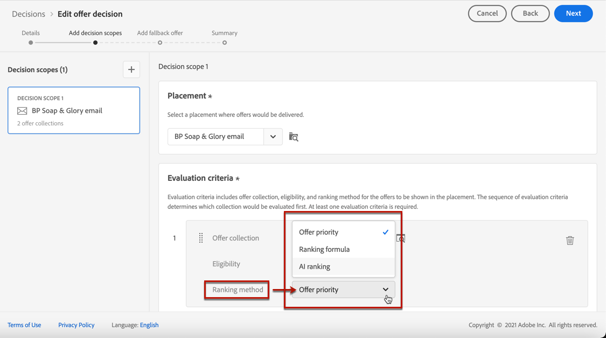

# 設定決定中的優惠選擇 {#offers-selection-in-decisions}

如果幾個優惠適合給定的放置，則您可以選擇在配置決策時為每個配置檔案選擇最佳優惠的方法。 您可以按以下方式對優惠進行排序：
* 提供優先順序
* 排名公式
* [AI排名](#use-ranking-strategy) （僅限於選定用戶的早期訪問）

## 提供優先順序 {#offer-priority}

預設情況下，當多個要約有資格在決策中進行給定的配售時，其報價最高 **優先順序** 會先送給客戶。

在建立聘用時，將分配聘用的優先順序分數。 瞭解如何在中建立個性化服務 [此部分](../offer-library/creating-personalized-offers.md)。

## 排名公式 {#assign-ranking-formula}

除了提供優先順序外，Journey Optimizer還允許您建立 **排序公式**。 這些公式確定在給定位置應首先提供哪個優惠，而不是考慮優惠的優先順序得分。

例如，您可以提高結束日期在24小時以內的所有優惠的優先順序，或者，如果配置檔案的興趣點是「正在運行」，則提高「正在運行」類別中的優惠。

瞭解如何在中建立排名公式 [此部分](../offer-library/create-ranking-formulas.md)。

一旦建立了排名公式，您就可以將其分配給決策中的位置。 為此，請執行以下步驟：

1. 建立決策或編輯現有決策。 請參閱[建立決定](../offer-activities/create-offer-activities.md)。

1. 添加將包含您的優惠的位置。 請參閱 [建立放置](../offer-library/creating-placements.md)。

1. 對於每個位置，添加一個集合。 請參閱 [建立集合](../offer-library/creating-collections.md)。

1. 選擇 **[!UICONTROL Ranking formula]** 作為排名方法，然後按一下 **[!UICONTROL Add ranking]**。

   

1. 選擇所需的排名公式，然後按一下 **[!UICONTROL Select]**。

   

現在，排名公式與位置關聯。

如果多份報價符合在此配售中提供的條件，則此決定將使用排名公式的公式計算哪些報價要先交付。

## AI 排名 {#use-ranking-strategy}

<!--If you are an [Adobe Experience Platform](https://experienceleague.adobe.com/docs/experience-platform/landing/home.html){target="_blank"} user leveraging the **Offer Decisioning** application service,-->

您還可以使用經過培訓的模型系統自動對提供的服務進行評級，通過選擇評級策略來顯示給定配置檔案。 瞭解如何在 [此部分](../offer-library/create-ranking-strategies.md)。

>[!CAUTION]
>
>AI排名的使用目前僅在選擇用戶的早期訪問中可用。

一旦建立了排名策略，您就可以將其分配給決策中的位置。 要執行此操作，請執行以下步驟：

1. 建立決策或編輯現有決策。 請參閱[建立決定](../offer-activities/create-offer-activities.md)。

1. 添加將包含您的優惠的位置。 請參閱 [建立放置](../offer-library/creating-placements.md)。

1. 對於每個位置，添加一個集合。 請參閱 [建立集合](../offer-library/creating-collections.md)。

1. 選擇按 **[!UICONTROL AI ranking]** 從下拉清單中，按一下 **[!UICONTROL Add ranking]**。

   

1. 選擇您建立的排名策略。 將顯示排名策略的所有詳細資訊。

   

1. 按一下「**[!UICONTROL Select]**」。該排名策略現在與該位置相關聯。

如果多個報價符合條件，則經過培訓的模型系統將確定在給定位置應首先提供哪個報價。

