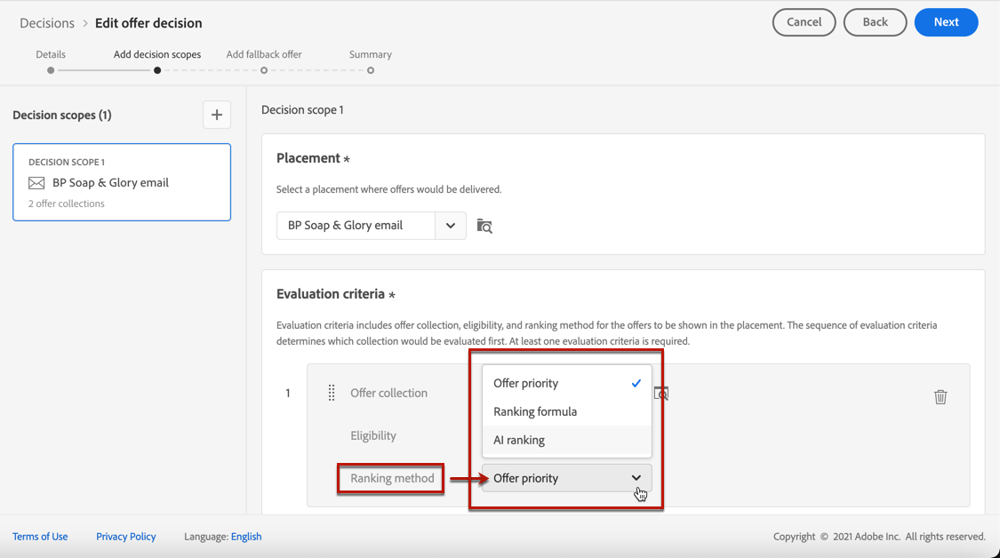
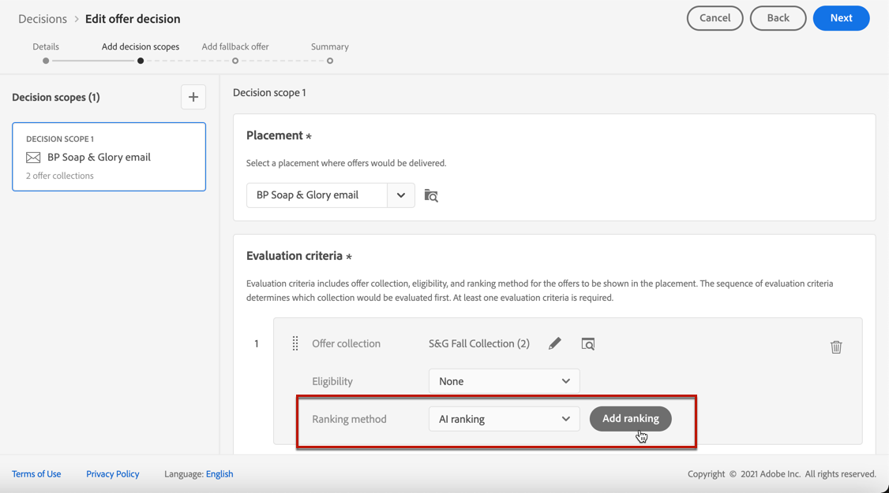

# 設定決定中的產品建議選擇 {#offers-selection-in-decisions}

>[!TIP]
>
>[!DNL Adobe Journey Optimizer] 的新決策功能「決策」現在可透過程式碼型體驗和電子郵件管道使用！ [了解更多](../../experience-decisioning/gs-experience-decisioning.md)

如果多個優惠方案符合指定位置的資格，您可以選擇在設定決定時，為每個設定檔選取最佳優惠方案的方法。 您可以依下列方式排名優惠方案：

* 優惠優先順序
* 排名公式
* [AI 排名](#use-ranking-strategy)

## 優惠優先順序 {#offer-priority}

依預設，當數個優惠方案符合決策中指定位置的資格時，具有最高&#x200B;**優先順序**&#x200B;的優惠方案將先傳送給客戶。

建立優惠方案時會指派優惠方案的優先順序分數。 在[本節](../offer-library/creating-personalized-offers.md)中瞭解如何建立個人化優惠。

## 排名公式 {#assign-ranking-formula}

除了優惠優先順序之外，Journey Optimizer還可讓您建立&#x200B;**排名公式**。 這些公式可決定應先針對指定位置顯示哪個優惠，而不是考慮優惠的優先順序分數。

例如，您可以提升結束日期距離現在不足24小時的所有優惠方案的優先順序，或如果設定檔的興趣點為「執行中」，則提升「執行中」類別的優惠方案。

瞭解如何在[本節](../ranking/create-ranking-formulas.md)中建立排名公式。

建立公式後，您就可以將其指派給決定中的位置。 請依照下列步驟執行此操作：

1. 建立決定或編輯現有決定。 請參閱[建立決定](../offer-activities/create-offer-activities.md)。

1. 新增將包含優惠方案的版位。 請參閱[建立版位](../offer-library/creating-placements.md)。

1. 對於每個位置，新增一個集合。 請參閱[建立集合](../offer-library/creating-collections.md)。

1. 選取&#x200B;**[!UICONTROL 公式]**&#x200B;作為排名方法，然後按一下&#x200B;**[!UICONTROL 新增排名]**。

   

1. 選取想要的公式，然後按一下&#x200B;**[!UICONTROL 選取]**。

   

排名公式現在與位置相關聯。

如果在此位置中符合顯示多個優惠方案的資格，決策將使用選取的公式來計算要先傳送哪個優惠方案。

## AI 排名 {#use-ranking-strategy}

<!--If you are an [Adobe Experience Platform](https://experienceleague.adobe.com/docs/experience-platform/landing/home.html){target="_blank"} user leveraging the **Offer Decisioning** application service,-->

您也可以使用經過訓練的模型系統，藉由選取AI模型，自動排名要針對指定設定檔顯示的優惠方案。 在[本節](../ranking/create-ranking-strategies.md)中瞭解如何建立AI模型。

建立AI模型後，您可以將其指派給決定中的位置。 請依照下列步驟以執行此操作：

1. 建立決定或編輯現有決定。 請參閱[建立決定](../offer-activities/create-offer-activities.md)。

1. 新增將包含優惠方案的版位。 請參閱[建立版位](../offer-library/creating-placements.md)。

1. 對於每個位置，新增一個集合。 請參閱[建立集合](../offer-library/creating-collections.md)。

1. 選擇從下拉式清單中依&#x200B;**[!UICONTROL AI排名]**&#x200B;來排名優惠方案，然後按一下&#x200B;**[!UICONTROL 新增排名]**。

   

1. 選取您建立的AI模型。 會顯示模型的所有細節。

   

1. 按一下&#x200B;**[!UICONTROL 選取]**。 AI模型現在與位置相關聯。

如果多個優惠方案都符合條件，則經過訓練的模型系統將決定應先針對指定位置顯示哪個優惠方案。

