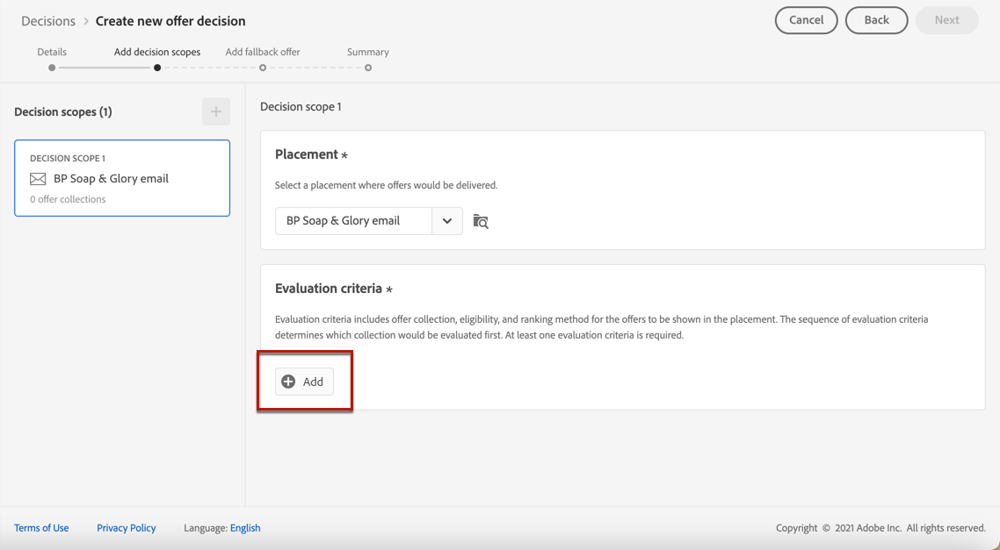
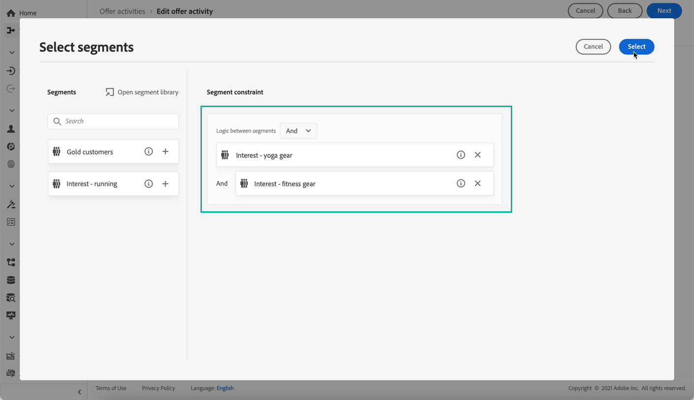
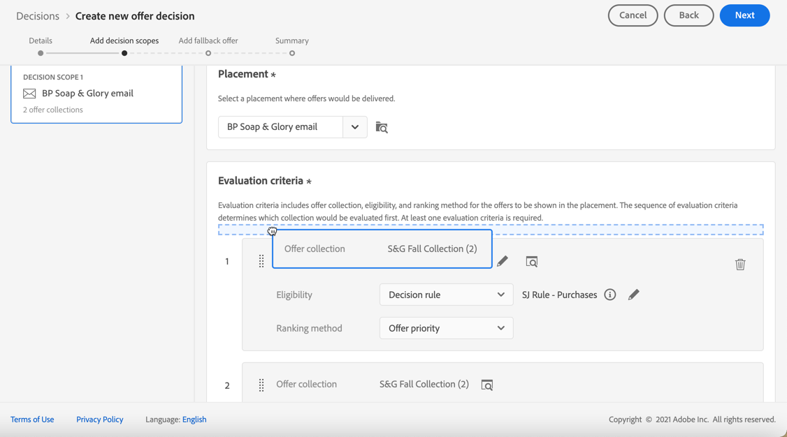
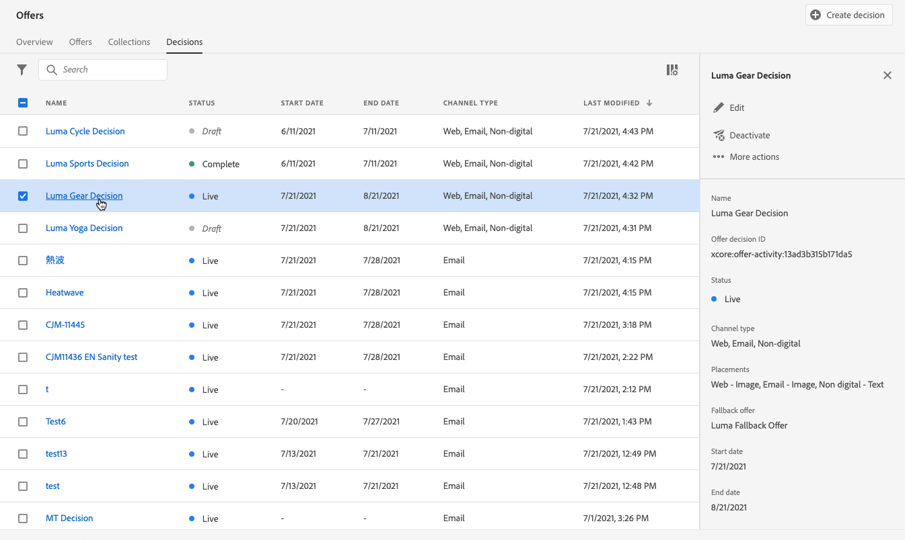

# 建立決定 {#create-offer-activities}

決策（以前稱為聘用活動）是您的聘用的容器，它將利用聘用決策引擎來根據交貨目標選擇要交付的最佳聘用。

➡️ [在影片中探索此功能](#video)

可在 **[!UICONTROL Offers]** 菜單> **[!UICONTROL Decisions]** 頁籤。 篩選器可幫助您根據決策的狀態或開始和結束日期檢索決策。

在建立決策之前，請確保以下元件已在「提供庫」中建立：

* [版位](../offer-library/creating-placements.md)
* [集合](../offer-library/creating-collections.md)
* [個人化優惠](../offer-library/creating-personalized-offers.md)
* [遞補優惠](../offer-library/creating-fallback-offers.md)

## 建立決策 {#create-activity}

1. 訪問決策清單，然後按一下 **[!UICONTROL Create decision]**。

1. 指定決策的名稱。

1. 根據需要定義開始和結束日期和時間，然後按一下 **[!UICONTROL Next]**。

   

## 定義決策範圍 {#add-decision-scopes}

1. 從下拉清單中選擇一個放置。 它將添加到您的決定中的第一個決定範圍。

   

1. 按一下 **[!UICONTROL Add]** 選擇此放置的評估標準。

   

   每個標準包括與資格約束關聯的聘用集合和確定要在放置中顯示的聘用的排名方法。

   >[!NOTE]
   >
   >至少需要一個評估標準。

1. 選擇包含要考慮的聘用的聘用集合，然後按一下 **[!UICONTROL Add]**。

   

   >[!NOTE]
   >
   >您可以按一下 **[!UICONTROL Open offer collections]** 連結以在新頁籤中顯示集合清單，您可以通過該連結瀏覽集合及其包含的優惠。

   所選集合將添加到條件。

   

1. 使用 **[!UICONTROL Eligibility]** 欄位，以限制此位置的聘用選擇。

   此約束可通過使用 **決策規則**&#x200B;或 **Adobe Experience Platform段**。 詳情見 [此部分](#segments-vs-decision-rules)。

   * 要將聘用的選擇限制為Experience Platform段的成員，請選擇 **[!UICONTROL Segments]**，然後按一下 **[!UICONTROL Add segments]**。

      

      從左窗格中添加一個或多個段，然後使用 **[!UICONTROL And]** / **[!UICONTROL Or]** 邏輯運算子。

      

      瞭解如何使用 [此部分](../../segment/about-segments.md)。

   * 如果要添加具有決策規則的選擇約束，請使用 **[!UICONTROL Decision rule]** 的子菜單。

      

      瞭解如何在中建立決策規則 [此部分](../offer-library/creating-decision-rules.md)。

1. 定義要用於為每個配置檔案選擇最佳優惠的排名方法。

   

   * 預設情況下，如果多個優惠符合此配售條件，則優先順序最高的優惠將交付給客戶。

   * 如果要使用特定公式來選擇要交付的合格優惠，請選擇 **[!UICONTROL Ranking formula]**。 瞭解如何在中對優惠排序 [此部分](../offer-activities/configure-offer-selection.md)。

1. 按一下 **[!UICONTROL Add]** 定義相同放置的更多條件。

   

1. 添加多個條件時，將按特定順序對它們進行評估。 添加到序列中的第一個集合將首先被評估，依此類推。

   要更改預設序列，可以拖放收藏以根據需要重新排序。

   

1. 您還可以同時評估多個標準。 要執行此操作，請將收藏拖放到另一個收藏上。

   

   現在，它們的等級相同，因此將同時進行評估。

   

1. 要在此決定中為您的優惠添加其他位置，請使用 **[!UICONTROL New scope]** 按鈕 對每個決策範圍重複上述步驟。

   

### 使用段與決策規則 {#segments-vs-decision-rules}

<!--to move to create-offers?-->

要應用約束，可以將聘用的選擇限制為一個或多個成員 **Adobe Experience Platform段**，或者 **決策規則**，兩個解決方案對應於不同的用途。

基本上，段的輸出是簡檔清單，而決策規則是在決策過程中根據需要針對單個簡檔執行的函式。 下面詳細說明了這兩種用途的區別。

* **區段**

   一方面，段是一組基於配置檔案屬性和經驗事件的Adobe Experience Platform配置檔案，它們與特定邏輯匹配。 然而，要約管理不會重新計算該段，該段在提出要約時可能不是最新的。

   瞭解有關 [此部分](../../segment/about-segments.md)。

* **決定規則**

   另一方面，決策規則基於Adobe Experience Platform的可用資料，並確定可向誰顯示報價。 一旦在某個要約或某個給定位置的決定中選擇了該規則，則每次作出決定時都會執行該規則，這可確保每個配置檔案都獲得最新和最佳的要約。

   瞭解有關中的決策規則的詳細資訊 [此部分](../offer-library/creating-decision-rules.md)。

## 添加回退優惠 {#add-fallback}

定義決策範圍後，定義將作為最後手段提供給不符合聘用資格規則和約束的客戶的回退聘用。

為此，請從決策中定義的位置的可用回退優惠清單中選擇它，然後按一下 **[!UICONTROL Next]**。

>[!NOTE]
>
>您可以按一下 **[!UICONTROL Open offer library]** 連結，以在新頁籤中顯示聘用清單。

## 查看並保存決定 {#review}

如果所有內容都配置正確，則顯示決策屬性的摘要。

1. 確保已準備好將此決定用於向客戶提供優惠。 將顯示所有決策範圍及其包含的回退優惠。

   

   可展開或折疊每個放置。 您還可以預覽每個職位安排的可用聘用、資格和排名詳細資訊。

   

1. 按一下「**[!UICONTROL Finish]**」。
1. 選擇「**[!UICONTROL Save and activate]**」。

   

   您還可以將該決定另存為草稿，以便稍後編輯和激活它。

此決定顯示在清單中 **[!UICONTROL Live]** 或 **[!UICONTROL Draft]** 狀態，具體取決於您在上一步中是否激活了它。

現在，它已準備好用於向客戶提供優惠。

## 決定清單 {#decision-list}

從決策清單中，可以選擇顯示其屬性的決策。 您也可以從此編輯它，更改其狀態(**草稿**。 **實況**。 **完成**。 **存檔**)、複製決定或將其刪除。

選擇 **[!UICONTROL Edit]** 按鈕，返回到決策版本模式，在該模式中可以修改決策 [詳細資訊](#create-activity)。 [決策範圍](#add-decision-scopes) 和 [回退提議](#add-fallback)。

選擇即時決策，然後按一下 **[!UICONTROL Deactivate]** 將決策狀態設定回 **[!UICONTROL Draft]**。

將狀態再次設定為 **[!UICONTROL Live]**，選擇 **[!UICONTROL Activate]** 按鈕。

的 **[!UICONTROL More actions]** 按鈕啟用下面描述的操作。

* **[!UICONTROL Complete]**:將決策狀態設定為 **[!UICONTROL Complete]**，表示不能再調用該決定。 此操作僅可用於激活的決策。 該決定仍可從清單中獲得，但您無法將其狀態設定回 **[!UICONTROL Draft]** 或 **[!UICONTROL Approved]**。 您只能複製、刪除或存檔它。

* **[!UICONTROL Duplicate]**:建立具有相同屬性、決策範圍和備用優惠的決策。 預設情況下，新決定 **[!UICONTROL Draft]** 狀態。

* **[!UICONTROL Delete]**:從清單中刪除該決定。

   >[!CAUTION]
   >
   >該決定及其內容將不再可訪問。 此操作無法撤消。
   >
   >如果該決定用在另一個對象中，則無法刪除。

* **[!UICONTROL Archive]**:將決策狀態設定為 **[!UICONTROL Archived]**。 該決定仍可從清單中獲得，但您無法將其狀態設定回 **[!UICONTROL Draft]** 或 **[!UICONTROL Approved]**。 您只能複製或刪除它。

您還可以通過選中相應的複選框同時刪除或更改多個決策的狀態。

如果要更改狀態不同的多個決策的狀態，則只更改相關狀態。

建立決策後，可以從清單中按一下其名稱。

這使您能夠訪問該決定的詳細資訊。 選擇 **[!UICONTROL Change log]** 頁籤 [監視所有更改](../get-started/user-interface.md#changes-log) 已經做出決定。

## 教程視頻 {#video}

>[!NOTE]
>
>此視頻適用於在Adobe Experience Platform上構建的Offer decisioning應用程式服務。 然而，它為在Journey Optimizer背景下使用要約提供了一般性指導。

>[!VIDEO](https://video.tv.adobe.com/v/329606?quality=12)
