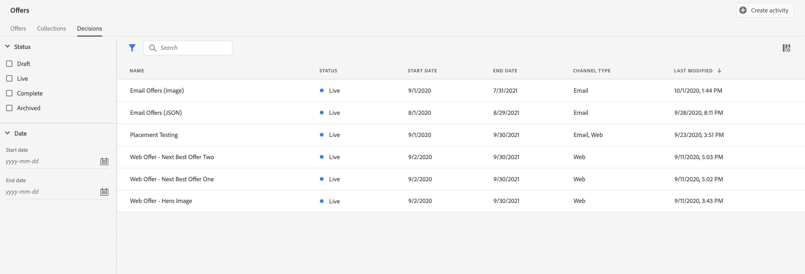
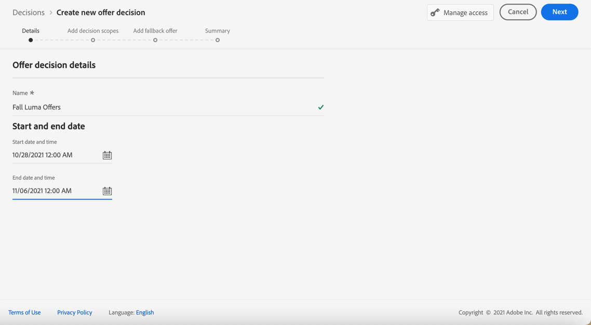
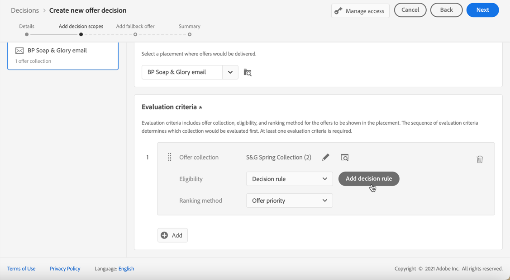

# 建立決定 {#create-offer-activities}

決定是優惠的容器，可運用優惠決定引擎，根據傳遞的目標來挑選最佳優惠。

➡️ [在本影片中瞭解如何建立優惠方案活動](#video)

決策清單可在 **[!UICONTROL 選件]** 功能表> **[!UICONTROL 決定]** 標籤。 篩選器可協助您根據決策的狀態或開始和結束日期來擷取決策。

建立決定之前，請確定已在優惠資料庫中建立下列元件：

* [版位](../offer-library/creating-placements.md)
* [集合](../offer-library/creating-collections.md)
* [個人化優惠](../offer-library/creating-personalized-offers.md)
* [遞補優惠](../offer-library/creating-fallback-offers.md)

## 建立決定 {#create-activity}

1. 存取決定清單，然後按一下 **[!UICONTROL 建立決定]**.

1. 指定決定的名稱。

1. 視需要定義開始和結束日期及時間，然後按一下 **[!UICONTROL 下一個]**.

   

1. 若要將自訂或核心資料使用標籤指派給決策，請選取 **[!UICONTROL 管理存取權]**. [進一步瞭解物件層級存取控制(OLAC)](../../administration/object-based-access.md)

## 定義決定範圍 {#add-decision-scopes}

1. 從下拉式清單中選取位置。 它會新增至您決定中的第一個決定範圍。

   

1. 按一下 **[!UICONTROL 新增]** 以選取此位置的評估准則。

   

   每個條件都包含與適用性限制相關聯的優惠方案集合，以及用於決定要顯示在位置中的優惠方案的排名方法。

   >[!NOTE]
   >
   >至少需要一個評估標準。

1. 選取包含要考量之優惠方案的優惠方案集合，然後按一下 **[!UICONTROL 新增]**.

   

   >[!NOTE]
   >
   >您可以按一下 **[!UICONTROL 開啟優惠收藏]** 在新標籤中顯示集合清單的連結，可讓您瀏覽集合及其包含的優惠。

   選取的集合會新增至條件。

   

1. 使用 **[!UICONTROL 資格]** 欄位以限制此位置的優惠方案選擇。

   此限制可使用套用 **決定規則**，或一或數個 **Adobe Experience Platform區段**. 兩者皆詳見 [本節](../offer-library/add-constraints.md#segments-vs-decision-rules).

   * 若要將優惠方案的選擇限製為Experience Platform區段的成員，請選取 **[!UICONTROL 區段]**，然後按一下 **[!UICONTROL 新增區段]**.

     

     從左窗格新增一或多個區段，並使用 **[!UICONTROL 和]** / **[!UICONTROL 或]** 邏輯運運算元。

     

     瞭解如何在中使用區段 [本節](../../segment/about-segments.md).

   * 如果您想使用決定規則新增選擇限制，請使用 **[!UICONTROL 決定規則]** 選項並選取您選擇的規則。

     

     瞭解如何在中建立決定規則 [本節](../offer-library/creating-decision-rules.md).

1. 當您選擇區段或決定規則時，您可以看到有關預估合格設定檔的資訊。按一下 **[!UICONTROL 重新整理]** 以更新資料。

   >[!NOTE]
   >
   >當規則引數包含不在設定檔中的資料（例如內容資料）時，設定檔預估不可用。 例如，適用性規則要求目前天氣為≥80度。

   

1. 定義您要用來為每個設定檔選取最佳優惠方案的排名方法。 [了解更多](../offer-activities/configure-offer-selection.md)。

   

   * 依預設，如果有多個優惠方案符合此位置的資格， **[!UICONTROL 優惠優先順序]** 方法使用優惠中定義的值：會將具有最高優先順序分數的優惠傳送給使用者。

   * 如果您想使用特定的計算分數來選擇要遞送的合格優惠方案，請選取 **[!UICONTROL 公式]** 或 **[!UICONTROL AI模型]**. [了解更多](../offer-activities/configure-offer-selection.md)。

1. 按一下 **[!UICONTROL 新增]** 為相同位置定義更多條件。

   

1. 新增多個條件時，系統會以特定順序評估這些條件。 系統會先評估新增至序列的第一個集合，依此類推。 [了解更多](#evaluation-criteria-order)

   若要變更預設順序，您可以拖放收藏集，以視需要重新排序。

   

1. 您也可以同時評估多個條件。 若要這麼做，請將集合拖放至其他集合上方。

   

   它們現在具有相同的排名，因此將同時進行評估。 [了解更多](#evaluation-criteria-order)

   

1. 若要在此決定中新增其他優惠位置，請使用 **[!UICONTROL 新範圍]** 按鈕。 對每個決定範圍重複上述步驟。

   

   >[!NOTE]
   >
   >新增多個決定範圍時，評估條件順序將受到影響。 [了解更多](#multiple-scopes)

### 評估准則順序 {#evaluation-criteria-order}

如上所述，評估准則包含集合、資格限制和排名方法。 您可以設定評估准則要評估的順序順序，但也可以合併多個評估准則，以便一起評估而不是單獨評估。

#### 具有一個範圍 {#one-scope}

在單一決定範圍中，多個條件及其分組會決定條件的優先順序和合格優惠的排名。 第一個條件具有最高優先順序，並且在相同「群組」中合併的條件具有相同的優先順序。

例如，您有兩個集合，一個在評估標準A中，一個在評估標準B中。要求傳回兩個優惠方案。 假設有兩個來自評估標準A的合格優惠方案和三個來自評估標準B的合格優惠方案。

* 如果兩個評估准則為 **未合併** 和/或依序順序（1和2），評估准則的前兩個合格優惠方案會傳回在第一列。 如果第一個評估條件中沒有兩個符合資格的優惠，決定引擎會依序移至下一個評估條件，以找出仍需要多少優惠方案，最終將視需要傳回遞補。

  

* 如果兩個集合為 **同時評估**，由於評估標準A中有兩個符合資格優惠方案，評估標準B中有三個符合資格優惠方案，因此這五個優惠方案都會根據各自排名方法決定的值棧疊在一起。 要求兩個優惠方案，因此將傳回這五個優惠方案中的前兩個合格優惠方案。

  

+++ **具有多個條件的範例**

現在，讓我們舉一個例子，您對劃分為不同群組的單一範圍有多個條件。

您定義了三個條件。 條件1和條件2在群組1中組合在一起，條件3是獨立的（群組2）。

每個條件的合格優惠方案及其優先順序（用於排名函式評估）如下：

* 群組1：
   * 條件1 - （選件1、選件2、選件3） — 優先順序1
   * 條件2 - （選件3、選件4、選件5） — 優先順序1

* 群組2：
   * 條件3 - （選件5、選件6） — 優先順序0

系統會先評估優先順序最高的條件優惠方案，並將其新增至排名優惠方案清單。

**反複專案1：**

條件1和條件2選件會一起評估（選件1、選件2、選件3、選件4、選件5）。 假設有以下結果：

選件1 - 10選件2 - 20選件3 - 30來自條件1,45來自條件2。 兩者中的最高會納入考量，因此會考慮45。
選件4 - 40選件5 - 50

排名優惠方案現在如下：優惠方案5、優惠方案3、優惠方案4、優惠方案2、優惠方案1。

**反複專案2：**

已評估條件3選件（選件5、選件6）。 假設有以下結果：

* 選件5 — 將不進行評估，因為它已存在於上述結果中。
* 選件6 - 60

排名優惠方案現在如下：優惠方案5 、優惠方案3、優惠方案4、優惠方案2、優惠方案1、優惠方案6。

+++

#### 使用多個範圍 {#multiple-scopes}

**如果複製關閉**

當您將數個決定範圍新增至決定時，如果版位上不允許重複，則會依請求中決定範圍的順序依序選取合格優惠。

>[!NOTE]
>
>此 **[!UICONTROL 允許跨版位的重複專案]** 引數是在位置層級上設定的。 如果決策請求中任何位置的複製設定為false，請求中的所有位置都將繼承false設定。 [進一步瞭解複製引數](../offer-library/creating-placements.md)

以新增兩個決定範圍為例，例如：

* 範圍1：有四個符合資格的優惠方案（優惠方案1、優惠方案2、優惠方案3、優惠方案4），要求傳回兩個優惠方案。
* 範圍2：有四個符合資格的優惠方案（優惠方案1、優惠方案2、優惠方案3、優惠方案4），要求傳回兩個優惠方案。

+++ **範例 1**

選取範圍如下：

1. 系統會傳回Scope 1的前兩個合格優惠方案（優惠方案1、優惠方案2）。
1. 將傳回Scope 2中其餘兩個符合資格的優惠方案（優惠方案3、優惠方案4）。

+++

+++ **範例 2**

在此範例中，選件1已達到其頻率上限。 [進一步瞭解頻率限定](../offer-library/add-constraints.md#capping)

選取範圍如下：

1. 將傳回Scope 1中其餘兩個符合資格的優惠方案（優惠方案2、優惠方案3）。
1. 將傳回領域2中剩餘的合格優惠方案（優惠方案4）。

+++

+++ **範例 3**

在此範例中，選件1和選件3已達到其頻率上限。 [進一步瞭解頻率限定](../offer-library/add-constraints.md#capping)

選取範圍如下：

1. 將傳回Scope 1中其餘兩個符合資格的優惠方案（優惠方案2、優惠方案4）。
1. 沒有剩餘的符合範圍2的優惠方案，因此 [遞補優惠](#add-fallback) 會傳回。

+++

**如果複製開啟**

當允許跨所有版位重複時，可以跨不同版位多次建議相同的選件。 如果啟用，系統會針對多個版位考慮相同的選件。 [進一步瞭解複製引數](../offer-library/creating-placements.md)

讓我們採取和上面相同的範例，其中新增了兩個決定範圍，例如：

* 範圍1：有四個符合資格的優惠方案（優惠方案1、優惠方案2、優惠方案3、優惠方案4），要求傳回兩個優惠方案。
* 範圍2：有四個符合資格的優惠方案（優惠方案1、優惠方案2、優惠方案3、優惠方案4），要求傳回兩個優惠方案。

+++ **範例 1**

選取範圍如下：

1. 系統會傳回Scope 1的前兩個合格優惠方案（優惠方案1、優惠方案2）。
1. 將傳回範圍2中相同的前兩個合格優惠方案（優惠方案1、優惠方案2）。

+++

+++ **範例 2**

在此範例中，選件1已達到其頻率上限。 [進一步瞭解頻率限定](../offer-library/add-constraints.md#capping)

選取範圍如下：

1. 將傳回Scope 1中其餘兩個符合資格的優惠方案（優惠方案2、優惠方案3）。

1. 將傳回範圍2中其餘兩個符合資格的優惠方案（優惠方案2、優惠方案3）。

+++

+++ **範例 3**

在此範例中，選件1和選件3已達到其頻率上限。 [進一步瞭解頻率限定](../offer-library/add-constraints.md#capping)

選取範圍如下：

1. 將傳回Scope 1中其餘兩個符合資格的優惠方案（優惠方案2、優惠方案4）。

1. 將傳回範圍2中其餘兩個符合資格的優惠方案（優惠方案2、優惠方案4）。

+++

## 新增遞補優惠 {#add-fallback}

定義決定範圍後，請定義遞補優惠，此遞補優惠將作為不符合優惠方案適用性規則和限制的客戶的最後手段。

若要這麼做，請從決定中定義之位置的可用遞補優惠清單中選取它，然後按一下 **[!UICONTROL 下一個]**.

>[!NOTE]
>
>您可以按一下 **[!UICONTROL 開啟優惠資料庫]** 在新標籤中顯示優惠方案清單的連結。

## 檢閱並儲存決定 {#review}

如果所有專案皆已正確設定，則會顯示決定屬性的摘要。

1. 確定決定已準備好用於向客戶呈現優惠方案。 會顯示所有決定範圍及其包含的遞補優惠。

   

1. 您可以展開或收合每個位置。 您可以預覽每個位置的可用優惠方案、資格和排名詳細資料。 您也可以顯示預估合格設定檔的相關資訊。 按一下 **[!UICONTROL 重新整理]** 以更新資料。

   

1. 按一下&#x200B;**[!UICONTROL 完成]**。
1. 選取 **[!UICONTROL 儲存並啟動]**.

   

   您也可以將決定儲存為草稿，以便稍後編輯及啟動。

決定會顯示在清單中，並附有 **[!UICONTROL 即時]** 或 **[!UICONTROL 草稿]** 狀態，取決於您是否在上一步啟動。

現在已準備好用來將優惠方案提供給客戶。

## 決定清單 {#decision-list}

從決定清單中，您可以選取要顯示其屬性的決定。 您也可以從那裡編輯和變更其狀態(**草稿**， **即時**， **完成**， **已封存**)、複製決定或刪除決定。

選取 **[!UICONTROL 編輯]** 按鈕以返回決定版本模式，您可以在其中修改決定 [詳細資料](#create-activity)， [決定範圍](#add-decision-scopes) 和 [遞補優惠](#add-fallback).

>[!IMPORTANT]
>
>如果對歷程訊息中使用的優惠決定進行變更，您需要取消發佈歷程並重新發佈。  這將確保將變更納入歷程的訊息中，且訊息與最新更新一致。

選取即時決定並按一下 **[!UICONTROL 停用]** 將決定狀態設回 **[!UICONTROL 草稿]**.

若要再次將狀態設定為 **[!UICONTROL 即時]**，選取 **[!UICONTROL 啟動]** 現在顯示的按鈕。

此 **[!UICONTROL 更多動作]** 按鈕會啟用下面所述的動作。

* **[!UICONTROL 完成]**：將決定的狀態設為 **[!UICONTROL 完成]**，這表示該決定無法再被呼叫。 此動作僅適用於啟用的決定。 該決定仍然可以從清單中使用，但您不能將其狀態設定回 **[!UICONTROL 草稿]** 或 **[!UICONTROL 已核准]**. 您只能複製、刪除或封存它。

* **[!UICONTROL 複製]**：使用相同的屬性、決定範圍和遞補優惠建立決定。 依預設，新決定具有 **[!UICONTROL 草稿]** 狀態。

* **[!UICONTROL 刪除]**：從清單中移除決定。

  >[!CAUTION]
  >
  >決定及其內容將無法再存取。 此動作無法復原。
  >
  >如果決定用於其他物件，則無法刪除該決定。

* **[!UICONTROL 封存]**：將決定狀態設為 **[!UICONTROL 已封存]**. 該決定仍然可以從清單中使用，但您不能將其狀態設定回 **[!UICONTROL 草稿]** 或 **[!UICONTROL 已核准]**. 您只能複製或刪除它。

您也可以選取對應的核取方塊，同時刪除或變更多個決定的狀態。

如果您想要變更具有不同狀態的多個決定的狀態，則只會變更相關狀態。

建立決定後，您可以從清單中按一下其名稱。

這可讓您存取該決定的詳細資訊。 選取 **[!UICONTROL 變更記錄]** 按Tab鍵至 [監視所有變更](../get-started/user-interface.md#changes-log) 已針對此決定進行。

## 操作說明影片{#video}

瞭解如何在決定管理中建立優惠方案活動。

>[!VIDEO](https://video.tv.adobe.com/v/329606?quality=12)

