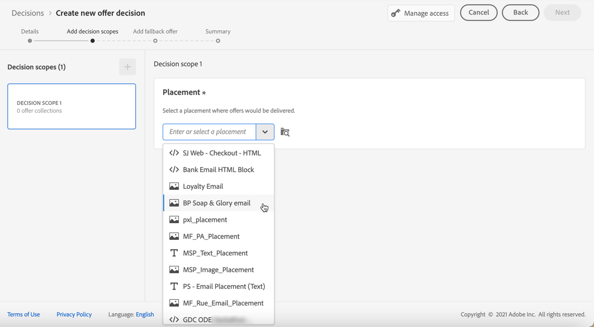
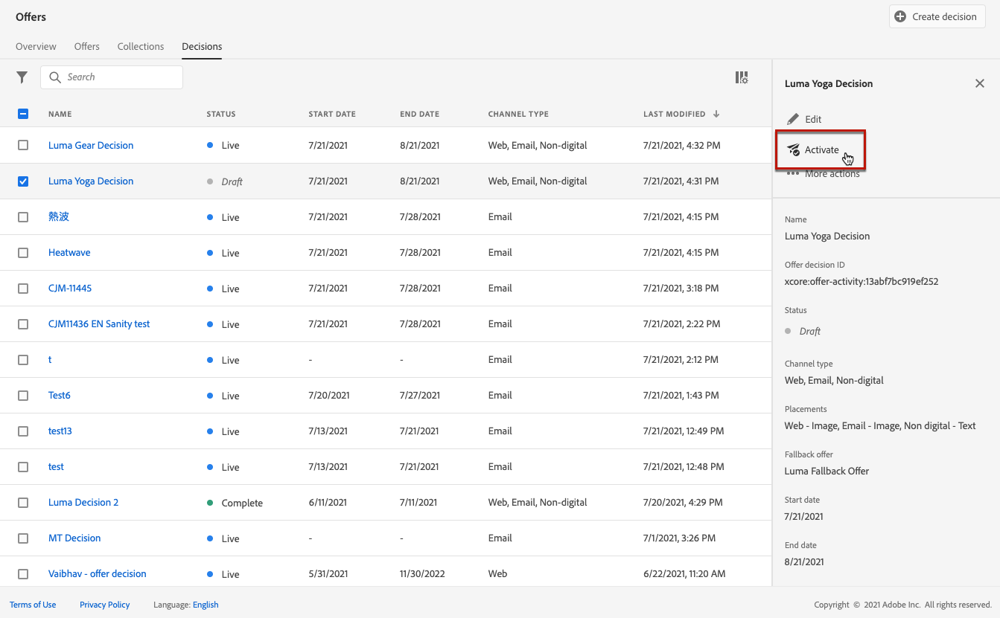

# 建立決定 {#create-offer-activities}

決定是優惠的容器，可運用優惠決定引擎，根據傳遞的目標來挑選最佳優惠。

➡️ [在此影片中瞭解如何建立優惠方案活動](#video)

決定清單可在&#x200B;**[!UICONTROL 優惠]**&#x200B;功能表> **[!UICONTROL 決定]**&#x200B;標籤中存取。 篩選器可協助您根據其狀態或開始和結束日期擷取決策。

建立決定之前，請確定已在優惠資料庫中建立下列元件：

* [位置](../offer-library/creating-placements.md)
* [集合](../offer-library/creating-collections.md)
* [個人化產品建議](../offer-library/creating-personalized-offers.md)
* [後備產品建議](../offer-library/creating-fallback-offers.md)

## 建立決策 {#create-activity}

>[!CONTEXTUALHELP]
>id="ajo_decisioning_decision_details"
>title="產品建議決策詳細資料"
>abstract="指定決策的名稱並定義開始和結束的日期與時間 (如有需要)。若要對決策指派自訂或核心資料使用標籤，請選取「**[!UICONTROL 管理存取權]**」。"

1. 存取決定清單，然後按一下&#x200B;**[!UICONTROL 建立決定]**。

1. 指定決定的名稱。

1. 視需要定義開始和結束日期及時間，然後按一下[下一步] **&#x200B;**。

   

1. 若要指派自訂或核心資料使用標籤給決定，請選取&#x200B;**[!UICONTROL 管理存取權]**。 [進一步瞭解物件層級存取控制(OLAC)](../../administration/object-based-access.md)

## 定義決策範圍 {#add-decision-scopes}

>[!CONTEXTUALHELP]
>id="ajo_decisioning_decision_scopes"
>title="決策範圍"
>abstract="為產品建議決策設定一個或多個範圍，以決定要顯示的產品建議。設定範圍需要選取一個產品建議放置環境，以及這個產品建議放置環境的相關評估條件。"

>[!CONTEXTUALHELP]
>id="ajo_decisioning_decision_placement"
>title="刊登"
>abstract="選取用於傳遞產品建議的放置環境。"

>[!CONTEXTUALHELP]
>id="ajo_decisioning_decision_evaluation"
>title="評估條件"
>abstract="評估條件包括與適用性限制相關的產品建議集合，以及決定要在產品建議放置環境中顯示哪些產品建議的排名方法。評估條件的順序會決定要先評估哪個集合。需要至少一項評估條件。"

1. 從下拉式清單中選取位置。 它會新增到您決定中的第一個決定範圍。

   

1. 按一下&#x200B;**[!UICONTROL [新增]**]以選取此位置的評估准則。

   

   每個條件都包含與資格限制相關聯的優惠方案集合，以及決定要顯示在位置中的優惠方案的排名方法。

   >[!NOTE]
   >
   >至少需要一個評估准則。

1. 選取包含要考量之優惠方案的優惠方案集合，然後按一下[新增]。**&#x200B;**

   

   >[!NOTE]
   >
   >您可以按一下&#x200B;**[!UICONTROL 開啟優惠收藏]**&#x200B;連結，在新索引標籤中顯示收藏清單，讓您瀏覽收藏及其包含的優惠。

   選取的集合會新增至條件。

   

1. 使用&#x200B;**[!UICONTROL 資格]**&#x200B;欄位來限制此位置的優惠方案選擇。

   此限制可使用&#x200B;**決定規則**&#x200B;或一或多個&#x200B;**Adobe Experience Platform對象**&#x200B;套用。 在[此區段](../offer-library/add-constraints.md#segments-vs-decision-rules)中都有詳細說明。

   * 若要將優惠方案的選取限制在Experience Platform對象的成員，請選取&#x200B;**[!UICONTROL 對象]**，然後按一下&#x200B;**[!UICONTROL 新增對象]**。

     

     從左窗格新增一或多個對象，並使用&#x200B;**[!UICONTROL And]** / **[!UICONTROL Or]**&#x200B;邏輯運運算元將它們合併。

     

     在[本節](../../audience/about-audiences.md)中瞭解如何使用對象。

   * 如果您想要新增具有決定規則的選擇限制，請使用&#x200B;**[!UICONTROL 決定規則]**&#x200B;選項並選取您選擇的規則。

     

     瞭解如何在[本節](../offer-library/creating-decision-rules.md)中建立決定規則。

1. 當您選取對象或決定規則時，您可以檢視有關預估合格設定檔的資訊。 按一下&#x200B;**[!UICONTROL 重新整理]**&#x200B;以更新資料。

   >[!NOTE]
   >
   >當規則引數包含不在設定檔中的資料（例如內容資料）時，設定檔預估無法使用。 例如，適用性規則要求目前天氣為≥80度。

   

1. 定義您要用來為每個設定檔選取最佳優惠方案的排名方法。 [了解更多](../offer-activities/configure-offer-selection.md)。

   

   * 根據預設，如果有多個優惠方案符合此位置的資格，**[!UICONTROL 優惠方案優先順序]**&#x200B;方法會使用優惠方案中定義的值：會將具有最高優先順序分數的優惠方案傳遞給使用者。

   * 如果您想要使用特定的計算分數來選擇要傳遞的合格優惠方案，請選取&#x200B;**[!UICONTROL 公式]**&#x200B;或&#x200B;**[!UICONTROL AI模型]**。 [了解更多](../offer-activities/configure-offer-selection.md)。

1. 按一下[新增]&#x200B;**&#x200B;**&#x200B;為相同位置定義更多條件。

   

1. 當您新增多個條件時，將會以特定順序評估這些條件。 將先評估新增至序列的第一個集合，依此類推。 [了解更多](#evaluation-criteria-order)

   若要變更預設順序，您可以拖放收藏集，以視需要重新排序。

   

1. 您也可以同時評估多個條件。 若要這麼做，請將集合拖放至另一個集合上方。

   

   它們現在有相同的排名，因此將同時進行評估。 [了解更多](#evaluation-criteria-order)

   

   >[!CAUTION]
   >
   >* 如果[AI模型](../ranking/ai-models.md)用於評估准則群組中，則該群組中的所有評估准則都必須使用AI排名方法，而且它們必須使用相同的特定AI模型。
   >
   >* 只有一個評估准則群組可以使用AI模型。 決策範圍內的任何其他群組都必須使用其他排名方法（優先順序或公式）。 [進一步瞭解排名方法](../offer-activities/configure-offer-selection.md)

1. 若要在此決定中新增其他優惠位置，請使用&#x200B;**[!UICONTROL 新範圍]**&#x200B;按鈕。 對每個決定範圍重複上述步驟。

   

   >[!NOTE]
   >
   >新增多個決定範圍時，評估條件順序將受到影響。 [了解更多](#multiple-scopes)

### 評估准則順序 {#evaluation-criteria-order}

如上所述，評估准則由集合、資格限制和排名方法組成。 您可以設定要評估評估准則的循序順序，但也可以合併多個評估准則，以便一起評估，而不是分別評估。

#### 具有一個範圍 {#one-scope}

在單一決定範圍中，多個條件及其群組會決定條件的優先順序以及合格優惠的排名。 第一個條件具有最高優先順序，且在相同「群組」中合併的條件具有相同優先順序。

例如，您有兩個集合，一個在評估標準A中，另一個在評估標準B中。要求傳回兩個優惠方案。 假設有兩個來自評估標準A的合格優惠方案和三個來自評估標準B的合格優惠方案。

* 如果兩個評估准則是&#x200B;**未合併**&#x200B;和/或依序順序（1和2），則評估准則的前兩個合格優惠方案將傳回第一列。 如果第一個評估條件沒有兩個符合資格的優惠，決定引擎會依序移至下一個評估條件，以找出仍需要多少優惠方案，最終將視需要傳回遞補。

  

* 如果兩個集合約時進行&#x200B;**評估**，因為有兩個符合評估標準A的優惠方案以及三個符合評估標準B的優惠方案，這五個優惠方案都將根據各自排名方法決定的值棧疊在一起。 已要求兩個優惠方案，因此將傳回這五個優惠方案中的前兩個合格優惠方案。

  

+++ **具有多個條件的範例**

現在，讓我們舉一個範例，您對分成不同群組的單一範圍有多個條件。

您已定義三個條件。 「條件1」和「條件2」在「群組1」中組合在一起，「條件3」是獨立的（群組2）。

每個條件的合格優惠方案及其優先順序（用於排名函式評估）如下：

* 群組1：
   * 條件1 - （選件1、選件2、選件3） — 優先順序1
   * 條件2 - （選件3、選件4、選件5） — 優先順序1

* 群組2：
   * 條件3 - （選件5、選件6） — 優先順序0

系統會先評估最高優先順序的條件優惠方案，並將其新增至排名優惠方案清單。

**反複專案1：**

條件1和條件2選件會一起評估（選件1、選件2、選件3、選件4、選件5）。 假設結果為：

選件1 - 10
選件2 - 20
條件1的優惠3 - 30，條件2的優惠45。 兩者中的最高會納入考量，因此會考慮45。
選件4 - 40
選件5 - 50

排名選件現在如下：選件5、選件3、選件4、選件2、選件1。

**反複專案2：**

已評估條件3選件（選件5、選件6）。 假設結果為：

* 選件5 — 將不進行評估，因為它已存在於上述結果中。
* 選件6 - 60

排名優惠方案現在如下：優惠方案5 、優惠方案3、優惠方案4、優惠方案2、優惠方案1、優惠方案6。

+++

#### 使用多個範圍 {#multiple-scopes}

**如果複製關閉**

當您將數個決定範圍新增至決定時，如果不允許跨版位複製，則系統會依請求中的決定範圍順序，依序選取合格的優惠。

>[!NOTE]
>
>在版位層級設定&#x200B;**[!UICONTROL 跨版位允許重複專案]**&#x200B;引數。 如果決策請求中任何位置的複製設定為false，則請求中的所有位置都將繼承false設定。 [進一步瞭解複製引數](../offer-library/creating-placements.md)

以新增兩個決定範圍為例，例如：

* 範圍1：有四個合格優惠方案（優惠方案1、優惠方案2、優惠方案3、優惠方案4），請求傳回兩個優惠方案。
* 範圍2：有四個合格優惠方案（優惠方案1、優惠方案2、優惠方案3、優惠方案4），請求傳回兩個優惠方案。

+++ **範例1**

選取範圍如下：

1. 系統會傳回Scope 1的前兩個合格優惠方案（優惠方案1、優惠方案2）。
1. 將傳回範圍2中剩餘的兩個合格優惠方案（優惠方案3、優惠方案4）。

+++

+++ **範例2**

在此範例中，選件1已達到其頻率上限。 [進一步瞭解頻率限定](../offer-library/add-constraints.md#capping)

選取範圍如下：

1. 將傳回範圍1中其餘兩個符合資格的優惠方案（優惠方案2、優惠方案3）。
1. 將傳回領域2中剩餘的合格優惠方案（優惠方案4）。

+++

+++ **範例3**

在此範例中，選件1和選件3已達到其頻率上限。 [進一步瞭解頻率限定](../offer-library/add-constraints.md#capping)

選取範圍如下：

1. 將傳回範圍1中其餘兩個符合資格的優惠方案（優惠方案2、優惠方案4）。
1. 領域2沒有剩餘的合格優惠，所以傳回[遞補優惠](#add-fallback)。

+++

**如果重複位於**

當允許跨所有版位重複時，可以跨不同版位多次建議相同的選件。 如果啟用，系統會針對多個位置考慮相同的選件。 [進一步瞭解複製引數](../offer-library/creating-placements.md)

讓我們採取和上面相同的範例，其中您新增了兩個決定範圍，例如：

* 範圍1：有四個合格優惠方案（優惠方案1、優惠方案2、優惠方案3、優惠方案4），請求傳回兩個優惠方案。
* 範圍2：有四個合格優惠方案（優惠方案1、優惠方案2、優惠方案3、優惠方案4），請求傳回兩個優惠方案。

+++ **範例1**

選取範圍如下：

1. 系統會傳回Scope 1的前兩個合格優惠方案（優惠方案1、優惠方案2）。
1. 系統會傳回範圍2中相同的前兩個合格優惠方案（優惠方案1、優惠方案2）。

+++

+++ **範例2**

在此範例中，選件1已達到其頻率上限。 [進一步瞭解頻率限定](../offer-library/add-constraints.md#capping)

選取範圍如下：

1. 將傳回範圍1中其餘兩個符合資格的優惠方案（優惠方案2、優惠方案3）。

1. 將傳回範圍2中剩餘的前兩個合格優惠方案（優惠方案2、優惠方案3）。

+++

+++ **範例3**

在此範例中，選件1和選件3已達到其頻率上限。 [進一步瞭解頻率限定](../offer-library/add-constraints.md#capping)

選取範圍如下：

1. 將傳回範圍1中其餘兩個符合資格的優惠方案（優惠方案2、優惠方案4）。

1. 將傳回範圍2中剩餘的前兩個合格優惠方案（優惠方案2、優惠方案4）。

+++

## 新增後備產品建議 {#add-fallback}

>[!CONTEXTUALHELP]
>id="ajo_decisioning_decision_fallback"
>title="新增後備產品建議"
>abstract="定義決策範圍後，請定義後備產品建議，這是為不符合產品建議適用性規則與限制之客戶顯示產品建議的最後手段。"

在您定義決定範圍後，請定義[遞補優惠方案](../offer-library/creating-fallback-offers.md)，此優惠方案將作為最後手段，提供給不符合優惠方案適用性規則和限制條件的客戶。

若要這麼做，請從決定中定義的位置的可用遞補優惠清單中選取它。

>[!NOTE]
>
>遞補優惠應包含決定內使用的所有宣告。 例如，如果您在決定中有5個優惠方案，而且每個優惠方案都有不同的代表方式，則備援優惠方案應包含5個代表方式。

選取之後，按一下&#x200B;**[!UICONTROL 下一步]**。

您可以按一下&#x200B;**[!UICONTROL 開啟選件資料庫]**&#x200B;連結，在新索引標籤中顯示選件清單。

## 檢閱並儲存決定 {#review}

如果所有專案都已正確設定，則會顯示決策屬性的摘要。

1. 確定決定已準備好用於向客戶呈現優惠方案。 會顯示所有決定範圍及其包含的遞補優惠。

   

1. 您可以展開或收合每個位置。 您可以預覽每個位置的可用優惠方案、資格和排名詳細資料。 您也可以顯示預估合格設定檔的相關資訊。 按一下&#x200B;**[!UICONTROL 重新整理]**&#x200B;以更新資料。

   

1. 按一下&#x200B;**[!UICONTROL 完成]**。
1. 選取&#x200B;**[!UICONTROL 儲存並啟動]**。

   

   您也可以將決定儲存為草稿，以便稍後編輯及啟動。

此決定會顯示在具有&#x200B;**[!UICONTROL 即時]**&#x200B;或&#x200B;**[!UICONTROL 草稿]**&#x200B;狀態的清單中，端視您在上一步驟中是否啟動而定。

現在已準備好用來將優惠方案提供給客戶。

## 決定清單 {#decision-list}

從決定清單中，您可以選取要顯示其屬性的決定。 您還可以從那裡編輯它、變更其狀態（**草稿**、**即時**、**完成**、**已封存**）、複製決定或刪除它。

選取&#x200B;**[!UICONTROL 編輯]**&#x200B;按鈕以返回決定版模式，您可以在此修改決定的[詳細資料](#create-activity)、[決定範圍](#add-decision-scopes)和[遞補優惠](#add-fallback)。

>[!IMPORTANT]
>
>如果對歷程訊息中使用的優惠決定進行變更，您需要取消發佈歷程並重新發佈。  這將確保將變更納入歷程的訊息中，並且該訊息與最新更新一致。

選取即時決定並按一下&#x200B;**[!UICONTROL 停用]**&#x200B;以將決定狀態設定回&#x200B;**[!UICONTROL 草稿]**。

若要再次將狀態設定為&#x200B;**[!UICONTROL 即時]**，請選取現在顯示的&#x200B;**[!UICONTROL 啟動]**&#x200B;按鈕。

**[!UICONTROL 其他動作]**&#x200B;按鈕可啟用下列動作。

* **[!UICONTROL 完成]**：將決定的狀態設為&#x200B;**[!UICONTROL 完成]**，表示無法再呼叫該決定。 此動作僅適用於啟用的決定。 仍可從清單中取得決定，但您不能將其狀態設定回&#x200B;**[!UICONTROL 草稿]**&#x200B;或&#x200B;**[!UICONTROL 已核准]**。 您只能複製、刪除或封存它。

* **[!UICONTROL 重複]**：建立具有相同屬性、決定範圍和遞補優惠的決定。 依預設，新決定具有&#x200B;**[!UICONTROL 草稿]**&#x200B;狀態。

* **[!UICONTROL 刪除]**：從清單移除決定。

  >[!CAUTION]
  >
  >系統將無法再存取決定及其內容。 此動作無法復原。
  >
  >如果決定用於其他物件，則無法刪除該決定。

* **[!UICONTROL 封存]**：將決定狀態設為&#x200B;**[!UICONTROL 已封存]**。 仍可從清單中取得決定，但您不能將其狀態設定回&#x200B;**[!UICONTROL 草稿]**&#x200B;或&#x200B;**[!UICONTROL 已核准]**。 您只能複製或刪除它。

您也可以選取對應的核取方塊，同時刪除或變更多個決定的狀態。

如果您想要變更具有不同狀態的多個決定的狀態，則只會變更相關狀態。

建立決定後，您可以從清單中按一下其名稱。

這可讓您存取該決定的詳細資訊。 選取&#x200B;**[!UICONTROL 變更記錄]**&#x200B;標籤以[監視對決定所做的所有變更](../get-started/user-interface.md#changes-logs)。

## 作法影片{#video}

瞭解如何在決定管理中建立優惠活動。

>[!VIDEO](https://video.tv.adobe.com/v/329606?quality=12)

