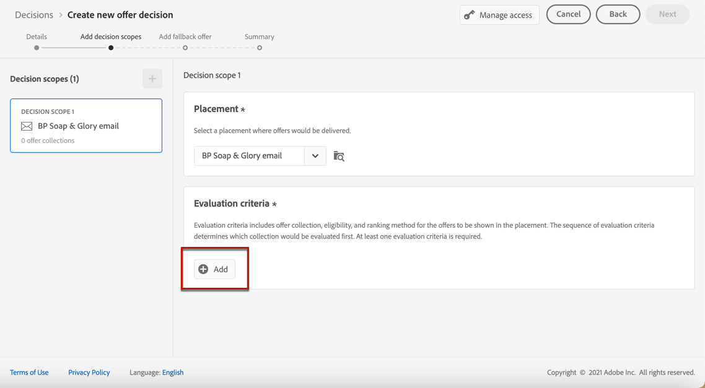

# 建立決定 {#create-offer-activities}

決策是您的報價的容器，它將利用「報價決策引擎」來選擇要交付的最佳報價，具體取決於交貨目標。

➡️ [瞭解如何在此視頻中建立優惠活動](#video)

可在 **[!UICONTROL 優惠]** 菜單> **[!UICONTROL 決定]** 頁籤。 篩選器可幫助您根據決策的狀態或開始和結束日期檢索決策。

在建立決策之前，請確保以下元件已在「提供庫」中建立：

* [版位](../offer-library/creating-placements.md)
* [集合](../offer-library/creating-collections.md)
* [個人化優惠](../offer-library/creating-personalized-offers.md)
* [遞補優惠](../offer-library/creating-fallback-offers.md)

## 建立決策 {#create-activity}

1. 訪問決策清單，然後按一下 **[!UICONTROL 建立決策]**。

1. 指定決策的名稱。

1. 根據需要定義開始和結束日期和時間，然後按一下 **[!UICONTROL 下一個]**。

   

1. 要為決策分配自定義或核心資料使用標籤，請選擇 **[!UICONTROL 管理訪問]**。 [瞭解有關對象級訪問控制(OLAC)的詳細資訊](../../administration/object-based-access.md)

## 定義決策範圍 {#add-decision-scopes}

1. 從下拉清單中選擇一個放置。 它將添加到您的決定中的第一個決定範圍。

   

1. 按一下 **[!UICONTROL 添加]** 選擇此放置的評估標準。

   

   每個標準包括與資格約束關聯的聘用集合和確定要在放置中顯示的聘用的排名方法。

   >[!NOTE]
   >
   >至少需要一個評估標準。

1. 選擇包含要考慮的聘用的聘用集合，然後按一下 **[!UICONTROL 添加]**。

   

   >[!NOTE]
   >
   >您可以按一下 **[!UICONTROL 開放式聘用集合]** 連結以在新頁籤中顯示集合清單，您可以通過該連結瀏覽集合及其包含的優惠。

   所選集合將添加到條件。

   

1. 使用 **[!UICONTROL 資格]** 欄位，以限制此位置的聘用選擇。

   此約束可通過使用 **決策規則**&#x200B;或 **Adobe Experience Platform段**。 詳情見 [此部分](../offer-library/add-constraints.md#segments-vs-decision-rules)。

   * 要將聘用的選擇限制為Experience Platform段的成員，請選擇 **[!UICONTROL 段]**，然後按一下 **[!UICONTROL 添加段]**。

      

      從左窗格中添加一個或多個段，然後使用 **[!UICONTROL 和]** / **[!UICONTROL 或]** 邏輯運算子。

      

      瞭解如何使用 [此部分](../../segment/about-segments.md)。

   * 如果要添加具有決策規則的選擇約束，請使用 **[!UICONTROL 決策規則]** 的子菜單。

      

      瞭解如何在中建立決策規則 [此部分](../offer-library/creating-decision-rules.md)。

1. 當您選擇區段或決定規則時，您可以看到有關預估合格設定檔的資訊。按一下 **[!UICONTROL 刷新]** 更新資料。

   >[!NOTE]
   >
   >當規則參數包括不在配置檔案中的資料（如上下文資料）時，配置檔案估計不可用。 例如，要求當前天氣為≥80度的資格規則。

   

1. 定義要用於為每個配置檔案選擇最佳優惠的排名方法。 [了解更多](../offer-activities/configure-offer-selection.md)。

   

   * 預設情況下，如果多個優惠符合此放置條件， **[!UICONTROL 提供優先順序]** 方法使用提供中定義的值：優先順序分數最高的優惠將交付給用戶。

   * 如果要使用特定計算得分來選擇要交付的合格優惠，請選擇 **[!UICONTROL 公式]** 或 **[!UICONTROL AI模型]**。 [了解更多](../offer-activities/configure-offer-selection.md)。

1. 按一下 **[!UICONTROL 添加]** 定義相同放置的更多條件。

   

1. 添加多個條件時，將按特定順序對它們進行評估。 添加到序列中的第一個集合將首先被評估，依此類推。 [了解更多](#evaluation-criteria-order)

   要更改預設序列，可以拖放收藏以根據需要重新排序。

   

1. 您還可以同時評估多個標準。 要執行此操作，請將收藏拖放到另一個收藏上。

   

   現在，它們的等級相同，因此將同時進行評估。 [了解更多](#evaluation-criteria-order)

   

1. 要在此決定中為您的優惠添加其他位置，請使用 **[!UICONTROL 新範圍]** 按鈕 對每個決策範圍重複上述步驟。

   

### 評估標準順序 {#evaluation-criteria-order}

如上所述，評估標準包括集合、資格約束和排名方法。 您可以設定要評估的評估標準的順序，但也可以組合多個評估標準，以便它們可以一起評估，而不是單獨評估。

例如，您有兩個集合，一個在評估標準A中，另一個在評估標準B中。該請求要求將兩份要約發回。 假設評價標準A有兩份合格報價，評價標準B有三份合格報價。

* 如果兩個評估標準 **未合併** 和/或按順序（1和2），在第一行中返回評價標準中的前兩個合格報價。 如果第一個評估標準沒有兩個合格的報價，則決策引擎將依次轉到下一個評估標準，以查找仍然需要的報價，並在需要時最終返回回退。

   

* 如果這兩個收藏 **同時評估**&#x200B;由於評價標準A有兩份合格報價，評價標準B有三份合格報價，因此，根據各種排名方法確定的值，五份報價將一併排列。 請求兩份報價，因此這五份報價中前兩份合格報價將被退回。

   

## 添加回退優惠 {#add-fallback}

定義決策範圍後，定義將作為最後手段提供給不符合聘用資格規則和約束的客戶的回退聘用。

為此，請從決策中定義的位置的可用回退優惠清單中選擇它，然後按一下 **[!UICONTROL 下一個]**。

>[!NOTE]
>
>您可以按一下 **[!UICONTROL 開放式服務庫]** 連結，以在新頁籤中顯示聘用清單。

## 查看並保存決定 {#review}

如果所有內容都配置正確，則顯示決策屬性的摘要。

1. 確保已準備好將此決定用於向客戶提供優惠。 將顯示所有決策範圍及其包含的回退優惠。

   

1. 可展開或折疊每個放置。 您可以預覽每個職位安排的可用聘用、資格和排名詳細資訊。 您還可以顯示有關估計的合格配置檔案的資訊。 按一下 **[!UICONTROL 刷新]** 更新資料。

   

1. 按一下&#x200B;**[!UICONTROL 完成]**。
1. 選擇 **[!UICONTROL 保存並激活]**。

   

   您還可以將該決定另存為草稿，以便稍後編輯和激活它。

此決定顯示在清單中 **[!UICONTROL 實況]** 或 **[!UICONTROL 草稿]** 狀態，具體取決於您在上一步中是否激活了它。

現在，它已準備好用於向客戶提供優惠。

## 決定清單 {#decision-list}

從決策清單中，可以選擇顯示其屬性的決策。 您也可以從此編輯它，更改其狀態(**草稿**。 **實況**。 **完成**。 **存檔**)、複製決定或將其刪除。

選擇 **[!UICONTROL 編輯]** 按鈕，返回到決策版本模式，在該模式中可以修改決策 [詳細資訊](#create-activity)。 [決策範圍](#add-decision-scopes) 和 [回退提議](#add-fallback)。

>[!IMPORTANT]
>
>如果更改了在行程消息中使用的優惠決定，則需要取消發佈行程並重新發佈。  這將確保將更改納入旅程的消息，並確保消息與最新更新一致。

選擇即時決策，然後按一下 **[!UICONTROL 停用]** 將決策狀態設定回 **[!UICONTROL 草稿]**。

將狀態再次設定為 **[!UICONTROL 實況]**，選擇 **[!UICONTROL 激活]** 按鈕。

的 **[!UICONTROL 更多操作]** 按鈕啟用下面描述的操作。

* **[!UICONTROL 完成]**:將決策狀態設定為 **[!UICONTROL 完成]**，表示不能再調用該決定。 此操作僅可用於激活的決策。 該決定仍可從清單中獲得，但您無法將其狀態設定回 **[!UICONTROL 草稿]** 或 **[!UICONTROL 已批准]**。 您只能複製、刪除或存檔它。

* **[!UICONTROL 重複]**:建立具有相同屬性、決策範圍和備用優惠的決策。 預設情況下，新決定 **[!UICONTROL 草稿]** 狀態。

* **[!UICONTROL 刪除]**:從清單中刪除該決定。

   >[!CAUTION]
   >
   >該決定及其內容將不再可訪問。 此動作無法復原。
   >
   >如果該決定用在另一個對象中，則無法刪除。

* **[!UICONTROL 存檔]**:將決策狀態設定為 **[!UICONTROL 存檔]**。 該決定仍可從清單中獲得，但您無法將其狀態設定回 **[!UICONTROL 草稿]** 或 **[!UICONTROL 已批准]**。 您只能複製或刪除它。

您還可以通過選中相應的複選框同時刪除或更改多個決策的狀態。

如果要更改狀態不同的多個決策的狀態，則只更改相關狀態。

建立決策後，可以從清單中按一下其名稱。

這使您能夠訪問該決定的詳細資訊。 選擇 **[!UICONTROL 更改日誌]** 頁籤 [監視所有更改](../get-started/user-interface.md#changes-log) 已經做出決定。

## 操作說明影片{#video}

瞭解如何在決策管理中建立服務活動。

>[!VIDEO](https://video.tv.adobe.com/v/329606?quality=12)

