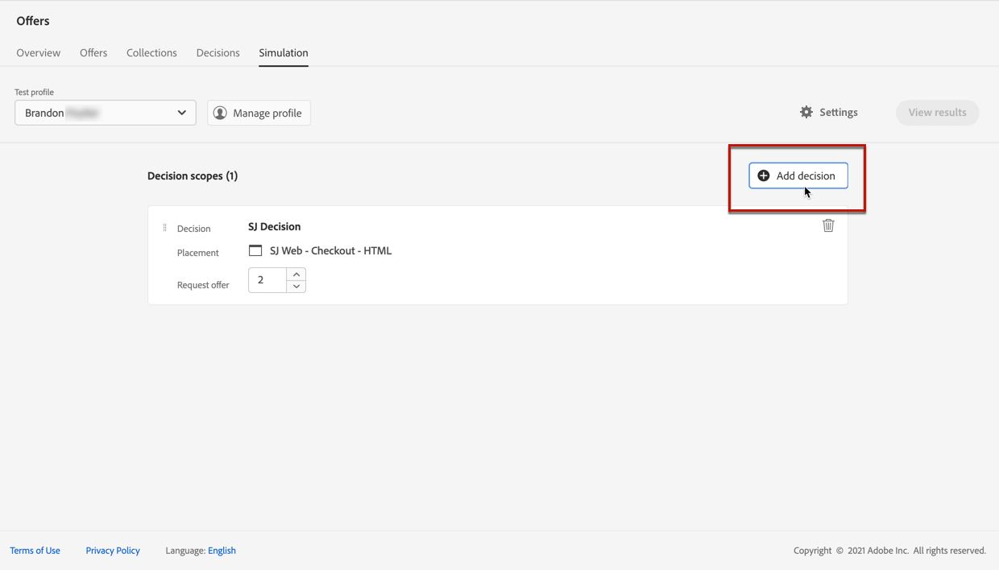
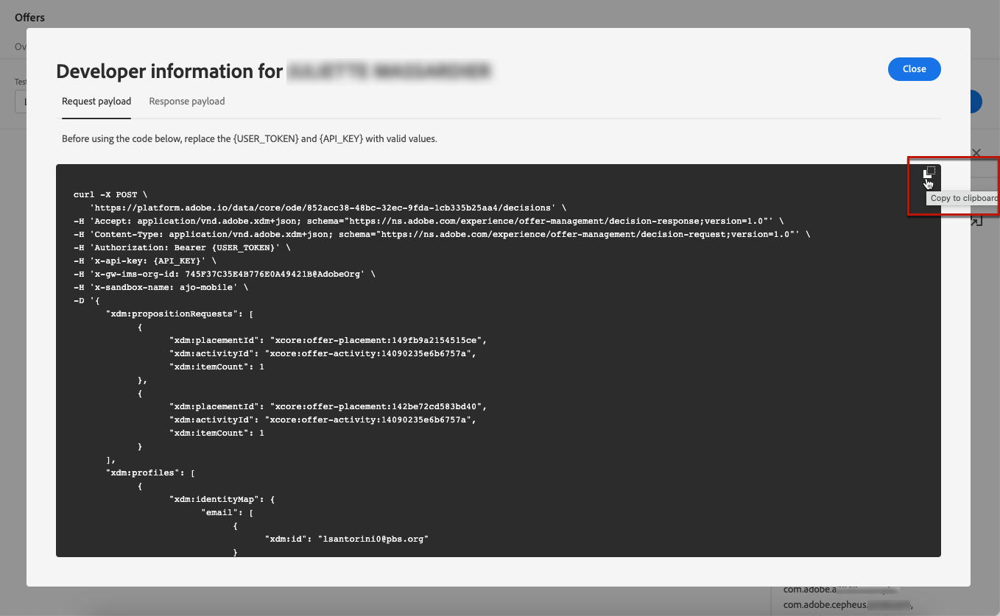

# 建立模擬 {#create-simulations}

## 關於模擬 {#about-simulation}

若要驗證決策邏輯，您可以模擬哪些選件將傳遞至指定位置的測試設定檔。

<!--Simulation allows you to view the results of offer decisions as a selected profile.-->

這可讓您測試和調整各種優惠方案版本，而不會影響目標收件者。

>[!NOTE]
>
>此功能可模擬 [!DNL Decisioning] API。 深入了解 [使用決策API提供優惠方案](../api-reference/offer-delivery-api/decisioning-api.md).

若要存取此功能，請選取 **[!UICONTROL 模擬]** 標籤 **[!UICONTROL 決策管理]** > **[!UICONTROL 選件]** 功能表。

>[!NOTE]
>
>由於模擬不會產生任何決策事件，因此 [上限](../offer-library/creating-personalized-offers.md#capping) 計數不受影響。

<!--
➡️ [Discover this feature in video](#video)
-->

## 選取測試設定檔 {#select-test-profiles}

>[!CONTEXTUALHELP]
>id="ajo_decisioning_simulation_test_profile"
>title="新增測試設定檔"
>abstract="您可以選取身分命名空間和對應的身分值，以新增測試設定檔。 您必須有測試設定檔可供使用，才能用於模擬。"
>additional-url="https://experienceleague.adobe.com/docs/journey-optimizer/using/segment/profiles/creating-test-profiles.html" text="建立測試設定檔"

首先，您需要選取要用於模擬的測試設定檔。

>[!CAUTION]
>
>您必須有可用的測試設定檔，以模擬將會提供哪些選件給他們。 了解如何 [建立測試設定檔](../../segment/creating-test-profiles.md).

1. 按一下 **[!UICONTROL 管理設定檔]**.

   

1. 選取您要用來識別測試設定檔的身分命名空間。 在此範例中，我們將使用 **電子郵件** 命名空間。

   >[!NOTE]
   >
   >身分命名空間會定義識別碼的內容，例如電子郵件地址或CRM ID。 深入了解Adobe Experience Platform身分識別命名空間 [在本節](../../segment/get-started-identity.md){target=&quot;_blank&quot;}。

1. 輸入身分值，然後按一下 **[!UICONTROL 檢視]** 以列出可用的設定檔。

   

1. 如果您想要測試不同的設定檔資料，請新增其他設定檔，並儲存您的選取項目。

   

1. 新增後，所有設定檔都會列在下方的下拉式清單中 **[!UICONTROL 測試設定檔]**. 您可以在儲存的測試設定檔之間切換，以顯示每個選取設定檔的結果。

   

   >[!NOTE]
   >
   >選取的設定檔將會在 **[!UICONTROL 模擬]** 從工作階段移除標籤，直到使用 **[!UICONTROL 管理設定檔]**.

1. 您可以按一下 **[!UICONTROL 設定檔詳細資訊]** 連結以顯示選取的設定檔資料。

<!--Learn more on [selecting test profiles](messages/preview.md#select-test-profiles)-->

## 添加決策範圍 {#add-decision-scopes}

現在，選取您要在測試設定檔上模擬的選件決策。

1. 選擇 **[!UICONTROL 添加決策範圍]**.

   

1. 從清單中選取位置。

   

1. 將顯示可用的決策。

   * 您可以使用搜尋欄位來調整選取範圍。
   * 您可以按一下 **[!UICONTROL 開啟優惠方案決策]** 連結以開啟您建立的所有決策的清單。 深入了解 [決策](create-offer-activities.md).

   選取您所選的決策，然後按一下 **[!UICONTROL 新增]**.

   

1. 您剛定義的決策範圍會顯示在主要工作區中。

   您可以調整要求的優惠方案數量。 例如，若您選取2，則此決策範圍會顯示最佳2個選件。

   

   >[!NOTE]
   >
   >您最多可以要求30個選件。

1. 重複上述步驟，以新增您需要的決策數。

   

   >[!NOTE]
   >
   >即使您定義多個決策範圍，系統也只會模擬一個API請求。

## 定義模擬設定 {#define-simulation-settings}

若要編輯模擬的預設設定，請遵循下列步驟。

1. 按一下 **[!UICONTROL 設定]**.

   

1. 在 **[!UICONTROL 重複資料刪除]** 區段中，您可以選擇根據決策和/或版位允許重複優惠方案。 這表示可能會為多個決策/版位指派相同的優惠方案。

   

   >[!NOTE]
   >
   >依預設，所有重複資料刪除旗標都會啟用模擬功能，這表示決策引擎允許重複項目，因此可以在多個決策/位置間提出相同的主張。 深入了解 [!DNL Decisioning] 中的API要求屬性 [本節](../api-reference/offer-delivery-api/decisioning-api.md).

1. 在 **[!UICONTROL 回應格式]** 區段中，您可以選擇在程式碼檢視中包含中繼資料。 核取對應的選項，然後選取您選取的中繼資料。 在選取 **[!UICONTROL 檢視程式碼]**. 了解更多 [查看模擬結果](#simulation-results) 區段。

   

   >[!NOTE]
   >
   >開啟選項時，預設會選取所有項目。

1. 按一下「**[!UICONTROL 儲存]**」。

>[!NOTE]
>
>目前，對於模擬資料，您只能使用 **[!UICONTROL 中樞]** API。

<!--
In the **[!UICONTROL API for simulation]** section, select the API you want to use: **[!UICONTROL Hub]** or **[!UICONTROL Edge]**.
Hub and Edge are two different end points for simulation data.

In the **[!UICONTROL Context data]** section, you can add as many elements as needed.

    >[!NOTE]
    >
    >This section is hidden if you select Edge API in the section above. Hub allows the use of Context data, Edge does not.

Context data allows the user to add contextual data that could affect the simulation score.
For instance, let's say the customer has an offer for a discount on ice cream. In the rules for that offer, it can have logic that would rank it higher when the temperature is above 80 degrees. In simulation, the user could add context data: temperature=65 and that offer would rank lower, of they could add temperature=95 and that would rank higher.
-->

## 查看模擬結果 {#simulation-results}

新增決策範圍並選取測試設定檔後，您就可以檢視結果。

1. 按一下 **[!UICONTROL 查看結果]**.

   

1. 系統會根據每個決策所選取的設定檔來顯示最佳可用選件。

   選取要顯示其詳細資訊的選件。

   

1. 按一下 **[!UICONTROL 檢視程式碼]** 來顯示請求和回應裝載。 [了解更多](#view-code)

1. 從清單中選取其他設定檔，以顯示不同測試設定檔的選件決策結果。

1. 您可以根據需要多次添加、刪除或更新決策範圍。

>[!NOTE]
>
>每次變更設定檔或更新決策範圍時，您都需要使用 **[!UICONTROL 查看結果]** 按鈕。

## 檢視程式碼 {#view-code}

1. 使用 **[!UICONTROL 檢視程式碼]** 按鈕來顯示請求和回應裝載。

   

   程式碼檢視會顯示目前使用者的開發人員資訊。 依預設， **[!UICONTROL 回應裝載]** 的下界。

   

1. 按一下 **[!UICONTROL 回應裝載]** 或 **[!UICONTROL 要求裝載]** 來導覽。

   

1. 在外部使用要求裝載 [!DNL Journey Optimizer]  — 以疑難排解為例，請使用 **[!UICONTROL 複製到剪貼簿]** 按鈕。

   

   <!--You cannot copy the response payload. ACTUALLY YES YOU CAN > to confirm with PM/dev? -->

   >[!NOTE]
   >
   >將請求或回應裝載複製到您自己的程式碼時，請務必將{USER_TOKEN}和{API_KEY}取代為有效值。 了解如何在 [Adobe Experience Platform API](https://experienceleague.adobe.com/docs/experience-platform/landing/platform-apis/api-authentication.html){target=&quot;_blank&quot;}檔案。

