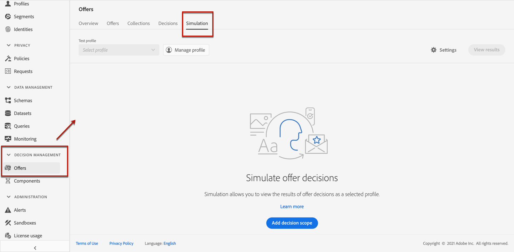

# 建立模擬 {#create-simulations}

## 關於模擬 {#about-simulation}

要驗證您的決策邏輯，您可以模擬將哪些優惠交付給給定位置的test配置檔案。

<!--Simulation allows you to view the results of offer decisions as a selected profile.-->

這使您能夠test和改進您提供的各種版本，而不會影響目標收件人。

>[!NOTE]
>
>此功能將單個請求模擬到 [!DNL Decisions] API。 瞭解更多 [使用決策API提供服務](../api-reference/decisions-api/deliver-offers.md)。

要訪問此功能，請選擇 **[!UICONTROL Simulation]** 的 **[!UICONTROL Decision management]** > **[!UICONTROL Offers]** 的子菜單。

>[!NOTE]
>
>由於模擬不生成任何決策事件，因此 [封蓋](../offer-library/creating-personalized-offers.md#capping) 計數不受影響。

<!--
➡️ [Discover this feature in video](#video)
-->

## 選擇test配置檔案 {#select-test-profiles}

首先，您需要選擇要用於模擬的test配置檔案。

>[!CAUTION]
>
>您必須具有test配置檔案才能預覽郵件和發送校樣。 瞭解如何 [建立test配置檔案](../../segment/creating-test-profiles.md)。

1. 按一下「**[!UICONTROL Manage profile]**」。

   

1. 選擇要用於標識test配置檔案的標識命名空間。 在此示例中，我們將使用 **電子郵件** 命名空間。

   >[!NOTE]
   >
   >標識命名空間定義標識符的上下文，如電子郵件地址或CRM ID。 瞭解有關Adobe Experience Platform標識命名空間的詳細資訊 [此部分](../../segment/get-started-identity.md){target=&quot;_blank&quot;}。

1. 輸入標識值，然後按一下 **[!UICONTROL View]** 清單可用的配置檔案。

   

1. 如果要test不同的配置檔案資料，則添加其他配置檔案，並保存您的選擇。

   

1. 添加後，所有配置檔案都將列在下面的下拉清單中 **[!UICONTROL Test profile]**。 可以在保存的test配置檔案之間切換以顯示每個選定配置檔案的結果。

   

   >[!NOTE]
   >
   >所選配置檔案將繼續作為test配置檔案列在 **[!UICONTROL Simulation]** 從會話到會話的頁籤，直到使用 **[!UICONTROL Manage profile]**。

1. 您可以按一下 **[!UICONTROL Profile details]** 連結以顯示所選配置檔案資料。

<!--Learn more on [selecting test profiles](messages/preview.md#select-test-profiles)-->

## 添加決策作用域 {#add-decision-scopes}

現在，選擇要在您的test配置檔案上模擬的優惠決定。

1. 選擇「**[!UICONTROL Add decision scope]**」。

   

1. 從清單中選取一個放置。

   

1. 將顯示可用決策。

   * 您可以使用搜索欄位來細化選擇。
   * 您可以按一下 **[!UICONTROL Open offer decisions]** 連結以開啟您建立的所有決策的清單。 瞭解更多 [決策](create-offer-activities.md)。

   選擇您選擇的決定，然後按一下 **[!UICONTROL Add]**。

   

1. 您剛定義的決策範圍將顯示在主工作區中。

   您可以調整要請求的優惠數量。 例如，如果選擇2，則此決策範圍將顯示最佳的2個優惠。

   

   >[!NOTE]
   >
   >您最多可以要求30個優惠。

1. 重複上述步驟，以根據需要添加任意多個決策。

   

   >[!NOTE]
   >
   >即使定義了多個決策範圍，也只模擬一個API請求。

## 定義模擬設定 {#define-simulation-settings}

要編輯模擬的預設設定，請執行以下步驟。

1. 按一下「**[!UICONTROL Settings]**」。

   

1. 在 **[!UICONTROL Deduplication]** 部分，您可以選擇允許在決策和/或放置中重複的報價。 這意味著，多個決策/職位安排可能會分配相同的報價。

   

   >[!NOTE]
   >
   >預設情況下，所有重複資料消除標誌都啟用模擬，這意味著決策引擎允許重複項，因此可以在多個決策/放置中做出相同的主張。 瞭解 [!DNL Decisions] API請求屬性 [此部分](../api-reference/decisions-api/deliver-offers.md)。

1. 在 **[!UICONTROL Response format]** 部分，您可以選擇在代碼視圖中包括元資料。 選中相應選項，然後選擇您選擇的元資料。 在選擇請求和響應負載時，它們將顯示在 **[!UICONTROL View code]**。 在 [查看模擬結果](#simulation-results) 的子菜單。

   

   >[!NOTE]
   >
   >開啟選項時，預設情況下會選中所有項目。

1. 按一下「**[!UICONTROL Save]**」。

>[!NOTE]
>
>當前，對於模擬資料，您只能使用 **[!UICONTROL Hub]** API。

<!--
In the **[!UICONTROL API for simulation]** section, select the API you want to use: **[!UICONTROL Hub]** or **[!UICONTROL Edge]**.
Hub and Edge are two different end points for simulation data.

In the **[!UICONTROL Context data]** section, you can add as many elements as needed.

    >[!NOTE]
    >
    >This section is hidden if you select Edge API in the section above. Hub allows the use of Context data, Edge does not.

Context data allows the user to add contextual data that could affect the simulation score.
For instance, let's say the customer has an offer for a discount on ice cream. In the rules for that offer, it can have logic that would rank it higher when the temperature is above 80 degrees. In simulation, the user could add context data: temperature=65 and that offer would rank lower, of they could add temperature=95 and that would rank higher.
-->

## 查看模擬結果 {#simulation-results}

添加決策範圍並選擇test配置檔案後，可以查看結果。

1. 按一下「**[!UICONTROL View results]**」。

   

1. 根據每個決策的所選簡檔顯示最佳可用報價。

   選擇要顯示其詳細資訊的優惠。

   

1. 按一下 **[!UICONTROL View code]** 顯示請求和響應負載。 [了解更多](#view-code)

1. 從清單中選擇另一個配置檔案，以顯示不同test配置檔案的聘用決定結果。

1. 您可以根據需要添加、刪除或更新決策範圍多次。

>[!NOTE]
>
>每次更改配置檔案或更新決策範圍時，都需要使用 **[!UICONTROL View results]** 按鈕

## 查看代碼 {#view-code}

1. 使用 **[!UICONTROL View code]** 按鈕以顯示請求和響應負載。

   

   代碼視圖顯示當前用戶的開發人員資訊。 預設情況下， **[!UICONTROL Response payload]** 的上界。

   

1. 按一下 **[!UICONTROL Response payload]** 或 **[!UICONTROL Request payload]** 在兩個頁籤之間導航。

   

1. 在外部使用請求負載 [!DNL Journey Optimizer]  — 用於排除故障，例如，使用 **[!UICONTROL Copy to clipboard]** 按鈕。

   

   <!--You cannot copy the response payload. ACTUALLY YES YOU CAN > to confirm with PM/dev? -->

   >[!NOTE]
   >
   >將請求或響應負載複製到您自己的代碼時，請確保將{USER_TOKEN}和{API_KEY}替換為有效值。 瞭解如何在 [Adobe Experience PlatformAPI](https://experienceleague.adobe.com/docs/experience-platform/landing/platform-apis/api-authentication.html){target=&quot;_blank&quot;}文檔。

