# 在產品建議中新增限制 {#add-constraints}

>[!CONTEXTUALHELP]
>id="od_offer_constraints"
>title="關於產品建議限制"
>abstract="透過限制，您可以指定與其他產品建議相比，如何確定產品建議的優先順序並呈現給使用者。"

>[!CONTEXTUALHELP]
>id="ajo_decisioning_constraints"
>title="關於產品建議限制"
>abstract="透過限制，您可以指定與其他產品建議相比，如何確定產品建議的優先順序並呈現給使用者。"

>[!CONTEXTUALHELP]
>id="od_offer_priority"
>title="關於產品建議優先順序"
>abstract="在此欄位中，您可以指定產品建議的優先順序設定。優先順序是一個數字，用於對滿足所有限制 (例如資格、日期和上限) 的產品建議進行排名。"

>[!CONTEXTUALHELP]
>id="ajo_decisioning_priority"
>title="設定優先順序"
>abstract="如果使用者符合資格可獲得多個產品建議，則優先順序有助於定義產品建議相較於其他產品建議的優先順序。產品建議的優先順序越高，相較於其他產品建議的優先順序就越高。"

限制可讓您定義優惠的顯示條件。

1. 設定&#x200B;**[!UICONTROL 優惠資格]**。 [了解更多](#eligibility)

   

1. 如果使用者符合多個優惠方案的資格，請定義優惠方案與其他優惠方案相比的&#x200B;**[!UICONTROL 優先順序]**。 產品建議的優先順序越高，相較於其他產品建議的優先順序就越高。

   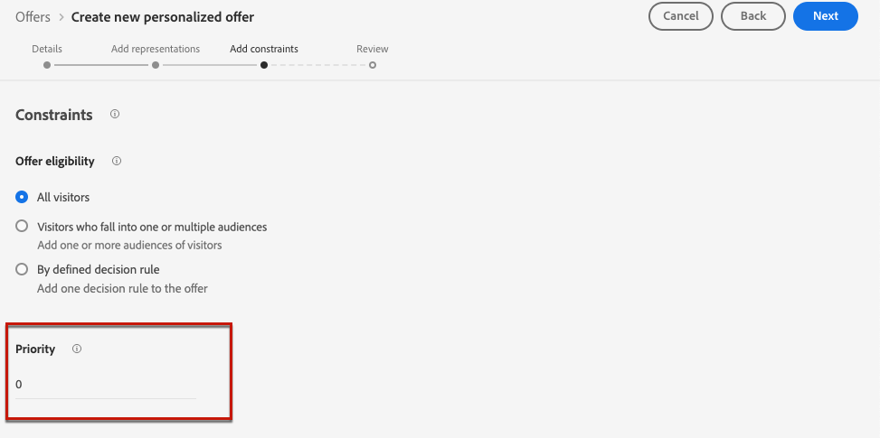

   >[!NOTE]
   >
   >優惠優先順序必須為整數值（無小數）。

1. 指定優惠方案的&#x200B;**[!UICONTROL 上限]**，表示將會顯示優惠方案的次數。 [了解更多](#capping)

   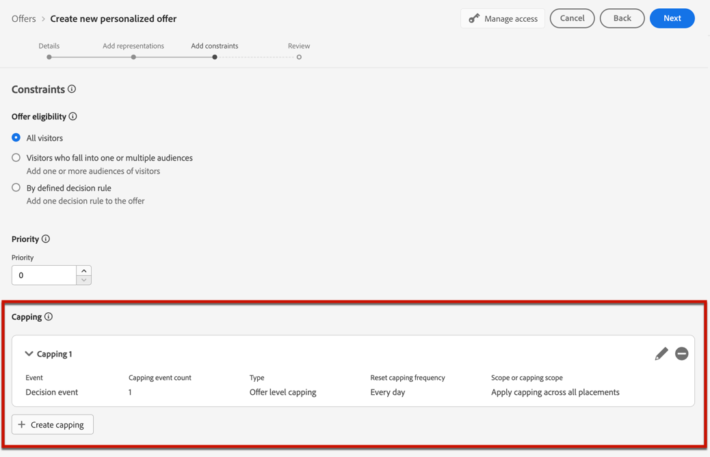

1. 按一下[下一步]&#x200B;**&#x200B;**&#x200B;以確認您定義的所有限制。

例如，如果您設定下列限制：

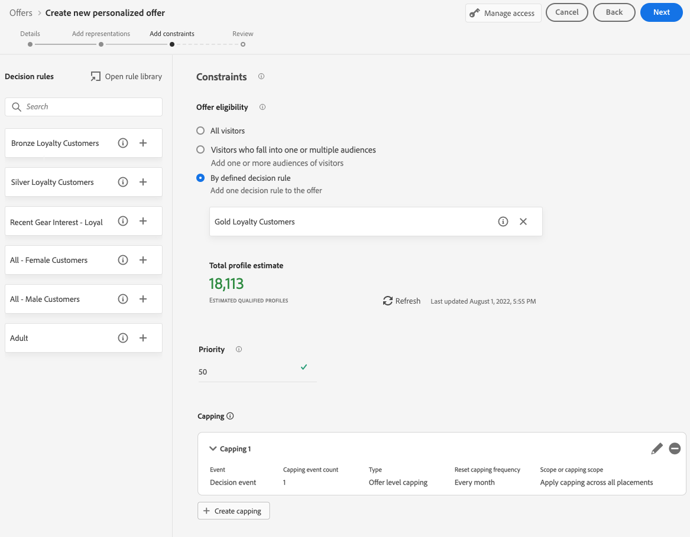

* 只有符合「金級忠誠客戶」決策規則的使用者才會考量此優惠。
* 優惠方案的優先順序設為「50」，這表示將會在優先順序介於1到49的優惠方案之前以及優先順序至少為51的優惠方案之後顯示優惠方案。
* 所有版位中每個使用者每月僅會顯示一次選件。

## 適用性 {#eligibility}

>[!CONTEXTUALHELP]
>id="ajo_decisioning_eligibility"
>title="定義資格"
>abstract="依預設，任何設定檔都有資格獲得產品建議，但您可以使用對象或決定規則將產品建議限制給特定設定檔。"

>[!CONTEXTUALHELP]
>id="od_offer_eligibility"
>title="關於產品建議資格"
>abstract="在此部分，您可以使用決定規則來確定哪些使用者有資格獲得產品建議。"

<!--additional-url="https://video.tv.adobe.com/v/329373" text="Watch demo video"-->

>[!CONTEXTUALHELP]
>id="ajo_decisioning_total_profile_estimate"
>title="總設定檔估計值"
>abstract="當您選取對象或決定規則時，您可以看到有關預估合格設定檔的資訊。"

**[!UICONTROL 優惠資格]**&#x200B;區段可讓您將優惠限製為您使用對象或決定規則定義的特定設定檔。

>[!NOTE]
>
>在&#x200B;**本節**&#x200B;中進一步瞭解如何使用&#x200B;**對象**&#x200B;與[決定規則](#segments-vs-decision-rules)。

* 依預設，會選取&#x200B;**[!UICONTROL 所有訪客]**&#x200B;選項，這表示任何設定檔都符合呈現優惠方案的資格。

  

* 您也可以將優惠方案的呈現方式限製為一或多個[Adobe Experience Platform對象](../../audience/about-audiences.md)的成員。

  若要這麼做，請啟用&#x200B;**[!UICONTROL 屬於一或多個受眾的訪客]**&#x200B;選項，然後從左窗格新增一或多個受眾，並使用&#x200B;**[!UICONTROL And]** / **[!UICONTROL Or]**&#x200B;邏輯運運算元將其合併。

  

* 如果您想要將特定[決定規則](../offer-library/creating-decision-rules.md)關聯至優惠，請選取&#x200B;**[!UICONTROL 依定義的決定規則]**，然後將需要的規則從左窗格拖曳至&#x200B;**[!UICONTROL 決定規則]**&#x200B;區域。

  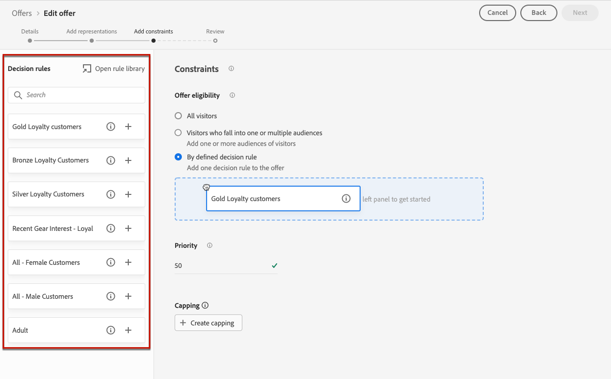

  >[!CAUTION]
  >
  >[!DNL Journey Optimizer]目前不支援事件型優惠。 如果您根據[事件](https://experienceleague.adobe.com/docs/experience-platform/segmentation/ui/segment-builder.html#events){target="_blank"}建立決定規則，則無法在優惠方案中使用它。

當您選取對象或決定規則時，您可以檢視有關預估合格設定檔的資訊。 按一下&#x200B;**[!UICONTROL 重新整理]**&#x200B;以更新資料。

>[!NOTE]
>
>當規則引數包含不在設定檔中的資料（例如內容資料）時，設定檔預估無法使用。 例如，適用性規則要求目前天氣為≥80度。

### 使用對象與決定規則 {#segments-vs-decision-rules}

若要套用限制，您可以將優惠方案選擇限制在一或多個&#x200B;**Adobe Experience Platform對象**&#x200B;的成員中，或者您可以使用&#x200B;**決定規則**，這兩個解決方案都對應不同的用法。

基本上，對象的輸出是設定檔清單，而決定規則是在決策流程期間根據單一設定檔執行的函式。 這兩種使用方式的差異詳述如下。

* **對象**

  一方面，受眾是一組Adobe Experience Platform設定檔，根據設定檔屬性和體驗事件符合特定邏輯。 不過，Offer Management不會重新計算對象，在展示優惠方案時，該對象可能不是最新狀態。

  若要了解客群的詳細資訊，請參閱[本章節](../../audience/about-audiences.md)。

* **決定規則**

  另一方面，決定規則會根據Adobe Experience Platform中的可用資料，並決定可向誰顯示優惠方案。 在優惠或指定位置的決定中選取後，每次做出決定時都會執行規則，以確保每個設定檔取得最新和最佳優惠。

  在[本節](creating-decision-rules.md)中進一步了解決定規則。

## 頻率上限 {#capping}

>[!CONTEXTUALHELP]
>id="od_offer_globalcap"
>title="關於產品建議上限"
>abstract="在此欄位中，您可以指定產品建議可以呈現的次數。"

>[!CONTEXTUALHELP]
>id="ajo_decisioning_capping"
>title="使用上限"
>abstract="為避免過度向客戶提供請求，請使用上限來定義可呈現優惠方案的最大次數。 您可以為指定產品建議建立最多 10 個上限規則。"
>additional-url="https://experienceleague.adobe.com/en/docs/journey-optimizer/using/decisioning/offer-decisioning/managing-offers-in-the-offer-library/configure-offers/add-constraints#capping" text="變更日期會影響上限"

上限會用作限制，以定義可顯示優惠方案的次數上限。 限制使用者取得特定優惠方案的次數，可讓您避免過度向客戶提供請求，進而使用最佳優惠方案將每個接觸點最佳化。

您最多可以為特定選件新增10個上限規則。 若要設定上限規則，請按一下&#x200B;**[!UICONTROL 建立上限]**&#x200B;按鈕，然後遵循下列步驟。

1. 定義將考慮哪個&#x200B;**[!UICONTROL 上限事件]**&#x200B;以增加計數器。 [了解更多](#capping-event)

1. 選取要將上限套用至所有使用者或僅套用至一個設定檔。 [了解更多](#capping-type)

1. 設定可顯示優惠方案的次數。 [了解更多](#capping-count)

1. 設定&#x200B;**[!UICONTROL 頻率]**&#x200B;以定義上限計數的重設頻率。 [了解更多](#frequency-capping)

1. 如果您已為優惠定義了數個[代表](add-representations.md)，請指定您是否要對所有位置&#x200B;**套用上限**，或為每個位置&#x200B;**套用上限**。 [了解更多](#placements)

1. 在儲存並核准後，如果根據您定義的條件和時間範圍，已根據您在此欄位中指定的次數向優惠方案顯示次數，則其傳送將停止。

系統會在準備電子郵件時計算建議某個優惠方案的次數。 例如，如果您準備包含多個產品建議的電子郵件，無論是否有傳送電子郵件，這些數量都會計入您的次數上限中。

<!--If an email delivery is deleted or if the preparation is done again before being sent, the capping value for the offer is automatically updated.-->

>[!NOTE]
>
>優惠到期時或優惠方案開始日期後2年（以先到者為準）時，上限計數器會重設。 在[本節](creating-personalized-offers.md#create-offer)中瞭解如何定義優惠方案的日期。

### 頻率上限事件 {#capping-event}

>[!CONTEXTUALHELP]
>id="ajo_decisioning_frequency_capping_impression"
>title="曝光"
>abstract="使用曝光數做為上限事件僅適用於傳入管道。"

**[!UICONTROL 選擇上限事件]**&#x200B;欄位可讓您定義將考慮哪個事件以增加計數器：

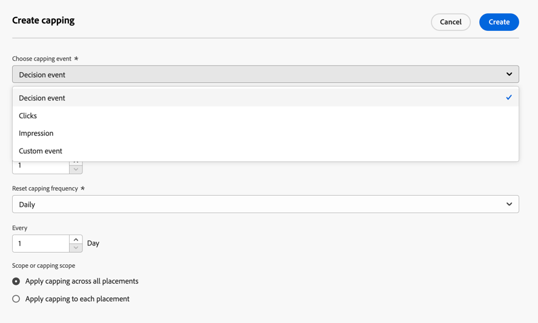

* **[!UICONTROL 決定事件]** （預設值）：可顯示優惠的最大次數。
* **[!UICONTROL 點按次數]**：使用者可點按選件的次數上限。
* **[!UICONTROL 曝光次數]**：可向使用者顯示選件的次數上限。

  >[!NOTE]
  >
  >曝光次數作為上限事件僅適用於&#x200B;**傳入頻道**。

* **[!UICONTROL 自訂事件]**：您可以定義自訂事件，用來限制已傳送的優惠方案數目。 例如，您可以限制贖回次數，直到它們等於10,000，或直到指定的設定檔已贖回1次。 若要這麼做，請使用[Adobe Experience Platform XDM](https://experienceleague.adobe.com/docs/experience-platform/xdm/home.html?lang=zh-Hant){target="_blank"}結構描述來建置自訂事件規則。

  <!--For example, you can cap on the number of redemptions so that the offer can be shown until redemptions equal 10,000. You can only select XDM ExperienceEvents. -->

  在下列範例中，您想要限制結帳次數。

   1. 從清單中選取&#x200B;**[!UICONTROL 自訂事件]**，並使用&#x200B;**[!UICONTROL 新增自訂事件]**&#x200B;按鈕。

   1. 使用&#x200B;**[!UICONTROL 建立自訂事件規則]**&#x200B;產生器來選取相關事件。 您可以選擇任何您想要限制選件的使用者動作。

      在這裡選擇&#x200B;**[!UICONTROL Commerce]** > **[!UICONTROL 結帳]** > **[!UICONTROL 值]**，然後從下拉式清單中選取&#x200B;**[!UICONTROL 存在]**。

      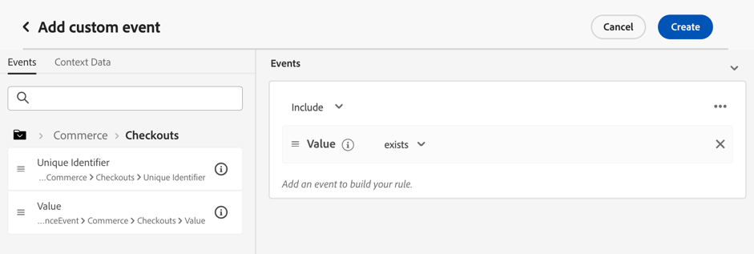

   1. 建立規則後，它會顯示在&#x200B;**[!UICONTROL 自訂事件查詢]**&#x200B;欄位中。

      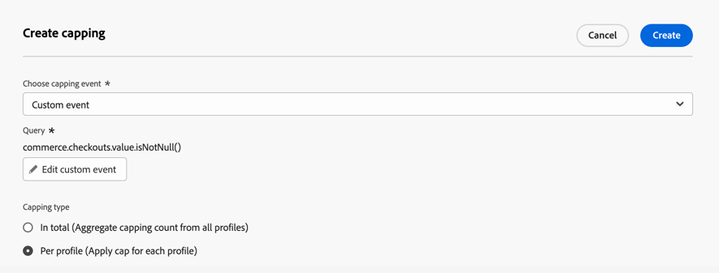

>[!CAUTION]
>
>對於決策事件以外的所有上限事件，決策管理意見可能不會自動收集，這可能會導致上限計數器未正確增加。 [了解更多](../data-collection/data-collection.md)
>
>若要確保在上限計數器中已追蹤和說明每個上限事件，請確定用於收集體驗事件的結構描述包含該事件的正確欄位群組。 [了解更多](../data-collection/schema-requirement.md)

### 上限型別 {#capping-type}

您可以指定是否要將上限套用至所有使用者或一個特定設定檔：

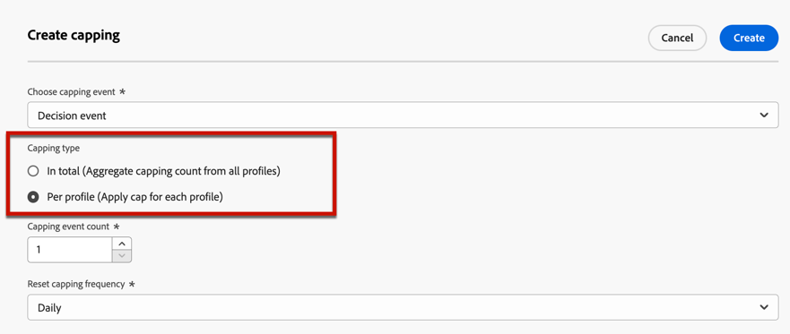

* 選取總計&#x200B;**[!UICONTROL 個]**&#x200B;以定義可在合併的目標對象中建議多少次選件，亦即在所有使用者中建議。

  例如，如果您是具有「TV doorbuster deal」的電子產品retailer，您只想讓所有設定檔傳回200次選件。

* 選取&#x200B;**[!UICONTROL 每個設定檔]**&#x200B;以定義可向同一個使用者建議某個優惠方案的次數。

  例如，如果您是具有「白金信用卡」優惠方案的銀行，您不希望此優惠方案在每個設定檔中顯示超過5次。 事實上，您相信，如果使用者看過5次選件且未採取行動，則他們有較高機會對下一個最佳選件採取行動。

### 上限計數 {#capping-count}

**[!UICONTROL 上限計數限制]**&#x200B;欄位可讓您指定可顯示優惠方案的次數。

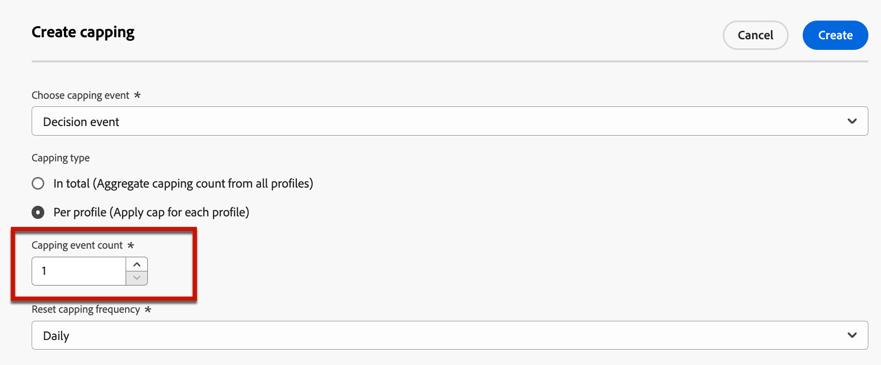

>[!NOTE]
>
>數字必須是大於0的整數。

例如，您定義了自訂上限事件，例如將結帳次數納入考量。 如果您在&#x200B;**[!UICONTROL 上限計數限制]**&#x200B;欄位中輸入10，則在10次結帳後不會再傳送優惠。

### 頻率上限 {#frequency-capping}

>[!CONTEXTUALHELP]
>id="ajo_decisioning_frequency_capping"
>title="設定上限頻率"
>abstract="您可以選擇每天、每週或每月重設產品建議上限計數器。請注意，啟用頻率上限並發佈產品建議後，您將無法變更已定義的頻率。"

**[!UICONTROL 重設上限頻率]**&#x200B;欄位可讓您定義上限計數的重設頻率。 若要這麼做，請定義盤點的期間（每日、每週或每月），並輸入您選擇的天數/周數/月數。 例如，如果您希望每兩週重設一次上限計數，請從對應的下拉式清單中選取&#x200B;**[!UICONTROL 每週]**，然後在另一個欄位中輸入&#x200B;**2**。

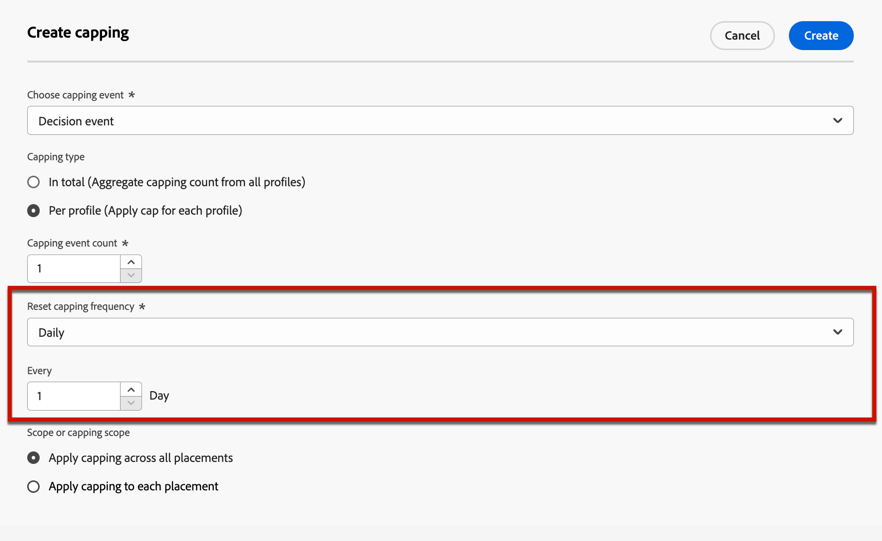

* 頻率上限計數器重設會在您定義的當天上午&#x200B;**12UTC**&#x200B;發生，或在一週/月的第一天發生（如適用）。 周開始日是&#x200B;**星期日**。 您選擇的任何期間不能超過&#x200B;**2年** （即對應的月數、周數或天數）。

* 發佈優惠方案後，您將無法變更您為頻率選取的時間期間（每月、每週或每日）。 如果優惠方案具有&#x200B;**[!UICONTROL 草稿]**&#x200B;狀態，而且之前從未發佈並啟用頻率限定，您仍可編輯頻率限定。

* 無論是在核准優惠還是建立上限（以最後發生者為準）時，將事件計入頻率上限限制之前，最多可能有15分鐘的緩衝時間。

+++ **必讀：頻率上限與決定管理API**

頻率上限計數器已更新，並且可在3秒內於[Edge Decisioning API](../api-reference/offer-delivery-api/start-offer-delivery-apis.md#edge)決定中使用。

每個中心區域都與一個或多個邊緣區域相關聯。 頻率限定規則會從每個中心區域產生並匯出至其關聯的邊緣區域。 每當使用Edge Decisioning API做出決定時，系統都會強制實施相同邊緣區域中可用的規則：

* 如果有相符的規則，則設定檔的頻率上限計數器會增加。
* 否則，不會為設定檔建立計數器，且頻率上限規則不適用。 因此，即使超過上限臨界值，設定檔仍會繼續收到個人化優惠。

例如，我們將您組織的中心區域視為&#x200B;*NLD2*，而您正在傳送來自歐洲（*IRL1*&#x200B;邊緣區域）的決策請求。 在此案例中，決策請求將遞增設定檔的計數器，因為規則可在（愛爾蘭） *IRL1*&#x200B;區域中使用。 但是，如果決策請求來自日本(*JPN3*)這樣的區域，該區域不是繫結至（荷蘭） *NLD2*&#x200B;中樞區域的邊緣區域，則不會建立任何計數器，也不會強制執行頻率上限規則。

>[!NOTE]
>
>當計數器從邊緣傳播到集線器或從集線器傳播到邊緣區域時，最多可能延遲30分鐘。

如需瞭解哪些中心與邊緣區域與貴組織建立關聯，請洽詢您的Adobe代表。

若使用其他API，頻率上限計數器會更新如下：

* 在[決策API](../api-reference/offer-delivery-api/start-offer-delivery-apis.md#decisioning)決定中，視流量而定，頻率上限計數器可能會延遲幾分鐘而更新。

* 在[批次決定API](../api-reference/offer-delivery-api/batch-decisioning-api.md)決定中，會使用快照，其中頻率上限計數器保持固定。 只要使用相同的快照，計數器就會維持不變。

+++

### 上限和版位 {#placements}

如果您已為優惠定義了數個[代表](add-representations.md)，請指定您是否要對所有刊登版位或每個刊登版位套用上限。

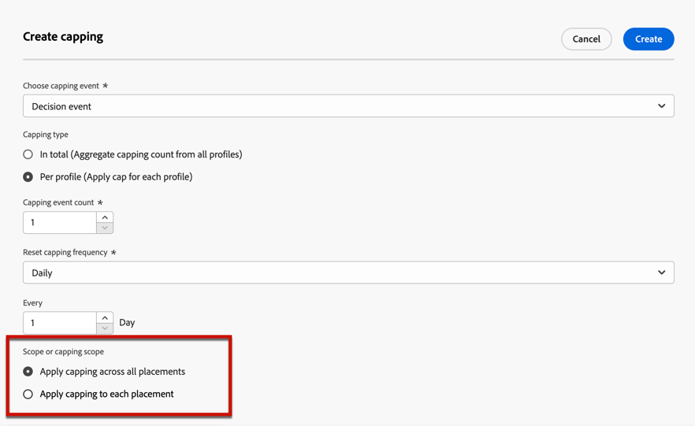

* **[!UICONTROL 針對所有版位套用上限]**：上限計數將會總計與優惠相關之版位的所有決定。

  例如，如果優惠方案有&#x200B;**電子郵件**&#x200B;版位和&#x200B;**網路**&#x200B;版位，而您在所有版位&#x200B;**將每個設定檔的上限設定為** 2，則無論版位組合為何，每個設定檔最多可以收到優惠方案共2次。

* **[!UICONTROL 對每個位置套用上限]**：上限計數將分別套用每個位置的決定計數。

  例如，如果優惠方案有&#x200B;**電子郵件**&#x200B;版位和&#x200B;**網路**&#x200B;版位，而您將每個版位&#x200B;**的最高限定設為每個設定檔** 2，則每個設定檔最多可以接收電子郵件版位2次優惠方案，以及網路版位2次優惠方案。

### 變更日期對頻率上限的影響 {#capping-change-date}

>[!CONTEXTUALHELP]
>id="ajo_decisioning_offer_change_date"
>title="變更日期會影響上限"
>abstract="如果將上限套用到此產品建議，則當您變更開始或結束日期時，它可能會受到影響。"

變更優惠方案的日期時，您必須謹慎進行，因為如果符合以下條件，這可能會對上限產生影響：

* 優惠方案已核准[&#128279;](#review)。
* [上限](#capping)已套用至選件。
* 上限是按設定檔定義的。

>[!NOTE]
>
>在[本節](creating-personalized-offers.md#create-offer)中瞭解如何定義優惠方案的日期。

每個設定檔的上限會儲存每個設定檔的上限計數。 當您變更已核准優惠方案的開始和結束日期時，部分設定檔的上限計數可能會根據以下所述的不同情況而受到影響。

以下是&#x200B;**變更優惠方案開始日期**&#x200B;時的可能情況：

| 案例： 如果…… | 發生下列情況： 然後…… | 對上限計數的可能影響 |
|--- |--- |--- |
| ...優惠方案開始日期會在原始優惠方案開始日期之前更新， | ...上限計數將從新的開始日期開始。 | 無 |
| ...新的開始日期在目前的結束日期之前， | ...上限會以新的開始日期繼續，而每個設定檔的先前上限計數則會延續。 | 無 |
| ...新的開始日期在目前結束日期之後， | ...目前的上限將會到期，而新的上限計數將會從新開始日期的所有設定檔的0重新開始。 | 是 |

以下是&#x200B;**延長優惠方案結束日期**&#x200B;時的可能情況：

| 案例： 如果…… | 發生下列情況： 然後…… | 對上限計數的可能影響 |
|--- |--- |--- |
| ...決策請求在原始優惠方案結束日期之前發生， | ...上限計數將更新，每個設定檔的先前上限計數將結轉。 | 無 |
| ...在原始結束日期之前不會發生任何決策請求， | ...上限計數將在每個設定檔的原始結束日期重設。 新的上限計數隨後將從0開始，任何新決策請求將發生在原始結束日期之後。 | 是 |

**範例**

假設您有一個優惠方案，其原始開始日期設為&#x200B;**1月1日**，到期日為&#x200B;**1月31日**。

1. 選件中會顯示設定檔X、Y和Z。
1. 在&#x200B;**1月10日**，優惠方案的結束日期變更為&#x200B;**2月15日**。
1. **從1月11日至1月31日**，只提供設定檔Z選件。

   * 由於決策請求發生在設定檔Z **的原始結束日期**&#x200B;之前，因此優惠方案的結束日期可以延長至&#x200B;**2015年2月15日**。
   * 但是，由於&#x200B;**設定檔X和Y**&#x200B;的原始結束日期之前未發生任何活動，因此其計數器將會過期，且其上限計數將在&#x200B;**1931年1月31日重設為0。**

