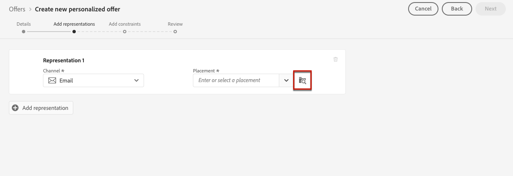

# 在產品建議中新增聲明 {#add-representations}

>[!CONTEXTUALHELP]
>id="ajo_decisioning_representation"
>title="表示方式"
>abstract="新增表示方式以定義您的產品建議在訊息中顯示的位置。產品建議具有的表示方式越多，在不同位置內容中使用產品建議的機會就越多。"

選件可顯示在訊息中的不同位置：在含有影像的頂端橫幅中、在段落中作為文字、在HTML區塊中等。 產品建議具有的表示方式越多，在不同位置內容中使用產品建議的機會就越多。

## 設定優惠的宣告 {#representations}

若要新增一或多個代表至您的優惠方案並加以設定，請遵循下列步驟。

1. 對於第一個表示法，請先選取要使用的&#x200B;**[!UICONTROL 管道]**。

   

   >[!NOTE]
   >
   >只有所選頻道的可用版位才會顯示在&#x200B;**[!UICONTROL 版位]**&#x200B;下拉式清單中。

1. 從清單中選取位置。

   您也可以使用&#x200B;**[!UICONTROL 位置]**&#x200B;下拉式清單旁的按鈕來瀏覽所有位置。

   

   您仍然可以在這裡根據版位頻道和/或內容型別來篩選版位。 選擇位置並按一下&#x200B;**[!UICONTROL 選取]**。

   

1. 將內容新增至您的代表。 在[本節](#content)中瞭解如何操作。

1. 新增影像或URL等內容時，您可以指定&#x200B;**[!UICONTROL 目的地連結]**：按一下選件的使用者將被導向到對應的頁面。

   

1. 最後，選取您選擇的語言，以協助識別並管理要向使用者顯示的內容。

1. 若要新增其他表示方式，請使用&#x200B;**[!UICONTROL 新增表示方式]**&#x200B;按鈕，並視需要新增多個表示方式。

   

1. 新增所有宣告後，請選取&#x200B;**[!UICONTROL 下一步]**。

## 定義表示的內容 {#content}

您可以將不同型別的內容新增到表現中。

>[!NOTE]
>
>只有與版位內容型別對應的內容才可供使用。

### 新增影像 {#images}

如果選取的位置是影像型別，您可以新增來自&#x200B;**Adobe Experience Cloud資產**&#x200B;資料庫（由[!DNL Adobe Experience Manager Assets]提供的資產集中存放庫）的內容。

>[!NOTE]
>
> 若要使用[Adobe Experience Manager Assets Essentials](https://experienceleague.adobe.com/docs/experience-manager-assets-essentials/help/introduction.html?lang=zh-Hant){target="_blank"}，您必須為貴組織部署[!DNL Assets Essentials]，並確定使用者是&#x200B;**Assets Essentials消費者使用者**&#x200B;或/和&#x200B;**Assets Essentials使用者**&#x200B;產品設定檔的一部分。 深入瞭解[此頁面](https://experienceleague.adobe.com/docs/experience-manager-assets-essentials/help/get-started-admins/deploy-administer.html?lang=zh-Hant){target="_blank"}。

1. 選擇&#x200B;**[!UICONTROL 資產庫]**&#x200B;選項。

1. 選取&#x200B;**[!UICONTROL 瀏覽]**。

   

1. 瀏覽資產以選取您選擇的影像

1. 按一下&#x200B;**[!UICONTROL 選取]**。

   

### 新增HTML或JSON檔案 {#html-json}

如果選取的位置為HTML型別，您也可以新增來自[HTML資產庫](https://experienceleague.adobe.com/docs/experience-manager-assets-essentials/help/introduction.html?lang=zh-Hant){target="_blank"}的Adobe Experience Cloud或JSON內容。

例如，您已於[Adobe Experience Manager](https://experienceleague.adobe.com/docs/experience-manager.html?lang=zh-Hant){target="_blank"}建立HTML電子郵件範本，且想要將該檔案用於您的優惠方案內容。 您不必建立新檔案，只要將範本上傳到&#x200B;**資產庫**，就能在優惠方案代表中重複使用它。

若要在呈現中重複使用您的內容，請依照&#x200B;**本節**&#x200B;所述瀏覽[資產庫](#images)，並選取您選擇的HTML或JSON檔案。


### 新增URL {#urls}

若要從外部公用位置新增內容，請選取&#x200B;**[!UICONTROL URL]**，然後輸入要新增內容的URL位址。

您可以使用個人化編輯器個人化URL。 深入瞭解[個人化](../../personalization/personalize.md#use-expression-editor)。


例如，您想要個人化顯示為選件的影像。 你想讓喜歡城市度假的使用者看紐約的天際線，也想讓喜歡海灘度假的使用者看夏威夷的北岸。

使用個人化編輯器，使用聯合結構描述擷取儲存在Adobe Experience Platform中的設定檔屬性。 [了解更多](https://experienceleague.adobe.com/docs/experience-platform/profile/union-schemas/union-schemas-overview.html?lang=zh-Hant){target="_blank"}


如果您指定&#x200B;**[!UICONTROL 目的地連結]**，也可以個人化使用者點選選件時導向的URL。

### 新增自訂文字 {#custom-text}

您也可以在選取相容版位時插入文字型內容。

1. 選取&#x200B;**[!UICONTROL 自訂]**&#x200B;選項，然後按一下&#x200B;**[!UICONTROL 新增內容]**。

   

   >[!NOTE]
   >
   >此選項不適用於影像型別的位置。

1. 輸入要在優惠方案顯示的文字。

   

   您可以使用個人化編輯器個人化您的內容。 深入瞭解[個人化](../../personalization/personalize.md#use-expression-editor)。

   

   >[!NOTE]
   >
   >只有&#x200B;**[!UICONTROL 設定檔屬性]**、**[!UICONTROL 對象]**&#x200B;和&#x200B;**[!UICONTROL 協助程式函式]**&#x200B;來源可用於決定管理。

## 根據內容資料個人化表示{#context-data}

在[Edge decisioning](../api-reference/offer-delivery-api/edge-decisioning-api.md)呼叫中傳遞內容資料時，您可以運用這些資料以動態方式個人化表示。 例如，您可以根據即時因素（例如在做出決定時的目前天氣條件）來定製優惠方案的表示方式。

若要在優惠方案表示中使用內容資料，請使用`profile.timeSeriesEvents.`名稱空間，直接將內容資料變數併入表示內容。

以下是根據使用者的作業系統來個人化優惠方案表現的語法範例：

```
 iosandroid 
```

包含內容資料的對應Edge決策請求如下：

```
{
    "body": {
        "xdm": {
            "identityMap": {
                "Email": [
                    {
                        "id": "xyz@abc.com"
                    }
                ]
            },
            "device": {
                "model": "Apple"
            }
        },
        "extra": {
            "query": {
                "decisionScopes": [
                    "eyJ4ZG06..."
                ]
            }
        }
    }
}
```
