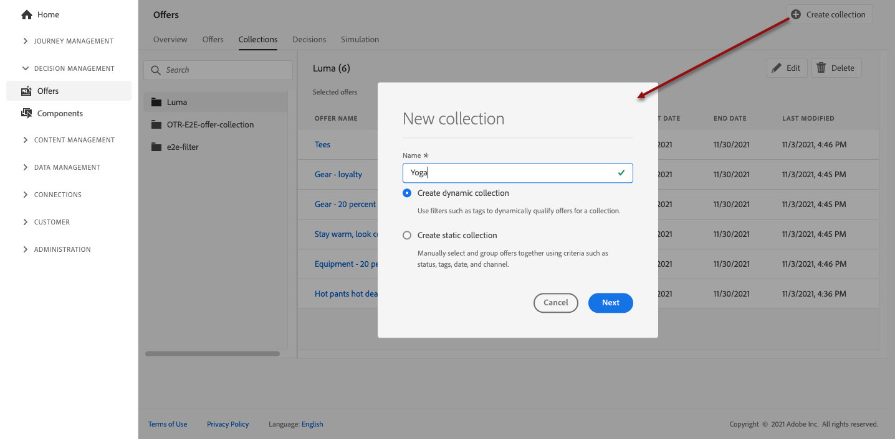
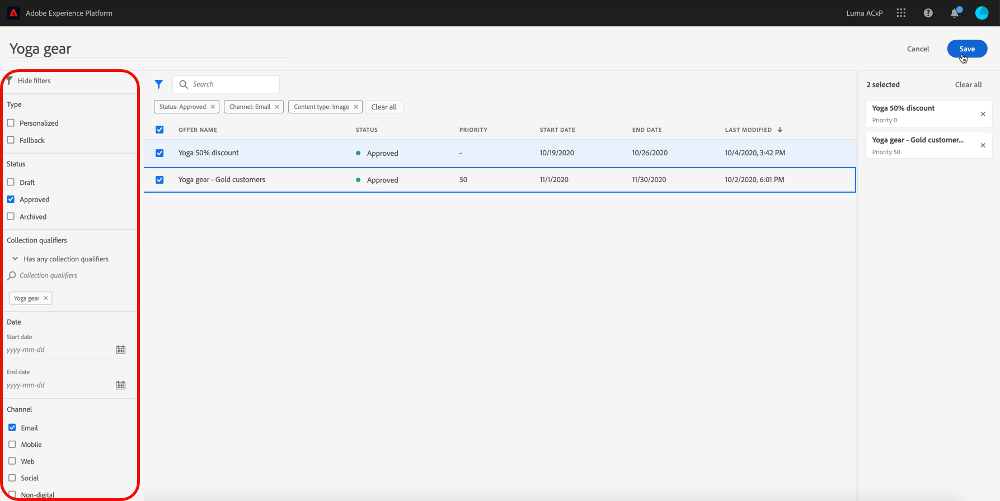

# 建立集合 {#create-collections}

>[!TIP]
>
>[!DNL Adobe Journey Optimizer] 的新決策功能「決策」現在可透過程式碼型體驗和電子郵件管道使用！[了解更多](../../experience-decisioning/gs-experience-decisioning.md)

>[!CONTEXTUALHELP]
>id="ajo_decisioning_decision_collection"
>title="關於產品建議集合"
>abstract="有了產品建議集合，您可以將產品建議重新群組到您選擇的類別中以組織產品建議。"

>[!CONTEXTUALHELP]
>id="ajo_decisioning_collection_dynamic"
>title="動態集合"
>abstract="使用集合限定詞，以動態方式限定集合的產品建議。"

>[!CONTEXTUALHELP]
>id="ajo_decisioning_collection_static"
>title="靜態集合"
>abstract="使用比如狀態、集合限定詞、日期和管道等條件，手動選取產品建議並將其設為群組。"

>[!CONTEXTUALHELP]
>id="ajo_decisioning_collection_static_select"
>title="靜態集合預覽"
>abstract="手動選取要包含在集合中的個別產品建議，即可建置靜態集合。要更新這類集合，僅能透過手動新增更多產品建議。"

>[!CONTEXTUALHELP]
>id="ajo_decisioning_collection_dynamic_select"
>title="動態集合預覽"
>abstract="動態集合根據集合限定詞收集產品建議。這類集合會自動更新。例如，若使用「體育」這個集合限定詞來建立新的產品建議，則該產品建議會自動新增到對應的集合中。"

集合可讓您將優惠重新分組為您選擇的類別，以組織優惠。 例如，您可以建立只包含運動相關優惠方案的「運動」集合。

➡️ [在影片中探索此功能](#video)

可在&#x200B;**[!UICONTROL 優惠方案]**&#x200B;功能表中存取優惠方案集合清單。

您可以建立兩種型別的集合：

* **動態集合**&#x200B;是根據集合限定詞（先前稱為「標籤」）的優惠集合。 這類集合會自動更新。例如，如果使用選取的集合限定詞建立新選件，則會自動將其新增至集合。

* **靜態集合**&#x200B;是透過手動選取要包含在集合中的個別優惠方案所建置的集合。 要更新這類集合，僅能透過手動新增更多產品建議。

若要建立集合，請依照下列步驟進行：

1. 移至&#x200B;**[!UICONTROL 集合]**&#x200B;標籤，然後按一下&#x200B;**[!UICONTROL 建立集合]**。

1. 指定要建立的集合名稱和型別。

   

1. 若要建立動態集合，請使用左窗格選取要新增至集合之優惠方案的集合限定詞，然後按一下[儲存]。**&#x200B;** 所有具有所選集合限定詞的優惠方案都會儲存在集合中。

   如需集合限定詞建立的詳細資訊，請參閱[建立集合限定詞](../offer-library/creating-tags.md)。

   

1. 若要建立靜態集合，請使用左窗格來篩選優惠方案清單（狀態、集合限定詞、日期、管道、內容型別），然後選取要新增至集合的優惠方案。

   

   >[!NOTE]
   >
   >靜態集合不會自動更新。 若要將優惠方案新增至靜態集合，您需要編輯並手動新增。

1. 若要指派自訂或核心資料使用標籤給靜態集合，請選取&#x200B;**[!UICONTROL 管理存取權]**。 [進一步瞭解物件層級存取控制(OLAC)](../../administration/object-based-access.md)

   >[!NOTE]
   >
   >動態集合無法使用OLAC。 它必須在選件層級進行管理。 因此，如果您沒有這些優惠方案的存取權，您可能會在動態集合中看不到任何優惠方案。

1. 集合建立後，會顯示在清單中。 您可以選取它來進行編輯或刪除。

   

## 作法影片 {#video}

>[!VIDEO](https://video.tv.adobe.com/v/329376?quality=12)

