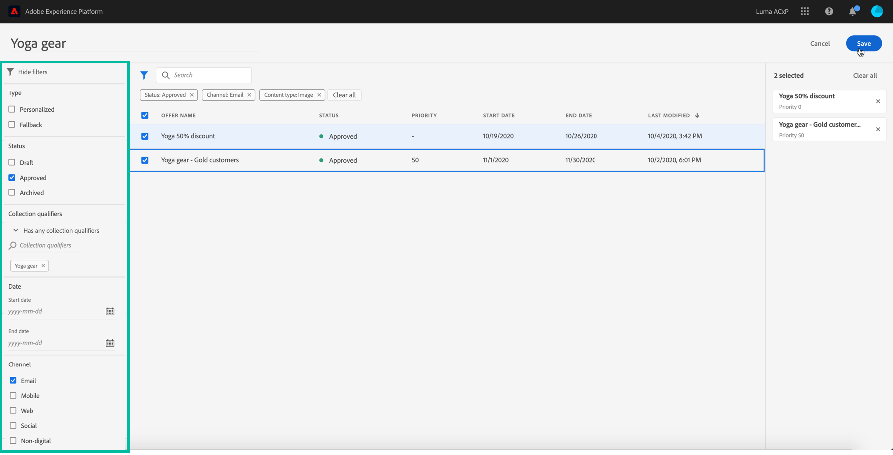

# 建立集合 {#create-collections}

>[!CONTEXTUALHELP]
>id="ajo_decisioning_decision_collection"
>title="關於選件集合"
>abstract="有了優惠方案集合，您可以將優惠方案重新分組到您所選擇的類別，借此組織優惠方案。"

集合可讓您將選件重新分組為您選擇的類別，借此組織選件。 例如，您可以建立「體育」系列，其中僅包含與體育相關的優惠方案。

➡️ [在影片中探索此功能](#video)

優惠方案集合清單可在 **[!UICONTROL 選件]** 功能表。

您可以建立兩種類型的集合：

* **動態集合** 是根據標籤的選件集合。 這些集合會自動更新。 例如，如果以選取的標籤建立新選件，則會自動將其新增至集合。

* **靜態集合** 是透過手動選取要包含在集合中的個別選件來建立集合。 只能手動新增更多選件來更新集合。

若要建立集合，請依照下列步驟操作：

1. 前往 **[!UICONTROL 集合]** ，然後按一下 **[!UICONTROL 建立集合]**.

1. 指定要建立的集合名稱和類型。

   

1. 若要建立動態系列，請使用左窗格選取要新增至系列的選件標籤，然後按一下 **[!UICONTROL 儲存]**. 所有具有選取標籤的選件都會儲存在集合中。

   如需建立標籤的詳細資訊，請參閱 [建立標籤](../offer-library/creating-tags.md).

   

1. 若要建立靜態集合，請使用左窗格篩選選件清單（狀態、標籤、日期、頻道、內容類型），然後選取要新增至集合的選件。

   

   >[!NOTE]
   >
   >靜態集合不會自動更新。 若要將選件新增至靜態集合，您需要編輯選件並手動新增選件。

1. 若要將自訂或核心資料使用量標籤指派至靜態集合，請選取 **[!UICONTROL 管理存取]**. [進一步了解物件層級存取控制(OLAC)](../../administration/object-based-access.md)

1. 集合建立後，就會顯示在清單中。 您可以選取它以編輯或刪除它。

   

## 作法影片 {#video}

>[!VIDEO](https://video.tv.adobe.com/v/329376?quality=12)

