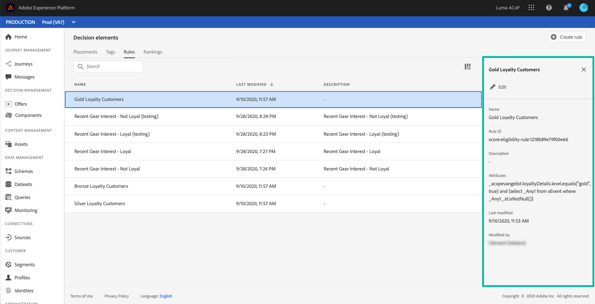

# 建立決定規則 {#create-decision-rules}

您可以根據Adobe Experience Platform的可用資料建立優惠決策規則。 決策規則確定可向誰顯示報價。

例如，您可以指定只在 (性別 =「女性」) 和 (地區 =「東北部」) 時顯示「女性冬季服裝優惠方案」。

➡️ [在影片中探索此功能](#video)

可在 **[!UICONTROL Components]** 的子菜單。

要建立決策規則，請執行以下步驟：

1. 轉到 **[!UICONTROL Rules]** ，然後按一下 **[!UICONTROL Create rule]**。

   

1. 命名規則並提供說明，然後根據需要配置規則。

   為此， **段生成器** 可用於幫助您構建規則的條件。 [了解更多](../../segment/about-segments.md)

   在此示例中，規則將針對具有「黃金」忠誠度級別的客戶。

   

   >[!NOTE]
   >
   >為建立決策規則而提供的段生成器與與 **[!UICONTROL Audience Destinations]** 服務。 例如， **[!UICONTROL Segments]** 頁籤不可用。 但是，段生成器文檔中描述的全局流程仍然有效，無法生成提供決策規則。

1. 按一下 **[!UICONTROL Save]** 確認。

1. 建立規則後，該規則將顯示在規則清單中。 可以選擇它以顯示其屬性，並編輯或刪除它。

   

>[!CAUTION]
>
>當前不支援基於事件的服務 [!DNL Journey Optimizer]。 如果根據 [事件](https://experienceleague.adobe.com/docs/experience-platform/segmentation/ui/segment-builder.html?lang=en#events){target=&quot;_blank&quot;}，您將無法在優惠中利用它。

## 教程視頻 {#video}

>[!NOTE]
>
>此視頻適用於在Adobe Experience Platform上構建的Offer decisioning應用程式服務。 然而，它為在Journey Optimizer背景下使用要約提供了一般性指導。

>[!VIDEO](https://video.tv.adobe.com/v/329373?quality=12)
