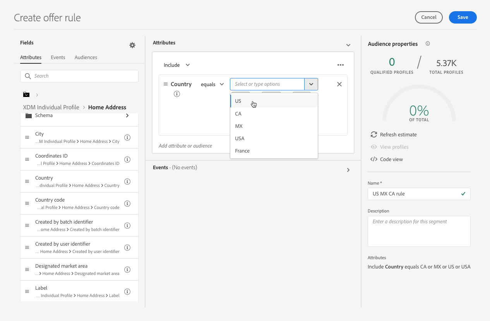

# 建立決策規則 {#create-decision-rules}

## 關於決定規則 {#about}

您可以根據Adobe Experience Platform中的可用資料來建立優惠決定規則。 決定規則會決定要向誰顯示優惠方案。

例如，您可以指定只在（性別=「女性」）和（地區=「東北」）時顯示「女士冬季服裝優惠方案」。

➡️ [在影片中探索此功能](#video)

以下是使用決定規則時應留意的限制清單：

* Edge決策使用不會儲存事件的邊緣設定檔，因此邊緣決策中使用的任何規則都將無效。
* 建立決定規則時，不支援回顧過去的一段時間。 例如，如果您將上個月之內發生的體驗事件指定為規則的元件。 在規則建立期間任何包含回顧期間的嘗試，在儲存時會觸發錯誤。
  <!--* Decision requests that use the hub profile will look at the last 100 experience events on the profile to evaluate rules that reference historical experience events.-->

## 建立決定規則 {#create}

可在&#x200B;**[!UICONTROL 元件]**&#x200B;功能表中存取已建立的決定規則清單。

若要建立決定規則，請遵循下列步驟：

1. 移至&#x200B;**[!UICONTROL 規則]**&#x200B;標籤，然後按一下&#x200B;**[!UICONTROL 建立規則]**。

   

1. 為規則命名並提供說明，然後視需要設定規則。

   若要這麼做，可使用Adobe Experience Platform **區段產生器**&#x200B;來協助您建立規則的條件。 [瞭解如何建立區段定義](../../audience/creating-a-segment-definition.md)

   <!--In this example, the rule will target customers that have the "Gold" loyalty level.-->

   

   >[!NOTE]
   >
   >提供用來建立決定規則的區段產生器，與&#x200B;**[!UICONTROL Segmentation]**&#x200B;服務所使用的區段產生器相比，有一些特異性。 但是，[區段產生器](../../audience/creating-a-segment-definition.md)檔案中說明的全域程式對於建立優惠決定規則仍然有效。 在 [Adobe Experience Platform 細分服務文件](https://experienceleague.adobe.com/docs/experience-platform/segmentation/ui/segment-builder.html?lang=zh-Hant)中了解更多。

1. 當您在工作區中新增及設定新欄位時，**[!UICONTROL 對象屬性]**&#x200B;窗格會顯示屬於該對象的預估設定檔資訊。 按一下&#x200B;**[!UICONTROL 重新整理預估值]**&#x200B;以更新資料。

   

   >[!NOTE]
   >
   >當規則引數包含不在設定檔中的資料（例如內容資料）時，設定檔預估無法使用。 例如，適用性規則要求目前天氣為≥80度。

1. 按一下&#x200B;**[!UICONTROL 儲存]**&#x200B;以確認。

1. 建立規則後，它會顯示在&#x200B;**[!UICONTROL 規則]**&#x200B;清單中。 您可以選取它以顯示其屬性，並加以編輯或刪除。

   

>[!CAUTION]
>
>[!DNL Journey Optimizer]目前不支援事件型優惠。 如果您根據[事件](https://experienceleague.adobe.com/docs/experience-platform/segmentation/ui/segment-builder.html?lang=zh-Hant#events){target="_blank"}建立決定規則，則無法在優惠方案中使用它。

## 教學課程影片 {#video}

>[!VIDEO](https://video.tv.adobe.com/v/329373?quality=12)
