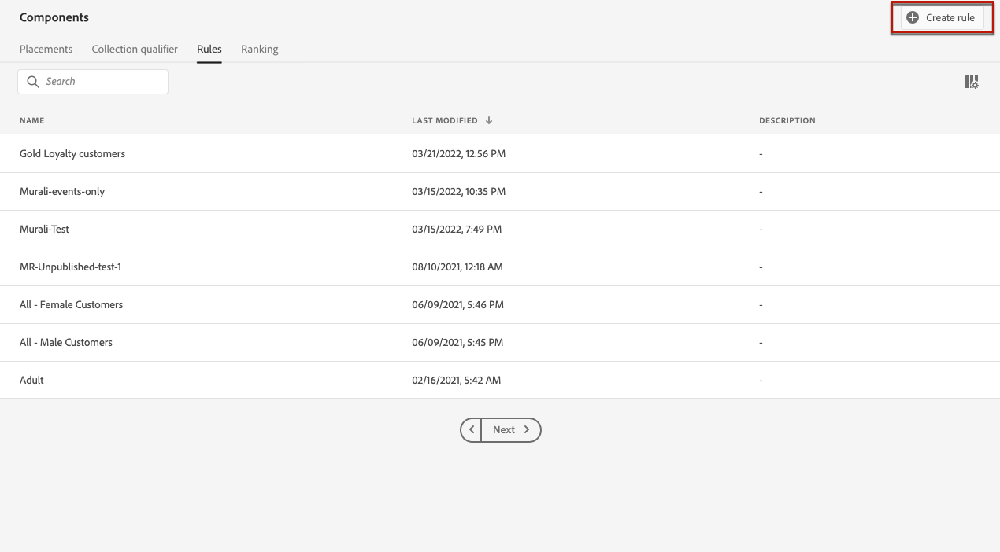

# 建立決定規則 {#creating-decision-rules}

您可以根據Adobe Experience Platform的可用資料建立選件決策規則。 決策規則會決定選件可顯示給誰。

例如，您可以指定只在 (性別 =「女性」) 和 (地區 =「東北部」) 時顯示「女性冬季服裝優惠方案」。

 [在影片中探索此功能](#video)

可在&#x200B;**[!UICONTROL Components]**&#x200B;菜單中訪問已建立的決策規則清單。

要建立決策規則，請執行以下步驟：

1. 前往&#x200B;**[!UICONTROL Rules]**&#x200B;標籤，然後按一下&#x200B;**[!UICONTROL Create rule]**。

   

1. 命名規則並提供說明，然後根據您的需求設定規則。

   為此，Adobe Experience Platform的&#x200B;**區段產生器**&#x200B;可協助您建立規則條件。 有關如何使用它的詳細資訊，請參閱[專用文檔](https://docs.adobe.com/content/help/en/experience-platform/segmentation/ui/segment-builder.html)。

   在此範例中，規則將定位擁有「金級」忠誠度等級的客戶。

   

   >[!NOTE]
   >
   >與&#x200B;**[!UICONTROL Audience Destinations]**&#x200B;服務所使用的區段產生器相比，建立決策規則時提供的區段產生器會呈現一些特定性。 例如，**[!UICONTROL Segments]**&#x200B;標籤不可用。 不過，「區段產生器」檔案中描述的全域程式仍適用於建立選件決策規則。

1. 按一下&#x200B;**[!UICONTROL Save]**&#x200B;進行確認。

1. 建立規則後，規則會顯示在規則清單中。 您可以選取它以顯示其屬性，並加以編輯或刪除。

   

## 教學課程影片{#video}

>[!NOTE]
>
>此視訊適用於以Adobe Experience Platform為基礎的Offer decisioning應用程式服務。 然而，它提供了在Journey Optimizer背景下使用選件的一般指導。

>[!VIDEO](https://video.tv.adobe.com/v/329373?quality=12)
