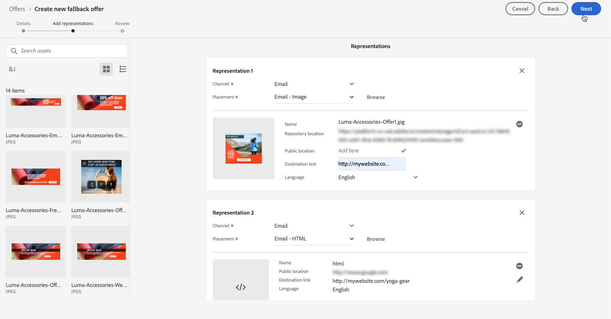

# 建立後備產品建議 {#create-fallback-offers}

>[!TIP]
>
>[!DNL Adobe Journey Optimizer] 的新決策功能「決策」現在可透過程式碼型體驗和電子郵件管道使用！[了解更多](../../experience-decisioning/gs-experience-decisioning.md)

>[!CONTEXTUALHELP]
>id="ajo_decisioning_new_fallback"
>title="備援產品建議"
>abstract="當一般使用者不具備任何個人化優惠的資格時，遞補優惠會是顯示的預設優惠。"

>[!CONTEXTUALHELP]
>id="ajo_decisioning_fallback_offer_details "
>title="遞補優惠詳細資料"
>abstract="指定遞補優惠的名稱。 您也可以將一或多個現有集合限定詞與其建立關聯，讓您更輕鬆地搜尋及組織「優惠資料庫」。"

如果客戶不符合其他優惠方案的資格，系統會將遞補優惠方案傳送給客戶。 建立遞補優惠的步驟包含建立一或多個表示，例如建立優惠時。

➡️ [在影片中探索此功能](#video)

可在&#x200B;**[!UICONTROL 優惠]**&#x200B;功能表中存取遞補優惠清單。

若要建立遞補優惠，請依照下列步驟進行：

>[!NOTE]
>
>請注意，與個人化優惠不同，遞補優惠沒有適用規則和限制引數，因為它們是作為無條件的最後度假村提供給客戶的。

1. 按一下&#x200B;**[!UICONTROL 建立選件]**，然後選取&#x200B;**[!UICONTROL 遞補選件]**。

   

1. 指定遞補優惠的名稱。 您也可以將一或多個現有的集合限定詞（先前稱為「標籤」）與其建立關聯，讓您更輕鬆地搜尋及組織「優惠資料庫」。

   

1. 若要指派自訂或核心資料使用標籤給優惠方案，請選取&#x200B;**[!UICONTROL 管理存取權]**。 [進一步瞭解物件層級存取控制(OLAC)](../../administration/object-based-access.md)

1. 為遞補優惠建立一或多個代表。 若要這麼做，請從左側窗格拖放版位，就像建立個人化優惠方案一樣。 請參閱[建立個人化優惠](../offer-library/creating-personalized-offers.md)。

   

   >[!CAUTION]
   >
   >遞補優惠應包含[決定](../offer-activities/create-offer-activities.md)內使用的所有代表。 例如，如果您在決定中有5個優惠方案，而且每個優惠方案都有不同的代表方式，則備援優惠方案應包含5個代表方式。

1. 新增遞補優惠的宣告後，會顯示摘要。 如果所有專案皆已正確設定，且您的遞補優惠已準備好呈現給客戶，請按一下[完成]&#x200B;**&#x200B;**，然後選取[儲存]並核准&#x200B;**[!UICONTROL 。]**

   您也可以將遞補優惠儲存為草稿，以便稍後編輯及核准。

   

1. 遞補優惠會顯示在具有&#x200B;**[!UICONTROL 即時]**&#x200B;或&#x200B;**[!UICONTROL 草稿]**&#x200B;狀態的清單中，端視您在上一步驟中是否核准而定。

   現在已準備好傳送給客戶。 您可以選取它以顯示其屬性並加以編輯。<!-- no suppression? -->

   

## 作法影片 {#video}

>[!VIDEO](https://video.tv.adobe.com/v/329383?quality=12)

