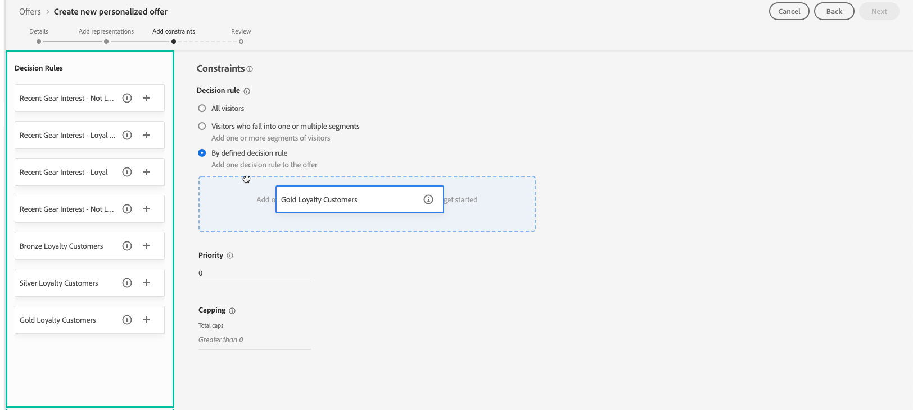

# 建立個人化優惠 {#creating-personalized-offers}

建立優惠方案之前，請確定您已建立：

* 將顯示優惠方案的&#x200B;**placement**。 請參閱[建立版位](../offer-library/creating-placements.md)
* **決策規則**&#x200B;將定義要呈現選件的條件。 請參閱[建立決策規則](../offer-library/creating-decision-rules.md)。
* 您要與選件建立關聯的一或多個&#x200B;**標籤**。 請參閱[建立標籤](../offer-library/creating-tags.md)。

 [在影片中探索此功能](#video)

可在&#x200B;**[!UICONTROL Offers]**&#x200B;功能表存取個人化優惠方案清單。

## 建立選件{#create-offer}

若要建立&#x200B;**選件**，請執行下列步驟：

1. 按一下&#x200B;**[!UICONTROL Create offer]**，然後選擇&#x200B;**[!UICONTROL Personalized offer]**。

   

1. 指定選件的名稱，以及其開始和結束日期與時間。 您也可以將一或多個現有標籤與選件建立關聯，讓您更輕鬆搜尋及組織選件資料庫。

   

   >[!NOTE]
   >
   >**[!UICONTROL Offer attributes]**&#x200B;區段可讓您將索引鍵值配對與選件建立關聯，以用於報表和分析用途。

## 設定優惠方案的陳述 {#representations}

1. 使用&#x200B;**[!UICONTROL Add representation]**&#x200B;按鈕，為您的選件新增一或多個表示法。

   >[!NOTE]
   >
   >選件可顯示在訊息中的不同位置：在頂端橫幅中，以影像、段落中的文字、html區塊等形式顯示。 優惠方案表示得越多，在不同版位內容中使用優惠方案的機會就越多。

1. 對於每個表示，指定將顯示選件的&#x200B;**[!UICONTROL Channel]**&#x200B;和&#x200B;**[!UICONTROL Placement]**。

   

   **[!UICONTROL Browse]**&#x200B;按鈕可讓您篩選可用版位，並根據版位的頻道和/或內容類型加以篩選。

   

1. 將內容新增至來自Adobe Experience Cloud Assets資料庫或外部公用位置的每個呈現。

   * 若要從Adobe Experience Cloud Assets資料庫新增內容，請從左窗格將其拖曳至表示區域，然後指定要與&#x200B;**[!UICONTROL Destination link]**&#x200B;欄位中的內容建立關聯的URL。

      >[!NOTE]
      >
      >只能從左側面板的「資產選擇器」拖放內容。 只有與版位內容類型對應的內容可供使用。

      

   * 若要從外部公用位置新增內容，請按一下&#x200B;**[!UICONTROL Add content]**&#x200B;按鈕，然後指定要新增內容的名稱、URL和目的地連結。

      請確定新增的內容與選取版位的內容類型相對應。

      

   * 您也可以插入文字類型內容。 要執行此操作，請按一下&#x200B;**[!UICONTROL Add content]**&#x200B;按鈕，然後選取&#x200B;**[!UICONTROL Custom text]**&#x200B;選項。 在&#x200B;**[!UICONTROL Text]**&#x200B;欄位中，輸入要顯示在選件中的文字。

      >[!NOTE]
      >
      >此選項不適用於影像類型版位。

      

## 新增適用性規則和限制 {#eligibility}

適用性規則和限制可讓您定義要顯示優惠方案的條件。

1. 配置&#x200B;**[!UICONTROL Offer eligibility]**。 依預設，會選取&#x200B;**[!UICONTROL All visitors]**&#x200B;決策規則選項，這表示任何設定檔都有資格呈現選件。

   您可以將優惠方案的呈現方式限制為一或多個Adobe Experience Platform區段的成員。 要執行此操作，請啟動&#x200B;**[!UICONTROL Visitors who fall into one or multiple segments]**&#x200B;選項，然後從左窗格中添加一個或多個段，並使用&#x200B;**[!UICONTROL And]** / **[!UICONTROL Or]**&#x200B;邏輯運算子將它們組合起來。

   如需如何使用區段的詳細資訊，請參閱[分段服務檔案](https://experienceleague.adobe.com/docs/experience-platform/segmentation/home.html)。

   

   如果您想要將特定決策規則與選件建立關聯，請選取&#x200B;**[!UICONTROL By defined decision rule]**，然後從左窗格將所需規則拖曳至&#x200B;**[!UICONTROL Decision rule]**&#x200B;區域。 有關如何建立決策規則的詳細資訊，請參閱[此區段](../offer-library/creating-decision-rules.md)。

   

1. 如果使用者符合多個選件的資格，請定義選件的&#x200B;**[!UICONTROL Priority]**，而非其他選件。 優惠方案的優先順序最高，與其他優惠方案相比其優先順序最高

1. 指定選件的&#x200B;**[!UICONTROL Capping]**，表示所有使用者總共會顯示該選件的次數。 如果已將選件傳送給所有使用者的次數超過您在此欄位中指定的次數，則其傳送將停止。

   >[!NOTE]
   >
   >系統會在準備電子郵件時計算建議某個優惠方案的次數。 例如，如果您準備包含多個優惠方案的電子郵件，無論是否有傳送電子郵件，這些數量都會計入您的次數上限中。
   >
   >如果刪除電子郵件傳送，或在傳送前再次進行準備，則會自動更新選件的上限值。

   

   在上述範例中：

   * 優先順序設為「50」，這表示優惠方案會在優先順序介於1到49之間的優惠方案之前，以及優先順序至少為51的優惠方案之後呈現。
   * 只有符合「金級忠誠客戶」決策規則的使用者才會考慮此優惠方案。
   * 每位使用者只會呈現一次選件。

## 檢閱優惠方案 {#review}

定義資格規則和限制後，即會顯示優惠方案屬性的摘要。 如果所有項目皆已正確設定，且您的選件已準備好呈現給使用者，請按一下「**[!UICONTROL Finish]**」，然後選取「**[!UICONTROL Save and approve]**」。

您也可以將優惠方案儲存為草稿，以便稍後編輯並核准。

選件會顯示在清單中，且狀態為&#x200B;**[!UICONTROL Live]**&#x200B;或&#x200B;**[!UICONTROL Draft]**，視您在上一個步驟中是否核准而定。

現在已可供使用者使用。 可以選擇它以顯示其屬性，並編輯或隱藏它。

建立選件後，您可以在清單中按一下其名稱以存取詳細資訊，並使用&#x200B;**[!UICONTROL Change log]**&#x200B;標籤監控對選件所做的所有變更（請參閱[監控選件和決策的變更](../get-started/user-interface.md#monitoring-changes)）。

## 教學課程影片 {#video}

>[!NOTE]
>
>此影片適用於以Adobe Experience Platform為基礎的Offer decisioning應用程式服務。 不過，它提供在Journey Optimizer內容中使用Offer的一般指引。

>[!VIDEO](https://video.tv.adobe.com/v/329375?quality=12)
