# 建立個人化優惠方案 {#create-personalized-offers}

>[!TIP]
>
>[!DNL Adobe Journey Optimizer]的全新決策功能「決策」現在可透過程式碼型體驗和電子郵件通道使用！ [進一步瞭解](../../experience-decisioning/gs-experience-decisioning.md)

建立優惠方案之前，請確定您已建立：

* 將顯示優惠方案的&#x200B;**位置**。 請參閱[建立版位](../offer-library/creating-placements.md)
* 如果您想要新增適用性條件： **決定規則**，它將定義優惠的呈現條件。 請參閱[建立決定規則](../offer-library/creating-decision-rules.md)。
* 您可能想要關聯至優惠方案的一或多個&#x200B;**集合限定詞** （先前稱為「標籤」）。 請參閱[建立集合限定詞](../offer-library/creating-tags.md)。

➡️ [在影片中探索此功能](#video)

可在&#x200B;**[!UICONTROL 優惠]**&#x200B;功能表中存取個人化優惠清單。

## 建立優惠方案 {#create-offer}

>[!CONTEXTUALHELP]
>id="ajo_decisioning_offer_details"
>title="優惠詳細資料"
>abstract="填寫優惠方案名稱及其開始和結束日期。 在這些日期之外，決策引擎將不會選取選件。"

>[!CONTEXTUALHELP]
>id="od_offer_attributes"
>title="關於優惠屬性"
>abstract="使用選件屬性，您可以將索引鍵值配對與選件建立關聯，以用於報表和分析。"

>[!CONTEXTUALHELP]
>id="ajo_decisioning_offer_attributes"
>title="優惠屬性"
>abstract="使用選件屬性，您可以將索引鍵值配對與選件建立關聯，以用於報表和分析。"

>[!CONTEXTUALHELP]
>id="ajo_decisioning_new_personalized"
>title="個人化優惠"
>abstract="個人化優惠是根據適用性規則和限制的可自訂訊息。"

若要建立&#x200B;**選件**，請遵循下列步驟：

1. 按一下&#x200B;**[!UICONTROL 建立優惠]**，然後選取&#x200B;**[!UICONTROL 個人化優惠]**。

   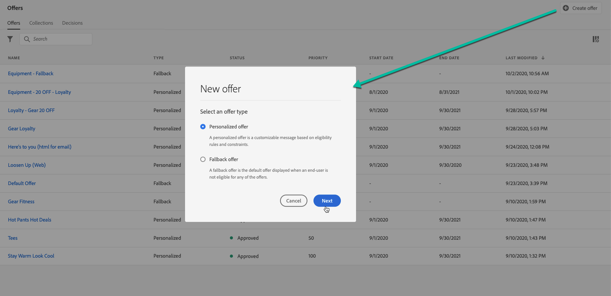

1. 指定優惠方案名稱及其開始和結束日期和時間。 在這些日期之外，決策引擎將不會選取選件。

   >[!NOTE]
   >
   >選取時間時，會考量您目前的時區。

   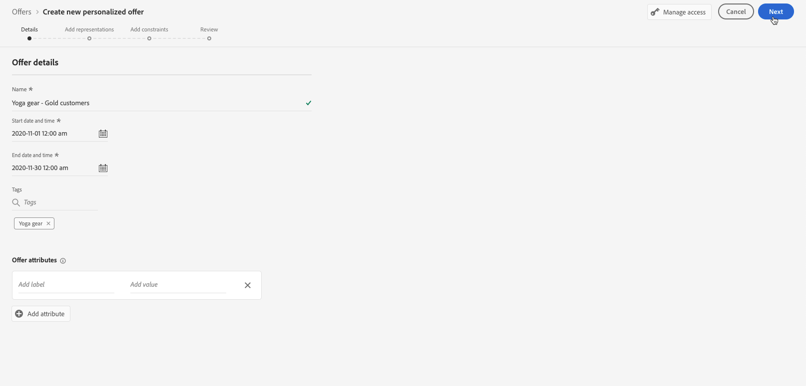

   >[!CAUTION]
   >
   >更新開始/結束日期可能會對上限產生影響。 [進一步瞭解](add-constraints.md#capping-change-date)

1. 您也可以將一或多個現有的&#x200B;**[!UICONTROL 集合限定詞]**&#x200B;關聯至優惠方案，讓您更輕鬆地搜尋及組織優惠方案庫。 [深入瞭解](creating-tags.md)。

1. **[!UICONTROL 選件屬性]**&#x200B;區段可讓您將索引鍵/值組與選件建立關聯，以用於報告和分析目的。

1. 若要指派自訂或核心資料使用標籤給優惠方案，請選取&#x200B;**[!UICONTROL 管理存取權]**。 [進一步瞭解物件層級存取控制(OLAC)](../../administration/object-based-access.md)

   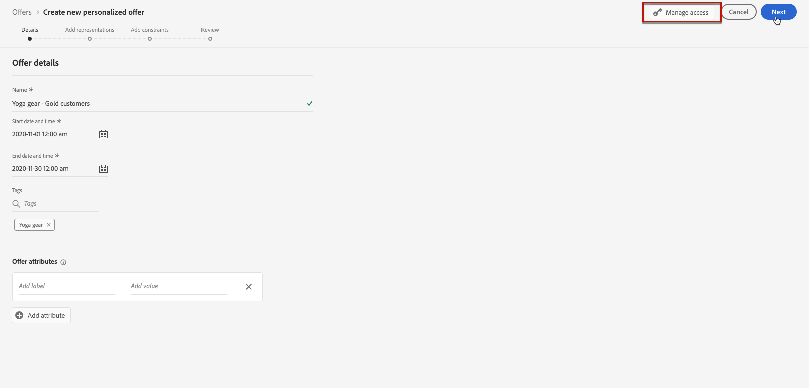

1. 新增代表以定義訊息中顯示優惠的位置。 [進一步瞭解](add-representations.md)

   個人化表示內容時，僅支援某些函式 — 請參閱個人化編輯器中的[支援函式](personalization-editor-supported-functions.md)。

   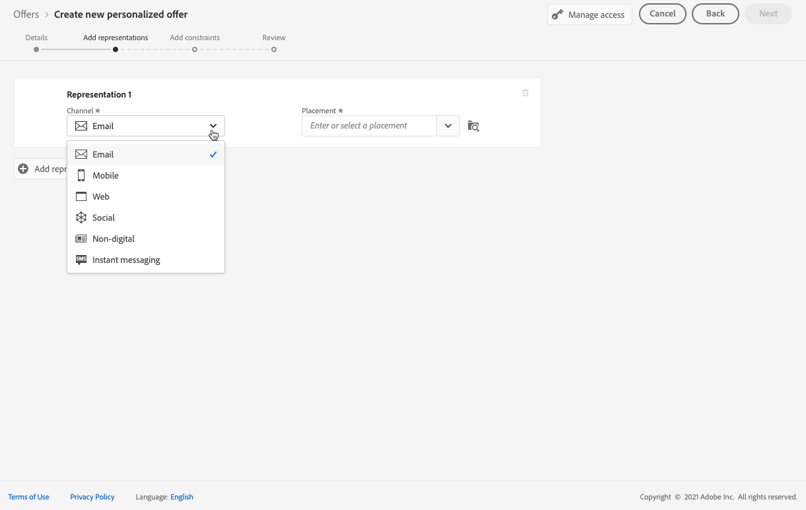

   >[!CAUTION]
   >
   >優惠方案（包括其所有表示）的大小不得超過300KB。

1. 新增限制以設定要顯示優惠的條件。 [進一步瞭解](add-constraints.md)

   >[!NOTE]
   >
   >當您選取對象或決定規則時，您可以檢視有關預估合格設定檔的資訊。 按一下&#x200B;**[!UICONTROL 重新整理]**&#x200B;以更新資料。
   >
   >請注意，當規則引數包含不在設定檔中的資料（例如內容資料）時，設定檔預估無法使用。 例如，適用性規則要求目前天氣為≥80度。

   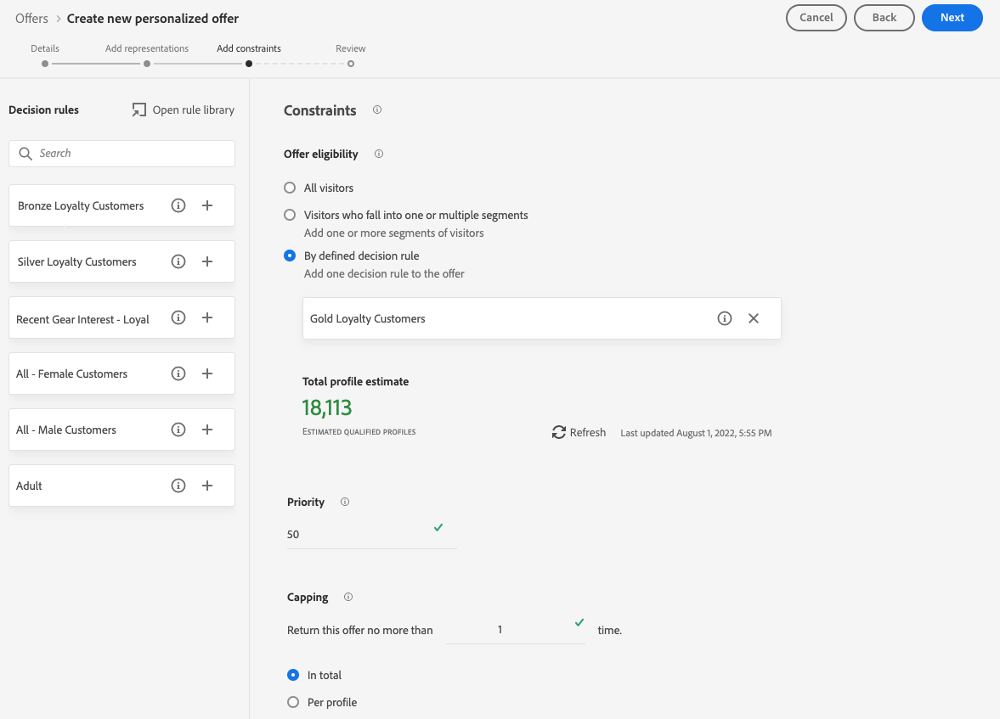

1. 檢閱並儲存選件。 [進一步瞭解](#review)

## 檢閱選件 {#review}

定義適用性規則和限制後，就會顯示優惠方案屬性的摘要。

1. 請確定所有專案皆已正確設定。

1. 您可以顯示預估合格設定檔的相關資訊。 按一下&#x200B;**[!UICONTROL 重新整理]**&#x200B;以更新資料。

   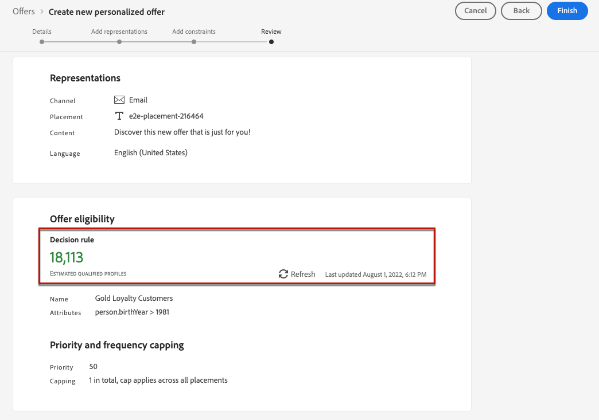

1. 當您的選件已準備好呈現給使用者時，請按一下&#x200B;**[!UICONTROL 完成]**。

1. 選取&#x200B;**[!UICONTROL 儲存並核准]**。

   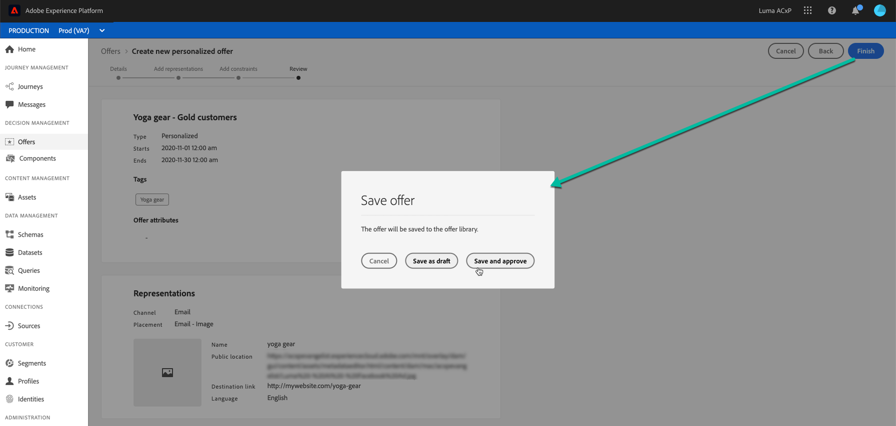

   您也可以將優惠方案儲存為草稿，以便稍後編輯及核准。

視您在上一步中是否核准而定，選件會顯示在具有&#x200B;**[!UICONTROL 已核准]**&#x200B;或&#x200B;**[!UICONTROL 草稿]**&#x200B;狀態的清單中。

現在已準備好傳送給使用者。

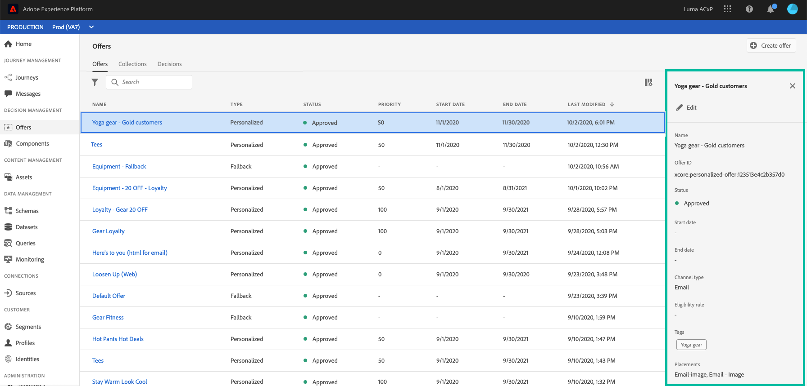

## 管理優惠方案 {#offer-list}

從選件清單中，您可以選取選件以顯示其屬性。 您也可以編輯它、變更其狀態（**草稿**、**已核准**、**已封存**）、複製選件或刪除它。

選取「**[!UICONTROL 編輯]**」按鈕以返回優惠方案版本模式，您可以在其中修改優惠方案的[詳細資料](#create-offer)、[代表](add-representations.md#representations)，以及編輯[適用性規則和限制](add-constraints.md#eligibility)。

選取核准的優惠方案，然後按一下[復原核准]，將優惠方案狀態設定回[草稿]。********

若要再次將狀態設定為&#x200B;**[!UICONTROL 已核准]**，請選取現在顯示的對應按鈕。

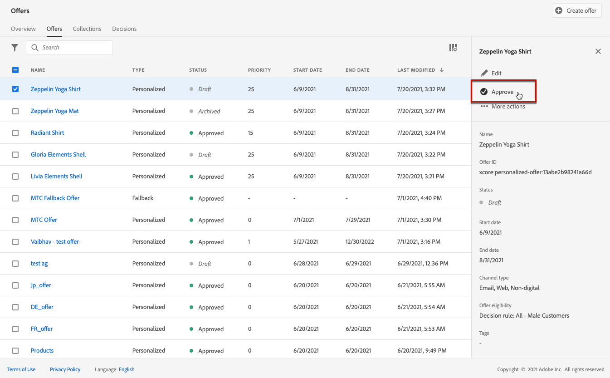

**[!UICONTROL 其他動作]**&#x200B;按鈕可啟用下列動作。

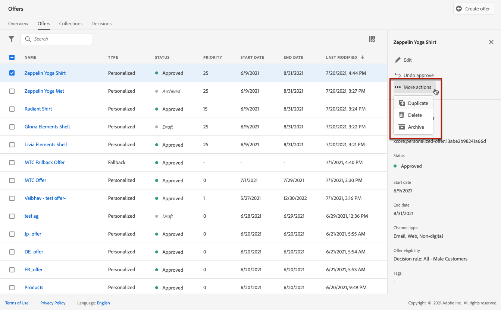

* **[!UICONTROL 重複]**：建立具有相同屬性、表示、適用規則和限制的優惠方案。 依預設，新選件具有&#x200B;**[!UICONTROL 草稿]**&#x200B;狀態。
* **[!UICONTROL 刪除]**：從清單移除選件。

  >[!CAUTION]
  >
  >將無法再存取選件及其內容。 此動作無法復原。
  >
  >如果優惠用於集合或決定中，則無法刪除該優惠。 您必須先從任何物件中移除選件。

* **[!UICONTROL 封存]**：將優惠方案狀態設為&#x200B;**[!UICONTROL 已封存]**。 清單中仍提供此優惠，但您無法將它的狀態設定回&#x200B;**[!UICONTROL 草稿]**&#x200B;或&#x200B;**[!UICONTROL 已核准]**。 您只能複製或刪除它。

您也可以選取對應的核取方塊，同時刪除或變更多個選件的狀態。

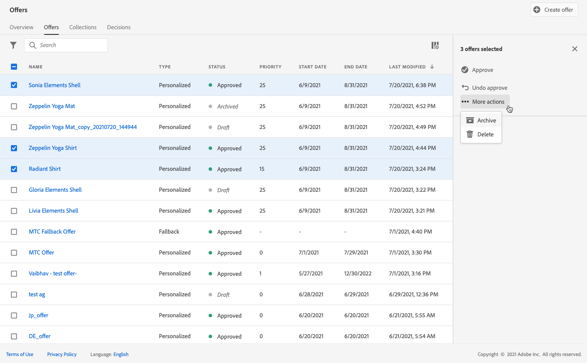

如果您想要變更具有不同狀態的數個選件的狀態，則只會變更相關狀態。

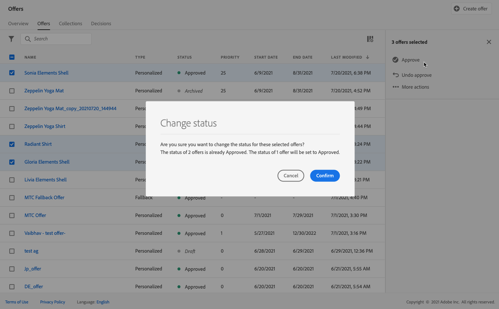

建立選件後，您就可以從清單中按一下其名稱。

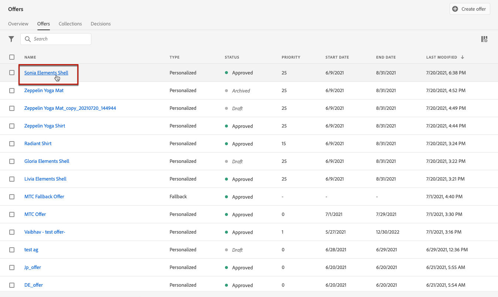

這可讓您存取該優惠方案的詳細資訊。 選取&#x200B;**[!UICONTROL 變更記錄]**&#x200B;索引標籤以[監視對選件所做的所有變更](../get-started/user-interface.md#changes-logs)。

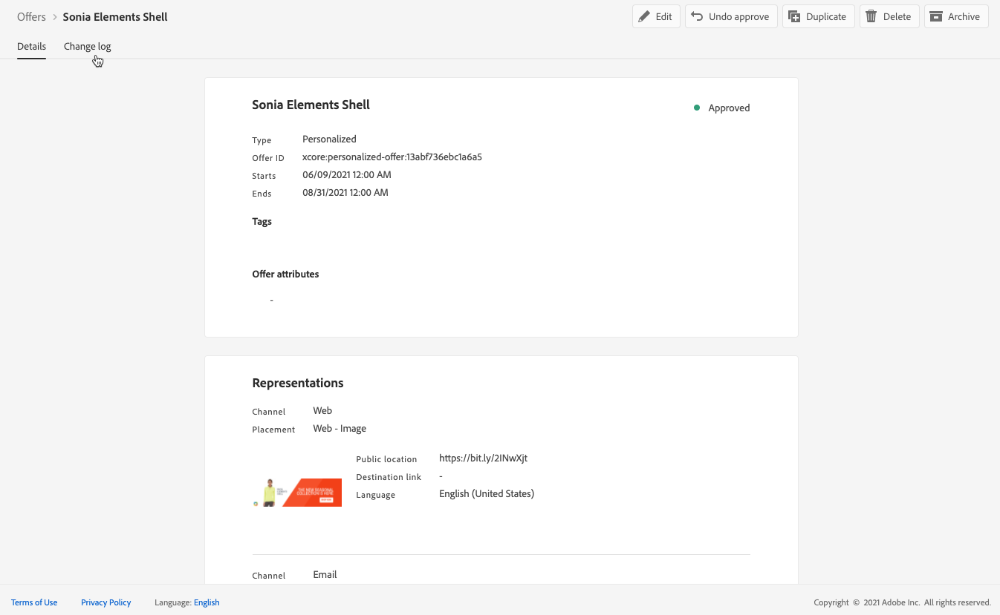

## 教學課程影片 {#video}

>[!VIDEO](https://video.tv.adobe.com/v/329375?quality=12)
