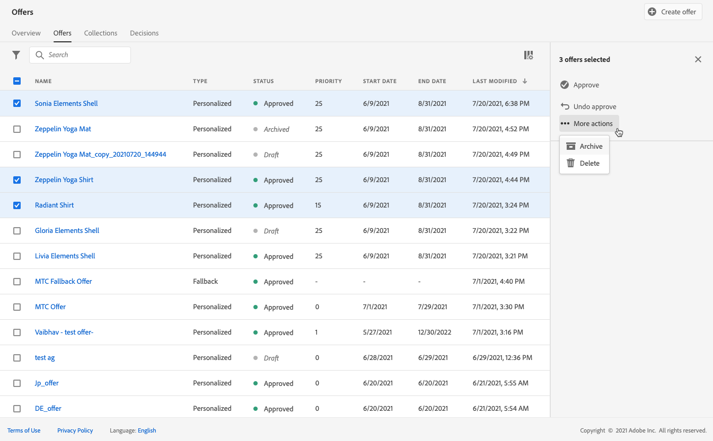
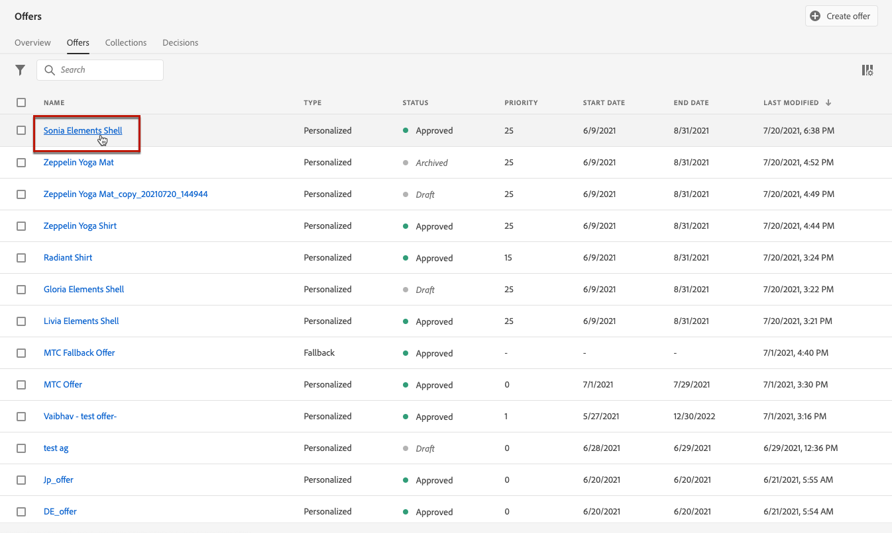

# 建立個人化優惠方案 {#create-personalized-offers}

建立優惠方案之前，請確定您已建立：

* A **刊登** 顯示選件的。 請參閱 [建立版位](../offer-library/creating-placements.md)
* 如果要新增資格條件：a **決策規則** 以定義將呈現選件的條件。 請參閱 [建立決策規則](../offer-library/creating-decision-rules.md).
* 一或多個 **標籤** 您可能想要與選件建立關聯。 請參閱 [建立標籤](../offer-library/creating-tags.md).

➡️ [在影片中探索此功能](#video)

個人化優惠方案清單可在 **[!UICONTROL Offers]** 功能表。

## 建立優惠方案 {#create-offer}

>[!CONTEXTUALHELP]
>id="od_offer_attributes"
>title="關於選件屬性"
>abstract="使用選件屬性時，您可以為報表和分析目的，將索引鍵值配對與選件建立關聯。"

>[!CONTEXTUALHELP]
>id="ajo_decisioning_offer_attributes"
>title="選件屬性"
>abstract="使用選件屬性時，您可以為報表和分析目的，將索引鍵值配對與選件建立關聯。"

若要建立 **優惠方案**，請遵循下列步驟：

1. 按一下 **[!UICONTROL Create offer]**，然後選取 **[!UICONTROL Personalized offer]**.

   

1. 指定選件的名稱，以及其開始和結束日期與時間。 在這些日期以外，決策引擎將不會選取選件。

   

   >[!CAUTION]
   >
   >更新開始/結束日期可能會影響上限設定。 [深入了解](add-constraints.md#capping-change-date)

1. 您也可以關聯一或多個現有 **[!UICONTROL tags]** ，讓您更輕鬆搜尋和組織優惠方案庫。 [深入了解](creating-tags.md).

1. 此 **[!UICONTROL Offer attributes]** 區段可讓您為報表和分析目的，將索引鍵值配對與選件建立關聯。

1. 若要將自訂或核心資料使用量標籤指派給優惠方案，請選取 **[!UICONTROL Manage access]**. [進一步了解物件層級存取控制(OLAC)](../../administration/object-based-access.md)

   

1. 新增表示法以定義您的選件在訊息中的顯示位置。 [深入了解](add-representations.md)

   

1. 新增限制以設定要顯示的選件的條件。 [深入了解](add-constraints.md)

   >[!NOTE]
   >
   >選取區段或決策規則時，您可以看到預估合格設定檔的相關資訊。 按一下 **[!UICONTROL Refresh]** 更新資料。
   >
   >請注意，當規則參數包含不在設定檔中的資料（例如內容資料）時，設定檔估計將無法使用。 例如，適用性規則要求目前的天氣為≥80度。

   

1. 檢閱並儲存選件。 [深入了解](#review)

## 檢閱優惠方案 {#review}

定義資格規則和限制後，即會顯示優惠方案屬性的摘要。

1. 請確定所有項目皆已正確設定。

1. 您可以顯示預估合格設定檔的資訊。 按一下 **[!UICONTROL Refresh]** 更新資料。

   

1. 當您的優惠方案準備好呈現給使用者時，請按一下 **[!UICONTROL Finish]**.

1. 選擇 **[!UICONTROL Save and approve]**.

   

   您也可以將優惠方案儲存為草稿，以便稍後編輯並核准。

選件會顯示在清單中，且 **[!UICONTROL Approved]** 或 **[!UICONTROL Draft]** 狀態，取決於您在上一步驟中是否核准。

現在已可供使用者使用。

## 管理優惠方案 {#offer-list}

您可以從選件清單中選取要顯示其屬性的選件。 您也可以編輯它、變更其狀態(**草稿**, **已核准**, **已封存**)、複製選件或將其刪除。

選取 **[!UICONTROL Edit]** 按鈕，返回優惠方案版本模式，您可在其中修改優惠方案的 [詳細資訊](#create-offer), [表示](#representations)，以及編輯 [適用性規則與限制](#eligibility).

選取已核准的優惠方案，然後按一下 **[!UICONTROL Undo approve]** 將優惠方案狀態設回 **[!UICONTROL Draft]**.

將狀態再次設定為 **[!UICONTROL Approved]**，請選取現在顯示的對應按鈕。

此 **[!UICONTROL More actions]** 按鈕可啟用以下說明的動作。

* **[!UICONTROL Duplicate]**:建立具有相同屬性、表示、適用性規則和限制的優惠方案。 依預設，新選件具有 **[!UICONTROL Draft]** 狀態。
* **[!UICONTROL Delete]**:從清單中移除選件。

   >[!CAUTION]
   >
   >優惠方案及其內容將無法再存取。 此動作無法復原。
   >
   >如果在集合或決策中使用選件，則無法刪除選件。 您必須先從任何物件中移除選件。

* **[!UICONTROL Archive]**:將優惠方案狀態設為 **[!UICONTROL Archived]**. 選件仍可從清單中取得，但您無法將其狀態設回 **[!UICONTROL Draft]** 或 **[!UICONTROL Approved]**. 您只能複製或刪除它。

您也可以選取對應的核取方塊，以同時刪除或變更多個選件的狀態。

如果您想要變更多個狀態不同之優惠方案的狀態，則只會變更相關狀態。

建立選件後，您就可以從清單按一下其名稱。

這可讓您存取該選件的詳細資訊。 選取 **[!UICONTROL Change log]** 標籤 [監視所有更改](../get-started/user-interface.md#monitoring-changes) 已經向你提出了。

## 教學課程影片 {#video}

>[!VIDEO](https://video.tv.adobe.com/v/329375?quality=12)
