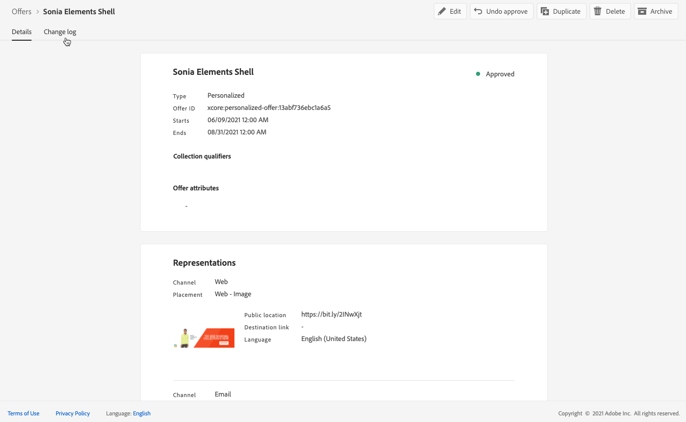

# 建立個人化優惠方案 {#create-personalized-offers}

在建立聘用前，請確保已建立：

* A **放置** 顯示要約。 請參閱 [建立放置](../offer-library/creating-placements.md)
* 如果要添加資格條件：a **決策規則** 將定義提出要約的條件。 請參閱 [建立決策規則](../offer-library/creating-decision-rules.md)。
* 一個或多個 **收集限定詞** （以前稱為「標籤」），您可能希望與要約關聯。 請參閱 [建立收集限定詞](../offer-library/creating-tags.md)。

➡️ [在影片中探索此功能](#video)

您可以在 **[!UICONTROL 優惠]** 的子菜單。

## 建立優惠方案 {#create-offer}

>[!CONTEXTUALHELP]
>id="od_offer_attributes"
>title="關於優惠屬性"
>abstract="有了優惠屬性，您可以將索引鍵值組與優惠相關聯以用於報告和分析。"

>[!CONTEXTUALHELP]
>id="ajo_decisioning_offer_attributes"
>title="優惠屬性"
>abstract="有了優惠屬性，您可以將索引鍵值組與優惠相關聯以用於報告和分析。"

建立 **提供**，請執行以下步驟：

1. 按一下 **[!UICONTROL 建立優惠]**，然後選擇 **[!UICONTROL 個性化服務]**。

   

1. 指定聘用的名稱及其開始和結束日期和時間。 在這些日期之外，決策引擎將不會選擇優惠。

   

   >[!CAUTION]
   >
   >更新開始/結束日期可能會影響上限設定。 [了解更多](add-constraints.md#capping-change-date)

1. 您還可以關聯一個或多個現有 **[!UICONTROL 收集限定詞]** 可讓您更輕鬆地搜索和組織服務庫。 [了解更多](creating-tags.md)。

1. 的 **[!UICONTROL 提供屬性]** 部分允許您將鍵值對與報價關聯，以便用於報告和分析。

1. 要將自定義或核心資料使用標籤分配給優惠，請選擇 **[!UICONTROL 管理訪問]**。 [瞭解有關對象級訪問控制(OLAC)的詳細資訊](../../administration/object-based-access.md)

   

1. 新增表示方式以定義您的優惠在訊息中顯示的位置。[了解更多](add-representations.md)

   

1. 添加約束以設定要顯示的要約的條件。 [了解更多](add-constraints.md)

   >[!NOTE]
   >
   >當您選擇區段或決定規則時，您可以看到有關預估合格設定檔的資訊。按一下 **[!UICONTROL 刷新]** 更新資料。
   >
   >請注意，當規則參數包括不在配置檔案中的資料（如上下文資料）時，配置檔案估計不可用。 例如，要求當前天氣為≥80度的資格規則。

   

1. 查看並保存優惠。 [了解更多](#review)

## 查看優惠 {#review}

一旦定義了資格規則和約束，將顯示聘用屬性的摘要。

1. 確保所有內容都配置正確。

1. 您可以顯示有關估計的限定配置檔案的資訊。 按一下 **[!UICONTROL 刷新]** 更新資料。

   

1. 當您的產品可供向用戶展示時，按一下 **[!UICONTROL 完成]**。

1. 選擇 **[!UICONTROL 保存和批准]**。

   

   您還可以將聘用保存為草稿，以便稍後編輯和批准。

在清單中顯示聘用， **[!UICONTROL 已批准]** 或 **[!UICONTROL 草稿]** 狀態，具體取決於您在上一步中是否批准了它。

現在，它已準備好交付給用戶。

## 管理產品 {#offer-list}

從聘用清單中，您可以選擇聘用以顯示其屬性。 您還可以編輯它，更改它的狀態(**草稿**。 **已批准**。 **存檔**)、複製或刪除此選項。

選擇 **[!UICONTROL 編輯]** 按鈕，返回至「聘用版」模式，在該模式中您可以修改聘用 [詳細資訊](#create-offer)。 [表示](#representations)，以及編輯 [資格規則和約束](#eligibility)。

選擇批准的優惠，然後按一下 **[!UICONTROL 撤消審批]** 將聘用狀態設定回 **[!UICONTROL 草稿]**。

將狀態再次設定為 **[!UICONTROL 已批准]**，選擇現在顯示的相應按鈕。

的 **[!UICONTROL 更多操作]** 按鈕啟用下面描述的操作。

* **[!UICONTROL 重複]**:建立具有相同屬性、表示法、資格規則和約束的聘用。 預設情況下，新優惠 **[!UICONTROL 草稿]** 狀態。
* **[!UICONTROL 刪除]**:從清單中刪除優惠。

   >[!CAUTION]
   >
   >此服務及其內容將不再可訪問。 此動作無法復原。
   >
   >如果在集合或決策中使用要約，則不能刪除該要約。 必須首先從任何對象中刪除聘用。

* **[!UICONTROL 存檔]**:將聘用狀態設定為 **[!UICONTROL 存檔]**。 此優惠仍可從清單中獲得，但您無法將其狀態設定回 **[!UICONTROL 草稿]** 或 **[!UICONTROL 已批准]**。 您只能複製或刪除它。

您也可以通過選中相應的複選框同時刪除或更改多個優惠的狀態。

如果要更改多個狀態不同的聘用的狀態，則只更改相關狀態。

一旦建立了優惠，您就可以從清單中按一下其名稱。

這使您能夠訪問該服務的詳細資訊。 選擇 **[!UICONTROL 更改日誌]** 頁籤 [監視所有更改](../get-started/user-interface.md#monitoring-changes) 已經提出的。

## 教程視頻 {#video}

>[!VIDEO](https://video.tv.adobe.com/v/329375?quality=12)
