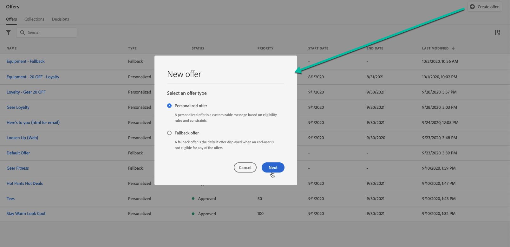
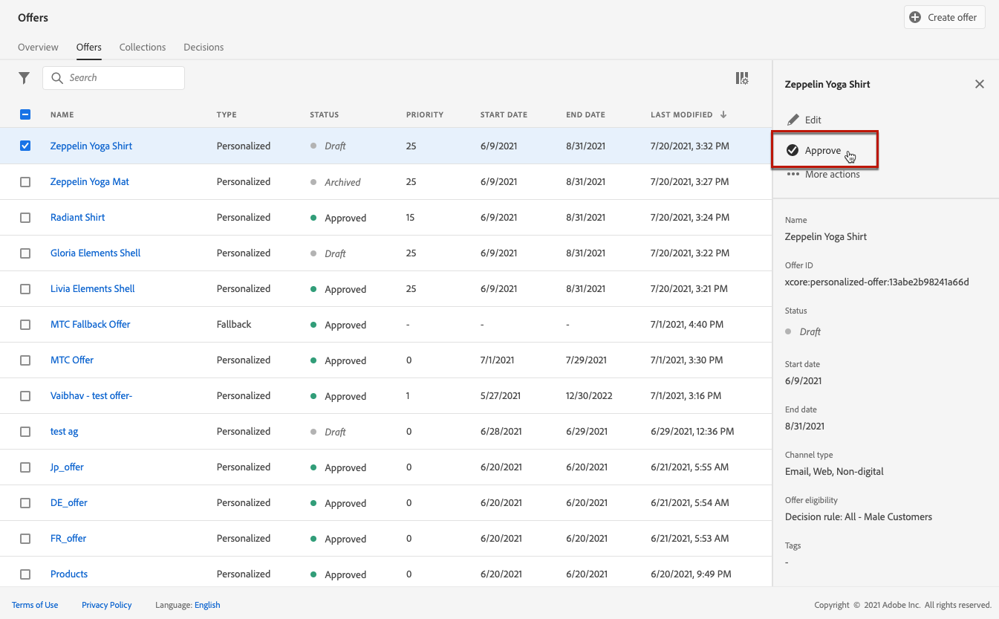

# 建立個人化優惠方案 {#create-personalized-offers}

建立優惠方案之前，請確定您已建立：

* A **刊登** 要顯示優惠方案的位置。 另請參閱 [建立版位](../offer-library/creating-placements.md)
* 如果您想要新增適用性條件：a **決定規則** 會定義優惠的呈現條件。 另請參閱 [建立決定規則](../offer-library/creating-decision-rules.md).
* 一或多個 **集合限定詞** （先前稱為「標籤」）建立關聯至優惠方案的標籤。 另請參閱 [建立集合限定詞](../offer-library/creating-tags.md).

➡️ [在影片中探索此功能](#video)

您可存取個人化優惠清單于 **[!UICONTROL 選件]** 功能表。

## 建立優惠方案 {#create-offer}

>[!CONTEXTUALHELP]
>id="od_offer_attributes"
>title="關於優惠屬性"
>abstract="有了優惠屬性，您可以將索引鍵值組與優惠相關聯以用於報告和分析。"

>[!CONTEXTUALHELP]
>id="ajo_decisioning_offer_attributes"
>title="優惠屬性"
>abstract="有了優惠屬性，您可以將索引鍵值組與優惠相關聯以用於報告和分析。"

若要建立 **優惠方案**，請遵循下列步驟：

1. 按一下 **[!UICONTROL 建立選件]**，然後選取 **[!UICONTROL 個人化優惠]**.

   

1. 指定優惠方案名稱及其開始和結束日期和時間。 在這些日期之外，決策引擎將不會選取選件。

   

   >[!CAUTION]
   >
   >更新開始/結束日期可能會對上限產生影響。 [了解更多](add-constraints.md#capping-change-date)

1. 您也可以關聯一或多個現有的 **[!UICONTROL 集合限定詞]** 至優惠方案，讓您更輕鬆地搜尋及組織優惠方案庫。 [了解更多](creating-tags.md)。

1. 此 **[!UICONTROL 優惠屬性]** 區段可讓您將索引鍵值配對與選件建立關聯，以用於報表和分析。

1. 若要指派自訂或核心資料使用標籤給選件，請選取「 」 **[!UICONTROL 管理存取權]**. [深入瞭解物件層級存取控制(OLAC)](../../administration/object-based-access.md)

   

1. 新增表示方式以定義您的優惠在訊息中顯示的位置。[了解更多](add-representations.md)

   

1. 新增限制以設定要顯示優惠的條件。 [了解更多](add-constraints.md)

   >[!NOTE]
   >
   >當您選取對象或決定規則時，您可以檢視有關預估合格設定檔的資訊。 按一下 **[!UICONTROL 重新整理]** 以更新資料。
   >
   >請注意，當規則引數包含不在設定檔中的資料（例如內容資料）時，設定檔預估無法使用。 例如，適用性規則要求目前天氣為≥80度。

   

1. 檢閱並儲存選件。 [了解更多](#review)

## 檢閱選件 {#review}

定義適用性規則和限制後，就會顯示優惠方案屬性的摘要。

1. 請確定所有專案皆已正確設定。

1. 您可以顯示預估合格設定檔的相關資訊。 按一下 **[!UICONTROL 重新整理]** 以更新資料。

   

1. 當您的選件已準備好呈現給使用者時，請按一下 **[!UICONTROL 完成]**.

1. 選取 **[!UICONTROL 儲存並核准]**.

   

   您也可以將優惠方案儲存為草稿，以便稍後編輯及核准。

選件會顯示在含有 **[!UICONTROL 已核准]** 或 **[!UICONTROL 草稿]** 狀態，取決於您是否在上一步驟中核准。

現在已準備好傳送給使用者。

## 管理優惠方案 {#offer-list}

從選件清單中，您可以選取選件以顯示其屬性。 您也可以編輯它，變更它的狀態(**草稿**， **已核准**， **已封存**)、複製選件或刪除它。

選取 **[!UICONTROL 編輯]** 按鈕以返回優惠方案版本模式，您可以在此修改優惠方案的 [詳細資料](#create-offer)， [表示方式](#representations)，並編輯 [適用規則和限制](#eligibility).

選取核准的優惠方案並按一下 **[!UICONTROL 還原核准]** 若要將優惠方案狀態設回 **[!UICONTROL 草稿]**.

若要再次將狀態設為 **[!UICONTROL 已核准]**，選取現在顯示的對應按鈕。

此 **[!UICONTROL 更多動作]** 按鈕可啟用下列動作。

* **[!UICONTROL 複製]**：建立具有相同屬性、表示、適用規則和限制的優惠方案。 依預設，新選件具有 **[!UICONTROL 草稿]** 狀態。
* **[!UICONTROL 刪除]**：從清單中移除選件。

  >[!CAUTION]
  >
  >將無法再存取選件及其內容。 此動作無法復原。
  >
  >如果優惠用於集合或決定中，則無法刪除該優惠。 您必須先從任何物件中移除選件。

* **[!UICONTROL 封存]**：將優惠方案狀態設為 **[!UICONTROL 已封存]**. 清單中仍提供此選件，但您無法將它的狀態設定回 **[!UICONTROL 草稿]** 或 **[!UICONTROL 已核准]**. 您只能複製或刪除它。

您也可以選取對應的核取方塊，同時刪除或變更多個選件的狀態。

如果您想要變更具有不同狀態的數個選件的狀態，則只會變更相關狀態。

建立選件後，您就可以從清單中按一下其名稱。

這可讓您存取該優惠方案的詳細資訊。 選取 **[!UICONTROL 變更記錄]** 定位至 [監視所有變更](../get-started/user-interface.md#monitoring-changes) 已對優惠方案執行的動作。

## 教學課程影片 {#video}

>[!VIDEO](https://video.tv.adobe.com/v/329375?quality=12)
