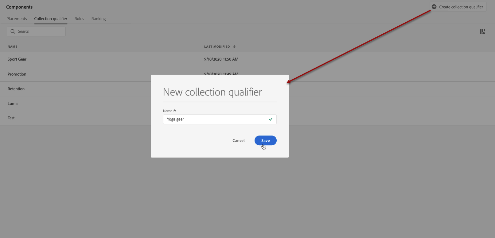
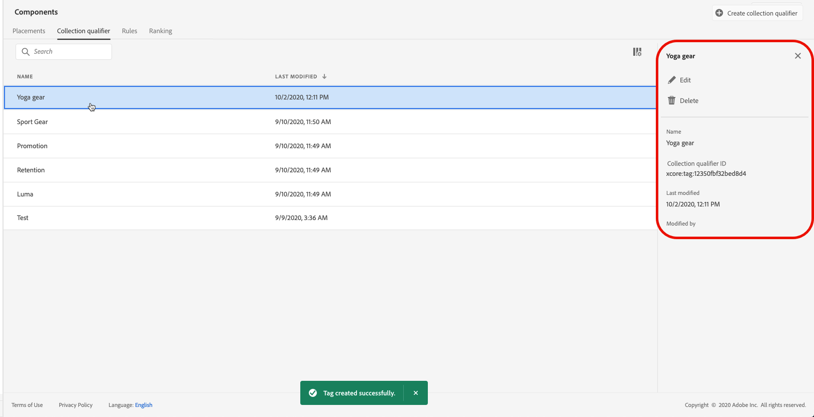

# 建立集合限定詞 {#create-tags}

>[!TIP]
>
>[!DNL Adobe Journey Optimizer] 的新決策功能「決策」現在可透過程式碼型體驗和電子郵件管道使用！[了解更多](../../experience-decisioning/gs-experience-decisioning.md)

>[!CONTEXTUALHELP]
>id="ajo_decisioning_offer_tags"
>title="集合限定詞"
>abstract="將一個或多個集合限定詞與產品建議相關聯，以保持您的產品建議庫井然有序並更輕鬆地找到產品建議。集合限定詞是從「元件」選單建立的。"

將系列限定詞（先前稱為「標籤」）與您的優惠方案建立關聯，可讓您更輕鬆地保持有條不紊的運作。 例如，您可以使用「黑色星期五」集合限定詞來標示「黑色星期五」優惠方案。 然後，您可以使用優惠資料庫中的搜尋功能，輕鬆找到所有具有該集合限定詞的優惠方案。

集合限定詞也可用來將優惠方案分組到優惠方案集合中。 請參閱[建立集合](../offer-library/creating-collections.md)。

➡️ [在影片中探索此功能](#video)

可在&#x200B;**[!UICONTROL 元件]**&#x200B;功能表中存取已建立的集合限定詞清單。

若要建立收集限定元，請遵循下列步驟：

1. 移至&#x200B;**[!UICONTROL 集合限定詞]**&#x200B;標籤，然後按一下&#x200B;**[!UICONTROL 建立集合限定詞]**。

1. 指定集合限定詞的名稱，然後按一下[儲存]。**&#x200B;**

   

1. 建立集合限定詞之後，它就會顯示在清單中。 您可以選取它以顯示其屬性，並編輯或隱藏它。

   

## 作法影片 {#video}

>[!VIDEO](https://video.tv.adobe.com/v/329374?quality=12)
