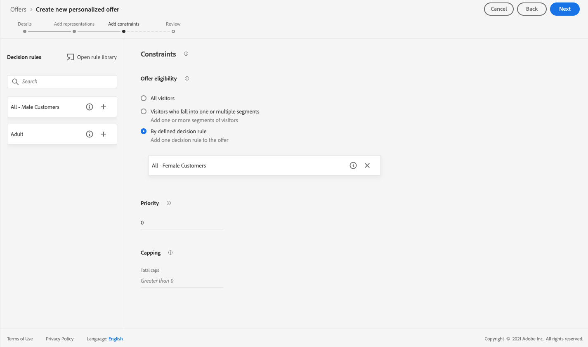

# 使用案例：設定個人化優惠以在電子郵件中使用 {#configure-add-personalized-offers-email}

本節提供端對端範例，說明如何根據您先前建立的決策，設定優惠方案並在電子郵件中使用優惠方案。

## 主要步驟

設定優惠方案、將優惠方案納入決策以及在電子郵件中運用此決策的關鍵步驟如下：

1. 建立優惠方案之前， [定義元件](#define-components)

   * 建立位置
   * 建立決定規則
   * 建立標籤
   * 建立排名（可選）

1. [設定優惠方案](#configure-offers)

   * 建立優惠方案
   * 對於每個選件：

      * 建立表示，並為每個表示選擇放置和資產
      * 為每個選件新增規則
      * 為每個選件定義優先順序

1. [建立遞補優惠](#create-fallback)

1. [建立集合](#create-collection) 納入您建立的個人化優惠方案

1. [設定決策](#configure-decision)

   * 建立決定
   * 選取您建立的版位
   * 為每個版位選取集合
   * 對於每個版位，選取排名（選用）
   * 選擇回退

1. [在電子郵件中插入決策](#insert-decision-in-email)

   * 選取符合您要顯示之優惠方案的版位
   * 從與所選位置相容的項目中選擇決策
   * 預覽優惠方案

在電子郵件中使用優惠方案的整體決策管理程式如下：

## 定義元件 {#define-components}

開始建立選件之前，您必須定義要在選件中使用的數個元件。

您會在 **[!UICONTROL Decision Management]** > **[!UICONTROL Components menu]**.

1. 從建立 **刊登** 來取得。

   定義優惠方案決策時，您將使用這些版位來定義結果優惠方案的顯示位置。

   在此範例中，建立三個版位，其中包含下列管道和內容類型：

   * *Web — 影像*
   * *電子郵件 — 影像*
   * *非數位 — 文字*

   

   建立版位的詳細步驟於 [本節](../../using/offers/offer-library/creating-placements.md).

1. 建立 **決策規則**.

   決策規則會為Adobe Experience Platform中的設定檔提供最佳選件。

   使用 **[!UICONTROL XDM Individual Profile > Person > Gender]** 屬性：

   * *女性客戶*
   * *男性客戶*

   

   建立規則的詳細步驟於 [本節](../../using/offers/offer-library/creating-decision-rules.md).

1. 您也可以建立 **標籤**.

   然後，您就能將選件與選件建立關聯，並使用此標籤將您的選件群組到集合中。

   在此範例中，建立 *瑜伽* 標籤。

   

   建立標籤的詳細步驟於 [本節](../../using/offers/offer-library/creating-tags.md).

1. 如果您想要定義規則，以決定應先針對指定版位呈現哪個優惠方案（而非考慮優惠方案的優先順序分數），您可以建立 **排名公式**.

   建立排名公式的詳細步驟於 [本節](../../using/offers/offer-library/create-ranking-formulas.md#create-ranking-formula).

   >[!NOTE]
   >
   >在此範例中，我們只會使用優先順序分數。 深入了解 [適用性規則與限制](../../using/offers/offer-library/creating-personalized-offers.md#eligibility).

## 設定優惠方案 {#configure-offers}

您現在可以建立和設定優惠方案。 在此範例中，您將建立四個要根據每個特定設定檔顯示的選件。

1. 建立優惠方案. 深入了解 [本節](../../using/offers/offer-library/creating-personalized-offers.md#create-offer).

1. 在此選件中，建立三個表示法。 每個表示都必須是您先前建立的版位與資產的組合：

   * 對應至 *Web — 影像* 刊登
   * 對應至 *電子郵件 — 影像* 刊登
   * 對應至 *非數位 — 文字* 刊登

   >[!NOTE]
   >
   >優惠方案可顯示在訊息中的不同位置，以建立更多機會，以便在不同版位內容中使用優惠方案。

   進一步了解 [本節](../../using/offers/offer-library/creating-personalized-offers.md#representations).

1. 為前兩個版位選取適當的影像。 輸入 *非數位 — 文字* 版位。

   

1. 在 **[!UICONTROL Offer eligibility]** 部分，選擇 **[!UICONTROL By defined decision rule]** 並拖放您所選擇的規則。

   

1. 填寫 **[!UICONTROL Priority]**. 在此範例中，新增 *25*.

1. 檢閱您的優惠方案，然後按一下 **[!UICONTROL Save and approve]**.

   

1. 在此範例中，使用相同表示法建立另外三個選件，但使用不同的資產。 以不同的規則和優先順序指派給使用者，例如：

   * 第一個選件 — 決策規則： *女性客戶*，優先順序： *25*
   * 第二個選件 — 決策規則： *女性客戶*，優先順序： *15*
   * 第三個選件 — 決策規則： *男性客戶*，優先順序： *25*
   * 第四個優惠方案 — 決策規則： *男性客戶*，優先順序： *15*

   

建立和設定選件的詳細步驟於 [本節](../../using/offers/offer-library/creating-personalized-offers.md).

## 建立遞補優惠 {#create-fallback}

1. 建立遞補優惠.

1. 為選件定義相同的表示法，並搭配適當的資產（這些表示法應與選件中使用的表示法不同）。

   每個表示都必須是您先前建立的版位與資產的組合：

   * 對應至 *Web — 影像* 刊登
   * 對應至 *電子郵件 — 影像* 刊登
   * 對應至 *非數位 — 文字* 刊登

   

1. 檢閱您的備援優惠方案，然後按一下 **[!UICONTROL Save and approve]**.

您的備援優惠方案現在已準備好用於決策。

建立和設定備援優惠方案的詳細步驟於 [本節](../../using/offers/offer-library/creating-fallback-offers.md).

## 建立集合 {#create-collection}

設定決策時，您需要將個人化優惠方案新增為集合的一部分。

1. 若要加速決策程式，請建立動態集合。

1. 使用 *瑜伽* 標籤來選取您先前建立的四個個人化選件。

   

建立集合的詳細步驟於 [本節](../../using/offers/offer-library/creating-collections.md).

## 設定決策 {#configure-decision}

現在，您必須建立決策，將版位與您剛建立的個人化優惠方案和備援優惠方案結合。

此組合將供Offer decisioning引擎用來尋找特定設定檔的最佳選件：在此範例中，它將以您指派給每個選件的優先順序和決策規則為基礎。

若要建立和設定優惠方案決策，請遵循下列主要步驟：

1. 建立決定. 深入了解 [本節](../../using/offers/offer-activities/create-offer-activities.md#create-activity).

1. 選取 *Web — 影像*, *電子郵件 — 影像* 和 *非數位 — 文字* 版位。

   

1. 對於每個版位，新增您建立的集合。

   

1. 如果您定義排名的時機 [建立元件](#define-components)，您可以將其指派給決策中的版位。 如果有多個優惠方案符合在此版位中呈現的資格，決策會使用此公式計算要先傳送的優惠方案。

   將排名公式指派給版位的詳細步驟於 [本節](../../using/offers/offer-activities/configure-offer-selection.md#assign-ranking-formula).

1. 選取您建立的備援優惠方案。 它會顯示為三個所選版位的可用後援優惠方案。

   

1. 檢閱您的決定，然後按一下 **[!UICONTROL Save and approve]**.

   

您的決策現在已準備好用於提供最佳化和個人化的優惠方案。

建立和設定決策的詳細步驟如下： [本節](../../using/offers/offer-activities/create-offer-activities.md).

## 在電子郵件中插入決策 {#insert-decision-in-email}

現在您的決策已上線，您可以將其插入電子郵件訊息中。 要執行此操作，請遵循下列步驟：

1. 建立您的電子郵件，然後開啟 [電子郵件設計工具](../../using/design-emails.md) 來設定其內容。

1. 從左側浮動視窗新增結構元件。

1. 新增 **[!UICONTROL Offer decision]** 內容元件。 了解如何在 [本節](../../using/content-components.md).

   

1. 請選取模式。在右側浮動視窗中，按一下 **[!UICONTROL Select offer decision]** 來新增決策。

   

1. 選取與您要從 **[!UICONTROL Placements]** 下拉式清單。

   在此案例中，根據您先前在此範例中建立的版位，僅 **電子郵件 — 影像** 您想在電子郵件中使用決策時，就可使用版位。 深入了解 [建立版位](../../using/offers/offer-library/creating-placements.md).

   

1. 符合的決策 **電子郵件 — 影像** 位置。 選取要在內容元件中使用的決策，然後按一下 **[!UICONTROL Add]**.

   

   >[!NOTE]
   >
   >只有與所選位置相容的決策才會顯示在清單中。

您現在可以在電子郵件設計工具中看到所有個人化優惠方案，以及後援優惠方案正在視覺化。

使用 **[!UICONTROL Offers]** 區段或內容元件箭頭（向右和向左箭頭）來瀏覽資料。 您也可以使用客戶設定檔來顯示屬於決策一部分的不同選件。 深入了解 [本節](../../using/deliver-personalized-offers.md#preview-offers-in-email).

儲存變更後及發佈訊息後，您的選件就可以在歷程中傳送訊息時，顯示給相關設定檔。

**相關主題：**

* 了解如何在中檢查訊息預覽 [本節](../../using/preview.md#preview-your-messages).

* 了解如何在 [本節](../../using/publish-manage-message.md).

* 了解中一或多個歷程如何觸發訊息 [本節](../building-journeys/journey.md).

<!--
* Learn how to measure your offer's success and impact on your targeted audience with reports in [this section](../reports/journey-global-report.md).
-->

