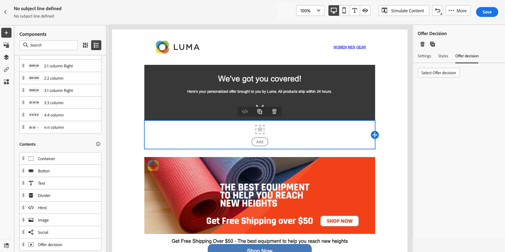

# 使用案例：設定個人化優惠以在電子郵件中使用 {#configure-add-personalized-offers-email}

本節將提供一個端到端示例，說明如何根據您以前建立的決定配置優惠並在電子郵件中使用這些優惠。

## 主要步驟 {#main-steps}

以下列出了配置優惠、將其納入決策以及在電子郵件中利用此決定的關鍵步驟：

1. 在建立優惠之前， [定義元件](#define-components)

   * 建立位置
   * 建立決定規則
   * 建立標籤
   * 建立排名（可選）

1. [配置優惠](#configure-offers)

   * 建立優惠
   * 對於每項服務：

      * 建立表示法，並為每個表示法選擇放置和資產
      * 為每個優惠添加規則
      * 為每個優惠定義優先順序

1. [建立遞補優惠](#create-fallback)

1. [建立集合](#create-collection) 包括您建立的個性化服務

1. [配置決策](#configure-decision)

   * 建立決定
   * 選擇您建立的放置
   * 對於每個放置，選擇集合
   * 對於每個位置，選擇一個排名（可選）
   * 選擇回退

1. [在電子郵件中插入決定](#insert-decision-in-email)

   * 選擇與要顯示的優惠匹配的位置
   * 從與所選放置相容的項目中選擇決策
   * 預覽您的優惠

在電子郵件中使用優惠的總體決策管理流程可描述如下：

## 定義元件 {#define-components}

在開始建立聘用之前，必須定義幾個要在聘用中使用的元件。

你會在 **[!UICONTROL Decision Management]** > **[!UICONTROL Components menu]**。

1. 從建立開始 **植入** 你的報價。

   在定義聘用決策時，您將使用這些放置來定義結果聘用的顯示位置。

   在本示例中，使用以下渠道和內容類型建立三個放置：

   * *Web — 影像*
   * *電子郵件 — 映像*
   * *非數字 — 文本*

   

   有關建立放置的詳細步驟，請參見 [此部分](../../using/offers/offer-library/creating-placements.md)。

1. 建立 **決策規則**。

   決策規則將為Adobe Experience Platform的個人資料提供最佳報價。

   使用 **[!UICONTROL XDM Individual Profile > Person > Gender]** 屬性：

   * *女性客戶*
   * *男性客戶*

   

   有關建立規則的詳細步驟，請參見 [此部分](../../using/offers/offer-library/creating-decision-rules.md)。

1. 也可以建立 **標籤**。

   然後，您將能夠將其與您的優惠相關聯，並使用此標籤將您的優惠組合到一個集合中。

   在此示例中，建立 *瑜伽* 標籤。

   

   有關建立標籤的詳細步驟，請參見 [此部分](../../using/offers/offer-library/creating-tags.md)。

1. 如果要定義規則，確定應首先為給定的職位提供哪個聘用（而不是考慮聘用的優先順序分數），您可以建立 **排序公式**。

   有關建立排名公式的詳細步驟，請參見 [此部分](../../using/offers/offer-library/create-ranking-formulas.md#create-ranking-formula)。

   >[!NOTE]
   >
   >在本例中，我們只使用優先順序分數。 瞭解更多 [資格規則和約束](../../using/offers/offer-library/creating-personalized-offers.md#eligibility)。

## 配置優惠 {#configure-offers}

您現在可以建立和配置您的優惠。 在本示例中，您將建立四個要根據每個特定配置檔案顯示的優惠。

1. 建立優惠方案. 瞭解詳情 [此部分](../../using/offers/offer-library/creating-personalized-offers.md#create-offer)。

1. 在此產品中，建立三個表示法。 每個表示必須是先前建立的放置與資產的組合：

   * 對應於 *Web — 影像* 放置
   * 對應於 *電子郵件 — 映像* 放置
   * 對應於 *非數字 — 文本* 放置

   >[!NOTE]
   >
   >在消息中的不同位置可以顯示一個要約，以建立更多機會在不同的放置上下文中使用該要約。

   瞭解有關中的表示法的更多資訊 [此部分](../../using/offers/offer-library/creating-personalized-offers.md#representations)。

1. 為前兩個放置選擇適當的影像。 為 *非數字 — 文本* 的下界。

   

1. 在 **[!UICONTROL Offer eligibility]** 選擇 **[!UICONTROL By defined decision rule]** 拖放你選擇的規則。

   

1. 填寫 **[!UICONTROL Priority]**。 在此示例中，添加 *25*。

1. 查看您的服務，然後按一下 **[!UICONTROL Save and approve]**。

   

1. 在本示例中，使用相同的表示法建立另外三個產品，但不同的資產。 使用不同的規則和優先順序分配它們，例如：

   * 第一項優惠 — 決策規則： *女性客戶*，優先順序： *25*
   * 第二項服務 — 決策規則： *女性客戶*，優先順序： *15*
   * 第三項服務 — 決策規則： *男性客戶*，優先順序： *25*
   * 第四項服務 — 決策規則： *男性客戶*，優先順序： *15*

   

有關建立和配置服務的詳細步驟，請參見 [此部分](../../using/offers/offer-library/creating-personalized-offers.md)。

## 建立遞補優惠 {#create-fallback}

1. 建立遞補優惠.

1. 定義與聘用相同的表示形式，並具有相應的資產（它們應與聘用中使用的不同）。

   每個表示必須是先前建立的放置與資產的組合：

   * 對應於 *Web — 影像* 放置
   * 對應於 *電子郵件 — 映像* 放置
   * 對應於 *非數字 — 文本* 放置

   

1. 查看備用優惠，然後按一下 **[!UICONTROL Save and approve]**。

您的備用優惠現已準備好用於決策。

有關建立和配置備用優惠的詳細步驟，請參見 [此部分](../../using/offers/offer-library/creating-fallback-offers.md)。

## 建立集合 {#create-collection}

在配置決策時，您需要將您的個性化優惠添加為集合的一部分。

1. 要加快決策過程，請建立動態集合。

1. 使用 *瑜伽* 標籤以選擇您先前建立的四個個性化優惠。

   

有關建立集合的詳細步驟，請參見 [此部分](../../using/offers/offer-library/creating-collections.md)。

## 配置決策 {#configure-decision}

現在，您必須建立一個決策，該決策將放置與您剛剛建立的個性化優惠和備用優惠結合起來。

此組合將由Offer decisioning引擎用於為特定配置檔案找到最佳服務：在本示例中，它將基於分配給每個優惠的優先順序和決策規則。

要建立和配置優惠決定，請執行以下主要步驟：

1. 建立決定. 瞭解詳情 [此部分](../../using/offers/offer-activities/create-offer-activities.md#create-activity)。

1. 選擇 *Web — 影像*。 *電子郵件 — 映像* 和 *非數字 — 文本* 的下界。

   

1. 對於每個放置，添加您建立的集合。

   

1. 如果定義了排名 [構建元件](#define-components)，可將其分配給決策中的位置。 如果多份報價符合在此配售中提交的條件，則此決定將使用此公式計算先交付哪份報價。

   有關將排名公式分配給放置的詳細步驟，請參見 [此部分](../../using/offers/offer-activities/configure-offer-selection.md#assign-ranking-formula)。

1. 選擇您建立的回退優惠。 它將顯示為三個選定放置的可用回退優惠。

   

1. 查看您的決定，然後按一下 **[!UICONTROL Save and approve]**。

   

您的決定現在已準備好用於提供優化和個性化的服務。

有關建立和配置決策的詳細步驟，請參見 [此部分](../../using/offers/offer-activities/create-offer-activities.md)。

## 在電子郵件中插入決定 {#insert-decision-in-email}

既然您的決定是即時的，您可以將其插入電子郵件。 要執行此操作，請遵循下列步驟：

1. 建立電子郵件，然後開啟 [電子郵件設計器](../../using/design/design-emails.md) 配置其內容。

1. 從左側調色板添加結構元件。

1. 添加 **[!UICONTROL Offer decision]** 內容元件。 瞭解如何在 [此部分](../../using/design/content-components.md)。

   

1. 請選取模式。在右調色板中，按一下 **[!UICONTROL Select offer decision]** 以添加決定。

   

1. 從中選擇與要顯示的優惠相對應的位置 **[!UICONTROL Placements]** 下拉清單。

   在本例中，從先前作為本示例一部分建立的位置，僅 **電子郵件 — 映像** 在電子郵件中使用此決定時，位置即可用。 瞭解更多 [建立放置](../../using/offers/offer-library/creating-placements.md)。

   

1. 與 **電子郵件 — 映像** 的下界。 選擇要在內容元件中使用的決定，然後按一下 **[!UICONTROL Add]**。

   

   >[!NOTE]
   >
   >清單中只顯示與所選放置相容的決定。

您現在可以在電子郵件設計器中看到所有個性化優惠和備用優惠。

使用 **[!UICONTROL Offers]** 或內容元件箭頭（右箭頭和左箭頭）來瀏覽資料。 您還可以顯示客戶配置檔案中決策的不同優惠。 瞭解詳情 [此部分](../../using/design/deliver-personalized-offers.md#preview-offers-in-email)。

保存更改後，一旦發佈消息，您的優惠就可以在將消息作為行程的一部分發送時顯示在相關配置檔案中。

>[!NOTE]
>
>更新聘用、回退聘用、聘用集合或聘用決策時，該決策在 [出版](../../using/messages/publish-manage-message.md) 消息，更新現在自動反映在相應消息中，而不需要重新發佈。

**相關主題：**

* 瞭解如何在中檢查郵件預覽 [此部分](../../using/design/preview.md#preview-your-messages)。

* 瞭解如何在 [此部分](../../using/messages/publish-manage-message.md)。

* 瞭解消息如何由中的一個或多個行程觸發 [此部分](../building-journeys/journey.md)。

<!--
* Learn how to measure your offer's success and impact on your targeted audience with reports in [this section](../reports/journey-global-report.md).
-->

