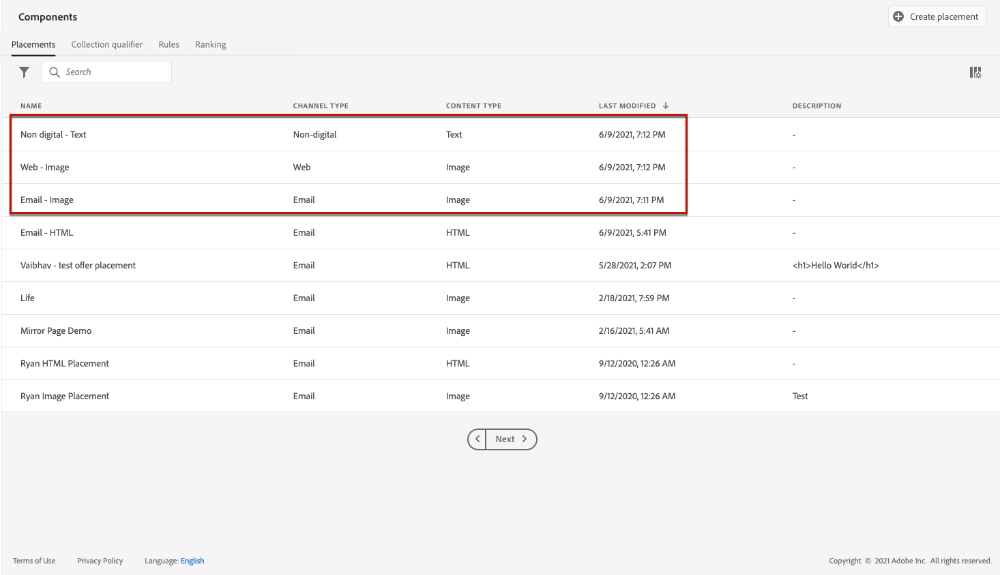
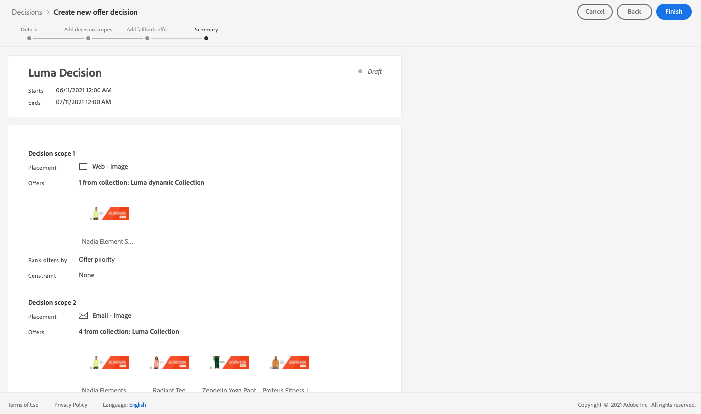

# 使用案例：設定個人化優惠以在電子郵件中使用 {#configure-add-personalized-offers-email}

本節提供端對端範例，說明如何根據您先前建立的決定，設定優惠方案並在電子郵件中使用。

## 主要步驟 {#main-steps}

設定優惠（包含在決定中）並在電子郵件中利用此決定的關鍵步驟如下所示：

1. 在建立優惠方案之前，[定義您的元件](#define-components)

   * 建立位置
   * 建立決策規則
   * 建立集合限定詞（先前稱為「標籤」）
   * 建立排名（選擇性）

1. [設定優惠方案](#configure-offers)

   * 建立優惠
   * 對於每個選件：

      * 建立表示，並為每個表示選取版位和資產
      * 為每個優惠方案新增規則
      * 定義每個優惠方案的優先順序

1. [建立後備產品建議](#create-fallback)

1. [建立集合](#create-collection)以包含您建立的個人化優惠

1. [設定決定](#configure-decision)

   * 建立決定
   * 選取您建立的版位
   * 對於每個位置，選取集合
   * 選取每個位置的排名（選擇性）
   * 選取遞補

1. [在電子郵件中插入決定](#insert-decision-in-email)

   * 選取符合您要顯示之優惠的位置
   * 從與所選位置相容的專案中選取決定
   * 預覽您的優惠

在電子郵件中使用優惠方案的整體「決定管理」程式如下：

## 定義元件 {#define-components}

在開始建立優惠方案之前，您必須定義要在優惠方案中使用的數個元件。

您會在&#x200B;**[!UICONTROL 決定管理]** > **[!UICONTROL 元件功能表]**&#x200B;下找到它們。

1. 首先，請為您的優惠方案建立&#x200B;**版位**。

   您將使用這些位置來定義定義定義優惠決定時，產生的優惠將顯示在何處。

   在此範例中，使用下列頻道和內容型別建立三個版位：

   * *網頁 — 影像*
   * *電子郵件 — 影像*
   * *非數位 — 文字*

   

   建立版位的詳細步驟在[本節](../../using/offers/offer-library/creating-placements.md)中說明。

1. 建立&#x200B;**決定規則**。

   決定規則會為Adobe Experience Platform中的設定檔提供最佳優惠。

   使用&#x200B;**[!UICONTROL XDM個人設定檔>人員>性別]**&#x200B;屬性來設定兩個簡單規則：

   * *女性客戶*
   * *男性客戶*

   

   建立規則的詳細步驟在[本節](../../using/offers/offer-library/creating-decision-rules.md)中說明。

1. 您也可以建立&#x200B;**集合限定詞**。

   然後，您就可以將其與優惠方案建立關聯，並使用此集合限定詞將優惠方案分組到集合中。

   在此範例中，建立&#x200B;*Yoga*&#x200B;集合限定詞。

   

   建立集合限定詞的詳細步驟在[本節](../../using/offers/offer-library/creating-tags.md)中說明。

1. 如果您想要定義規則，以決定應先針對指定位置顯示哪個優惠（而不是考慮優惠的優先順序分數），您可以建立&#x200B;**排名公式**。

   建立排名公式的詳細步驟在[本節](../../using/offers/ranking/create-ranking-formulas.md#create-ranking-formula)中說明。

   >[!NOTE]
   >
   >在此範例中，我們將僅使用優先順序分數。 深入瞭解[適用性規則和限制](../../using/offers/offer-library/creating-personalized-offers.md#eligibility)。

## 設定優惠 {#configure-offers}

您現在可以建立和設定優惠方案。 在此範例中，您將根據每個特定設定檔建立四個要顯示的選件。

1. 建立優惠方案。 請參閱[此章節](../../using/offers/offer-library/creating-personalized-offers.md#create-offer)深入瞭解。

1. 在此優惠中，建立三個代表。 每個表示都必須是您先前建立的版位與資產的組合：

   * 與&#x200B;*網頁 — 影像*&#x200B;位置相對應的專案
   * 一個對應至&#x200B;*電子郵件 — 影像*&#x200B;位置
   * 與&#x200B;*非數位 — 文字*&#x200B;位置相對應的專案

   >[!NOTE]
   >
   >優惠方案可顯示在訊息中的不同位置，以創造更多機會，讓使用者在不同的位置內容中使用優惠方案。

   在[本節](../../using/offers/offer-library/creating-personalized-offers.md#representations)中進一步瞭解代表。

1. 選取前兩個位置的適當影像。 輸入&#x200B;*非數位 — 文字*&#x200B;位置的自訂文字。

   

1. 在&#x200B;**[!UICONTROL 優惠資格]**&#x200B;區段中，選取&#x200B;**[!UICONTROL 依定義的決定規則]**，並拖放您選擇的規則。

   

1. 填寫&#x200B;**[!UICONTROL 優先順序]**。 在此範例中，新增&#x200B;*25*。

1. 檢閱您的選件，然後按一下&#x200B;**[!UICONTROL 儲存並核准]**。

   

1. 在此範例中，再建立三個具有相同表示但不同資產的優惠方案。 以不同的規則和優先順序指派給他們，例如：

   * 第一個優惠 — 決定規則： *女性客戶*，優先順序： *25*
   * 第二個優惠 — 決定規則： *女性客戶*，優先順序： *15*
   * 第三個優惠 — 決定規則： *男性客戶*，優先順序： *25*
   * 第四個優惠 — 決定規則： *男性客戶*，優先順序： *15*

   

建立和設定優惠方案的詳細步驟在[本節](../../using/offers/offer-library/creating-personalized-offers.md)中說明。

## 建立後備產品建議 {#create-fallback}

1. 建立遞補優惠。

1. 使用適當的資產，定義與優惠方案相同的代表（應與優惠方案中使用的代表不同）。

   每個表示都必須是您先前建立的版位與資產的組合：

   * 與&#x200B;*網頁 — 影像*&#x200B;位置相對應的專案
   * 一個對應至&#x200B;*電子郵件 — 影像*&#x200B;位置
   * 與&#x200B;*非數位 — 文字*&#x200B;位置相對應的專案

   

1. 檢閱您的遞補優惠，然後按一下[儲存並核准]。****

您的遞補優惠現在已準備好用於決定中。

建立及設定遞補優惠方案的詳細步驟在[本節](../../using/offers/offer-library/creating-fallback-offers.md)中說明。

## 建立集合 {#create-collection}

設定決定時，您需要將個人化優惠新增為集合的一部分。

1. 若要加快決策流程，請建立動態集合。

1. 使用&#x200B;*Yoga*&#x200B;集合限定詞來選取您先前建立的四個個人化優惠。

   

建立集合的詳細步驟在[本節](../../using/offers/offer-library/creating-collections.md)中說明。

## 設定決定 {#configure-decision}

現在您必須建立決定，將刊登版位與個人化優惠以及您剛才建立的遞補優惠結合使用。

決策引擎將使用此組合來尋找特定設定檔的最佳優惠方案：在此範例中，它會根據您指派給每個優惠方案的優先順序和決策規則。

若要建立及設定優惠決定，請遵循下列主要步驟：

1. 建立決定。 請參閱[此章節](../../using/offers/offer-activities/create-offer-activities.md#create-activity)深入瞭解。

1. 選取&#x200B;*網頁 — 影像*、*電子郵件 — 影像*&#x200B;和&#x200B;*非數位 — 文字*&#x200B;位置。

   

1. 對於每個位置，新增您建立的集合。

   

1. 如果您在[建置您的元件](#define-components)時定義了排名，您可以將其指派給決定中的位置。 如果在此位置中符合顯示多個優惠方案的資格，決策會使用此公式來計算要先傳送哪個優惠方案。

   指派排名公式給位置的詳細步驟在[本節](../../using/offers/offer-activities/configure-offer-selection.md#assign-ranking-formula)中說明。

1. 選取您建立的遞補優惠。 它將顯示為三個選定位置的可用遞補優惠。

   

1. 檢閱您的決定，然後按一下&#x200B;**[!UICONTROL [儲存並核准]]**。

   

您的決定現在已準備好用於提供最佳化和個人化優惠。

建立及設定決定的詳細步驟在[本節](../../using/offers/offer-activities/create-offer-activities.md)中說明。

## 在電子郵件中插入決定 {#insert-decision-in-email}

現在您的決定已上線，您可以將其插入電子郵件訊息。 若要這麼做，請依照[此頁面](../../using/email/add-offers-email.md)上詳述的步驟操作。

