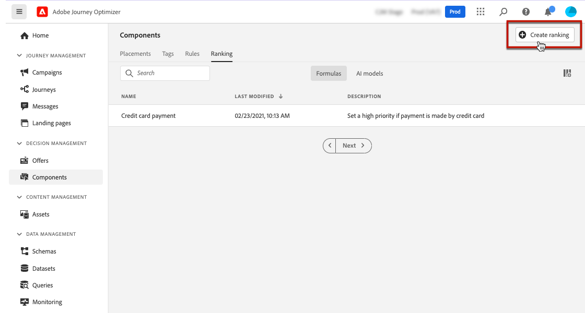

# 排名公式 {#create-ranking-formulas}

## 關於排名公式 {#about-ranking-formulas}

**排名公式**&#x200B;可讓您定義規則，這些規則將決定應先針對指定位置顯示哪個優惠，而不是考慮優惠的優先順序分數。

排名公式以&#x200B;**PQL語法**&#x200B;表示，而且可以利用設定檔屬性、內容資料和優惠屬性。 如需如何使用PQL語法的詳細資訊，請參閱[專屬檔案](https://experienceleague.adobe.com/docs/experience-platform/segmentation/pql/overview.html?lang=zh-Hant)。

建立排名公式後，您就可以將其指派給決定中的位置。 如需深入了解，請參閱[在決策設定產品建議選取項目](../offer-activities/configure-offer-selection.md)。

## 建立排名公式 {#create-ranking-formula}

若要建立排名公式，請遵循下列步驟：

1. 存取&#x200B;**[!UICONTROL 元件]**&#x200B;功能表，然後選取&#x200B;**[!UICONTROL 排名]**&#x200B;索引標籤。 預設會選取&#x200B;**[!UICONTROL 公式]**&#x200B;索引標籤。 此時會顯示先前建立的公式清單。

   

1. 按一下&#x200B;**[!UICONTROL 建立排名]**&#x200B;以建立新的排名公式。

   

1. 指定公式名稱、說明和公式。

   在此範例中，如果實際天氣炎熱，我們想提高所有具有「炎熱」屬性之選件的優先順序。 若要這麼做，已在決策呼叫中傳遞&#x200B;**contextData.weather=hot**。 [瞭解如何使用內容資料](../context-data.md)

   

   >[!IMPORTANT]
   >
   >建立排名公式時，不支援回顧過去時段。 例如，如果您將上個月之內發生的體驗事件指定為公式的元件。 在公式建立期間任何包含回顧期間的嘗試將在儲存時觸發錯誤。

1. 按一下&#x200B;**[!UICONTROL 「儲存」]**。您的排名公式已建立，您可以從清單中選取它以取得詳細資訊，並加以編輯或刪除。

   它現在已可隨時用於決定排名合適的優惠以進行位置（請參閱[在決定中設定優惠選擇](../offer-activities/configure-offer-selection.md)）。

   

## 排名公式範例 {#ranking-formula-examples}

您可以視需要建立許多不同的排名公式。 以下是一些範例。

<!--
Boost by offer ID

Boost the priority of an offer with the offer ID *xcore:personalized-offer:13d213cd4cb328ec* by 5.

**Ranking formula:**

```
if( offer._id = "xcore:personalized-offer:13d213cd4cb328ec", offer.rank.priority + 5, offer.rank.priority)
```

Change the offer priority based on a certain profile attribute

Set the offer priority to 30 for offer *xcore:personalized-offer:13d213cd4cb328ec* if the user lives in the city of Bondi.

**Ranking formula:**

```
if( offer._id = "xcore:personalized-offer:13d213cd4cb328ec" and homeAddress.city.equals("Bondi", false), 30, offer.rank.priority)
```

Boost multiple offers by offer ID based on the presence of a profile's audience membership

Boost the priority of offers based on whether the user is a member of a priority audience, which is configured as an attribute in the offer.

**Ranking formula:**

```
if( segmentMembership.get("ups").get(offer.characteristics.get("prioritySegmentId")).status in (["realized","existing"]), offer.rank.priority + 10, offer.rank.priority)
```
-->

### 根據設定檔屬性，以特定優惠方案屬性提升優惠方案

如果設定檔位在與優惠方案對應的城市，則將該城市中所有優惠方案的優先順序加倍。

**排名公式：**

```
if( offer.characteristics.get("city") = homeAddress.city, offer.rank.priority * 2, offer.rank.priority)
```

### 結束日期距離現在不足24小時的提升選件

**排名公式：**

```
if( offer.selectionConstraint.endDate occurs <= 24 hours after now, offer.rank.priority * 3, offer.rank.priority)
```

### 根據客戶購買所提供產品的傾向提升優惠方案

您可以根據客戶傾向分數來提升優惠方案的分數。

在此範例中，執行個體租使用者是&#x200B;*_salesvelocity*，而且設定檔結構描述包含儲存在陣列中的分數範圍：


有鑑於此，對於設定檔，例如：

```
{"_salesvelocity": {"individualScoring": [
                    {"core": {
                            "category":"insurance",
                            "propensityScore": 96.9
                        }},
                    {"core": {
                            "category":"personalLoan",
                            "propensityScore": 45.3
                        }},
                    {"core": {
                            "category":"creditCard",
                            "propensityScore": 78.1
                        }}
                    ]}
}
```

### 根據內容資料提升優惠方案 {#context-data}

[!DNL Journey Optimizer]可讓您根據呼叫中傳遞的內容資料，提升某些優惠方案。 例如，如果傳遞`contextData.weather=hot`，則必須提升所有具有`attribute=hot`的優惠方案的優先順序。 有關如何使用&#x200B;**Edge Decisioning**&#x200B;和&#x200B;**Decisioning** API傳遞內容資料的詳細資訊，請參閱[本節](../context-data.md)

請注意，使用&#x200B;**決策** API時，內容資料會新增至請求內文中的設定檔元素，如下例所示。

```
"xdm:profiles": [
{
    "xdm:identityMap": {
        "crmid": [
            {
            "xdm:id": "CRMID1"
            }
        ]
    },
    "xdm:contextData": [
        {
            "@type":"_xdm.context.additionalParameters;version=1",
            "xdm:data":{
                "xdm:weather":"hot"
            }
        }
    ]
    
}],
```

以下範例說明如何在排名公式中使用內容資料來提升優惠方案的優先順序。 展開每個區段，以取得排名公式語法的詳細資訊。

>[!NOTE]
>
>在Edge Decisioning API範例中，將`<OrgID>`取代為您的組織租使用者ID。

+++如果內容資料的管道符合客戶偏好的管道，則將優惠方案優先順序提升10

>[!BEGINTABS]

>[!TAB 決策API]

`if (@{_xdm.context.additionalParameters;version=1}.channel.isNotNull() and @{_xdm.context.additionalParameters;version=1}.channel.equals(_abcMobile.preferredChannel), offer.rank.priority + 10, offer.rank.priority)`

>[!TAB Edge Decisioning API]

`if (xEvent.<OrgID>.channel.isNotNull() and xEvent.<OrgID>.channel.equals(_abcMobile.preferredChannel), offer.rank.priority + 10, offer.rank.priority)`

>[!ENDTABS]

+++

+++如果在呼叫中傳遞「contextData.weather=hot」，則提升具有「attribute=hot」之所有選件的優先順序。

>[!BEGINTABS]

>[!TAB 決策API]

`if (@{_xdm.context.additionalParameters;version=1}.weather.isNotNull() and offer.characteristics.get("weather")=@{_xdm.context.additionalParameters;version=1}.weather, offer.rank.priority + 5, offer.rank.priority)`

>[!TAB Edge Decisioning API]

`if (xEvent.<OrgID>.weather.isNotNull() and offer.characteristics.get("weather")=xEvent.<OrgID>.weather, offer.rank.priority + 5, offer.rank.priority)`

>[!ENDTABS]

+++

+++內容來源提升

>[!BEGINTABS]

>[!TAB 決策API]

`if (@{_xdm.context.additionalParameters;version=1}.contentorigin.isNotNull() and offer.characteristics.contentorigin=@{_xdm.context.additionalParameters;version=1}.contentorigin, offer.rank.priority * 100, offer.rank.priority)`

>[!TAB Edge Decisioning API]

`if (xEvent.<OrgID>.contentorigin.isNotNull() and offer.characteristics.contentorigin=xEvent.<OrgID>.contentorigin, offer.rank.priority * 100, offer.rank.priority)`

>[!ENDTABS]

+++

+++天氣提升

>[!BEGINTABS]

>[!TAB 決策API]

`if (@{_xdm.context.additionalParameters;version=1}.weather.isNotNull() and offer.characteristics.weather=@{_xdm.context.additionalParameters;version=1}.weather, offer.rank.priority * offer.characteristics.scoringBoost, offer.rank.priority)`

>[!TAB Edge Decisioning API]

`if (xEvent.<OrgID>.weather.isNotNull() and offer.characteristics.weather=xEvent.<OrgID>.weather, offer.rank.priority * offer.characteristics.scoringBoost, offer.rank.priority)`

>[!ENDTABS]

+++
