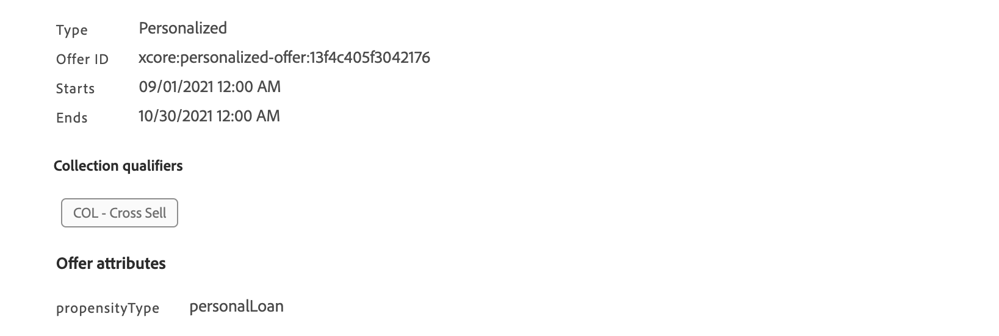

# 排名公式 {#create-ranking-formulas}

## 關於排名公式 {#about-ranking-formulas}

**排名公式**&#x200B;可讓您定義規則，以決定應先針對指定位置呈現哪個優惠方案，而非考慮優惠方案的優先順序分數。 

排名公式的表示方式為 **PQL語法** 並可運用設定檔屬性、內容資料和選件屬性。 如需如何使用PQL語法的詳細資訊，請參閱 [專屬檔案](https://experienceleague.adobe.com/docs/experience-platform/segmentation/pql/overview.html?lang=zh-Hant).

建立排名公式後，您就可以將其指派給決定中的位置。 如需深入了解，請參閱[在決策設定優惠方案選取項目](../offer-activities/configure-offer-selection.md)。

## 建立排名公式 {#create-ranking-formula}

若要建立排名公式，請遵循下列步驟：

1. 存取 **[!UICONTROL 元件]** 功能表，然後選取 **[!UICONTROL 排名]** 標籤。 此 **[!UICONTROL 公式]** 標籤預設為選取。 此時會顯示先前建立的公式清單。

   

1. 按一下 **[!UICONTROL 建立排名]** 以建立新的排名公式。

   

1. 指定公式名稱、說明和公式。

   在此範例中，如果實際天氣炎熱，我們想提高所有具有「炎熱」屬性之選件的優先順序。 若要這麼做， **contextData.weather=hot** 已在決策呼叫中傳遞。

   

1. 按一下&#x200B;**[!UICONTROL 「儲存」]**。您的排名公式已建立，您可以從清單中選取它以取得詳細資訊，並加以編輯或刪除。

   它現在已準備好用於決定排名合適的優惠以進行位置(請參閱 [設定決定中的優惠選擇](../offer-activities/configure-offer-selection.md))。

   

## 排名公式範例 {#ranking-formula-examples}

您可以視需要建立許多不同的排名公式。 以下是一些範例。

<!--
Boost by offer ID

Boost the priority of an offer with the offer ID *xcore:personalized-offer:13d213cd4cb328ec* by 5.

**Ranking formula:**

```
if( offer._id = "xcore:personalized-offer:13d213cd4cb328ec", offer.rank.priority + 5, offer.rank.priority)
```

Change the offer priority based on a certain profile attribute

Set the offer priority to 30 for offer *xcore:personalized-offer:13d213cd4cb328ec* if the user lives in the city of Bondi.

**Ranking formula:**

```
if( offer._id = "xcore:personalized-offer:13d213cd4cb328ec" and homeAddress.city.equals("Bondi", false), 30, offer.rank.priority)
```

Boost multiple offers by offer ID based on the presence of a profile's audience membership

Boost the priority of offers based on whether the user is a member of a priority audience, which is configured as an attribute in the offer.

**Ranking formula:**

```
if( segmentMembership.get("ups").get(offer.characteristics.get("prioritySegmentId")).status in (["realized","existing"]), offer.rank.priority + 10, offer.rank.priority)
```
-->

### 根據設定檔屬性，以特定優惠方案屬性提升優惠方案

如果設定檔位在與優惠方案對應的城市，則將該城市中所有優惠方案的優先順序加倍。

**排名公式：**

```
if( offer.characteristics.get("city") = homeAddress.city, offer.rank.priority * 2, offer.rank.priority)
```

### 結束日期距離現在不足24小時的提升選件

**排名公式：**

```
if( offer.selectionConstraint.endDate occurs <= 24 hours after now, offer.rank.priority * 3, offer.rank.priority)
```

### 根據內容資料，透過特定選件屬性提升選件

根據決策呼叫中傳遞的內容資料，提升特定優惠方案。 例如，如果 `contextData.weather=hot` 是在決策呼叫中傳遞，所有優惠方案的優先順序 `attribute=hot` 必須提升。

**排名公式：**

```
if (@{_xdm.context.additionalParameters;version=1}.weather.isNotNull()
and offer.characteristics.get("weather")=@{_xdm.context.additionalParameters;version=1}.weather, offer.rank.priority + 5, offer.rank.priority)
```

請注意，使用決策API時，內容資料會新增至請求內文中的設定檔元素，如下例所示。

**要求內文的程式碼片段：**

```
"xdm:profiles": [
{
    "xdm:identityMap": {
        "crmid": [
            {
            "xdm:id": "CRMID1"
            }
        ]
    },
    "xdm:contextData": [
        {
            "@type":"_xdm.context.additionalParameters;version=1",
            "xdm:data":{
                "xdm:weather":"hot"
            }
        }
    ]
 }],
```

### 根據客戶購買所提供產品的傾向提升優惠方案

您可以根據客戶傾向分數來提升優惠方案的分數。

在此範例中，例項租使用者為 *_salesvelocity* 而且設定檔結構描述包含儲存在陣列中的一系列分數：


有鑑於此，對於設定檔，例如：

```
{"_salesvelocity": {"individualScoring": [
                    {"core": {
                            "category":"insurance",
                            "propensityScore": 96.9
                        }},
                    {"core": {
                            "category":"personalLoan",
                            "propensityScore": 45.3
                        }},
                    {"core": {
                            "category":"creditCard",
                            "propensityScore": 78.1
                        }}
                    ]}
}
```

選件會包含 *傾向性型別* 符合分數中的類別：



然後，您的排名公式可將每個優惠方案的優先順序設定為等於客戶 *傾向分數* 為此 *傾向性型別*. 如果找不到分數，請使用優惠方案上設定的靜態優先順序：

```
let score = (select _Individual_Scoring1 from _salesvelocity.individualScoring
             where _Individual_Scoring1.core.category.equals(offer.characteristics.get("propensityType"), false)).head().core.propensityScore
in if(score.isNotNull(), score, offer.rank.priority)
```
