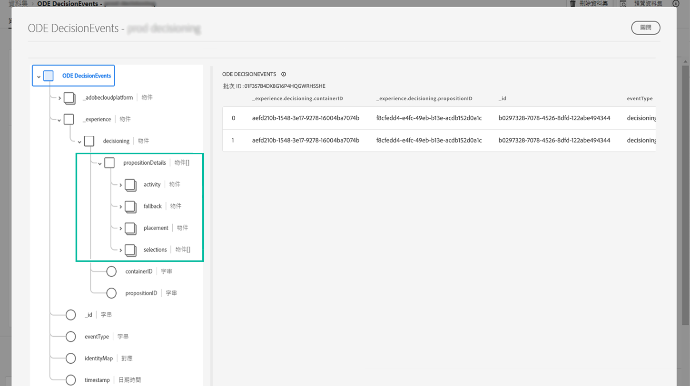

# 開始使用決定管理事件 {#monitor-offer-events}

每當決策管理為特定設定檔做出決定時，這些事件的相關資訊就會自動傳送至 Adobe Experience Platform。

這可讓您針對決策獲得深入分析，例如，了解哪項優惠已呈現給指定設定檔。 您可匯出這些資料，將其分析至您自己的報告系統，或善用 Adobe Experience Platform [查詢服務](https://experienceleague.adobe.com/docs/experience-platform/query/home.html?lang=zh-Hant)與其他工具，以達到增強分析與報告的目的。

## 資料集的可用重要資訊 {#key-information}

每個在決策時傳送的事件都包含四個關鍵資料點，可供您用於分析和報告用途：

* **[!UICONTROL 遞補內容]**：遞補優惠的名稱和 ID，若未選取個人化優惠，
* **[!UICONTROL 位置]**：用來傳遞優惠之位置的名稱、ID 和頻道，
* **[!UICONTROL 選取項目]**：為設定檔選取之優惠的名稱和 ID，
* **[!UICONTROL 活動]**：決策的名稱與 ID。

此外，您也可以運用 **[!UICONTROL identityMap]** 與&#x200B;**[!UICONTROL 時間戳記]**&#x200B;欄位來擷取有關設定檔和傳遞優惠時間的資訊。

有關隨每個決定傳送的所有 XDM 欄位的詳細資訊，請參閱[本節](xdm-fields.md)。

## 存取資料集 {#access-datasets}

包含決策管理事件的資料集可從 Adobe Experience Platform **[!UICONTROL 資料集]**&#x200B;選單存取。每個執行個體佈建時會自動建立一個資料集。

這些資料集以 **[!UICONTROL ODE DecisionEvents]** 結構描述為基礎，其中包含將資訊從決策管理傳送到 Adobe Experience Platform 所需的所有 XDM 欄位。

>[!NOTE]
>
>請注意，ODE DecisionEvents 資料集是&#x200B;**非設定檔資料集**，這代表它們不能擷取至 Experience Platform 中，以便由即時客戶設定檔所使用。
