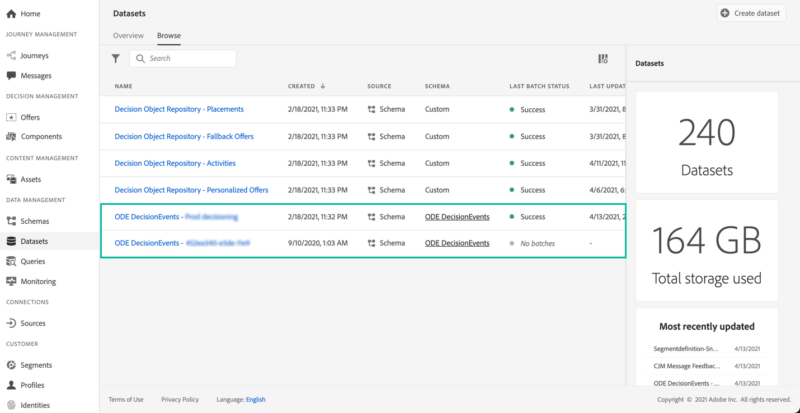

# 開始使用決定管理事件 {#monitor-offer-events}

每次Decision Management針對指定的設定檔進行決策時，與這些事件相關的資訊都會自動傳送至Adobe Experience Platform。

這可讓您匯出這些資料，以便將其分析至您自己的報吿系統。 您也可以善用 Adobe Experience Platform [查詢服務](https://experienceleague.adobe.com/docs/experience-platform/query/home.html?lang=zh-Hant)與其他工具，以達到增強分析和報告的目的。

包含Decision Management事件的資料集可從Adobe Experience Platform存取 **[!UICONTROL Datasets]** 功能表。 每個執行個體佈建時會自動建立一個資料集。

這些資料集以 **[!UICONTROL ODE DecisionEvents]** 結構，包含從決策管理傳送資訊至Adobe Experience Platform所需的所有XDM欄位。

>[!NOTE]
>
>請注意，ODE DecisionEvents 資料集是&#x200B;**非設定檔資料集**，這代表它們不能被獲取至 Experience Platform 中，以便由即時客戶設定檔所使用。

**相關主題：**

* [決定管理事件重要資訊](../reports/key-information.md)
* [存取事件 XDM 欄位](../reports/xdm-fields.md)
