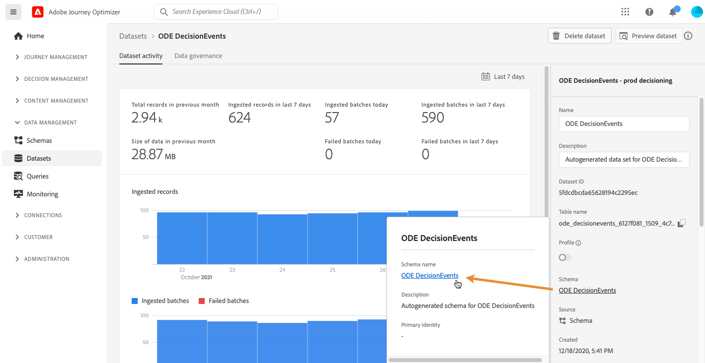

# 存取事件 XDM 欄位 {#decisioningevents-xdm-schema}

>[!TIP]
>
>[!DNL Adobe Journey Optimizer] 的新決策功能「決策」現在可透過程式碼型體驗和電子郵件管道使用！[了解更多](../../experience-decisioning/gs-experience-decisioning.md)

您可以直接從包含決定管理事件的資料集存取DecisioningEvents XDM架構。

結構描述包含從決定管理傳送資訊至Adobe Experience Platform所需的所有欄位。

若要取得特定欄位的詳細資訊，請選取該欄位以顯示包含欄位屬性的資訊窗格。

有關如何使用 XDM 結構描述和欄位的詳細資訊，請參閱體驗資料模型文件：

* [XDM 系統概觀](https://experienceleague.adobe.com/docs/experience-platform/xdm/home.html?lang=zh-Hant)
* [探索 XDM 資源](https://experienceleague.adobe.com/docs/experience-platform/xdm/ui/explore.html?lang=zh-Hant)
