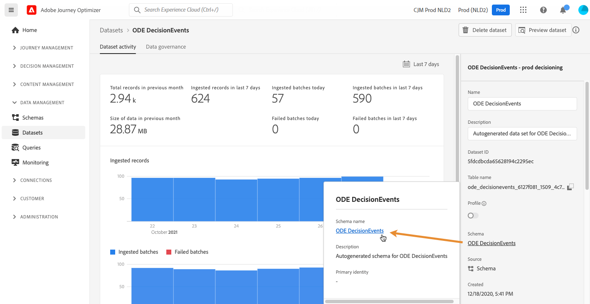

# 存取事件 XDM 欄位{#decisioningevents-xdm-schema}

您可以直接從包含「決策管理」事件的資料集存取「決策事件XDM」架構。

方案包含從Decision Management將資訊發送到Adobe Experience Platform所需的所有欄位。

若要取得特定欄位的詳細資訊，請選取該欄位以顯示包含欄位屬性的資訊窗格。

有關如何使用 XDM 架構和欄位的詳細資訊，請參閱體驗資料模型文件：

* [XDM 系統概覽](https://experienceleague.adobe.com/docs/experience-platform/xdm/home.html?lang=zh-Hant)
* [探索 XDM 資源](https://experienceleague.adobe.com/docs/experience-platform/xdm/ui/explore.html?lang=)
