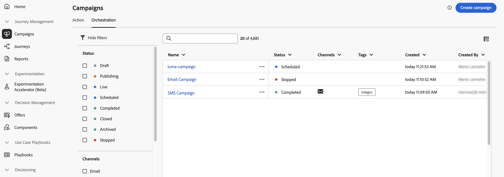
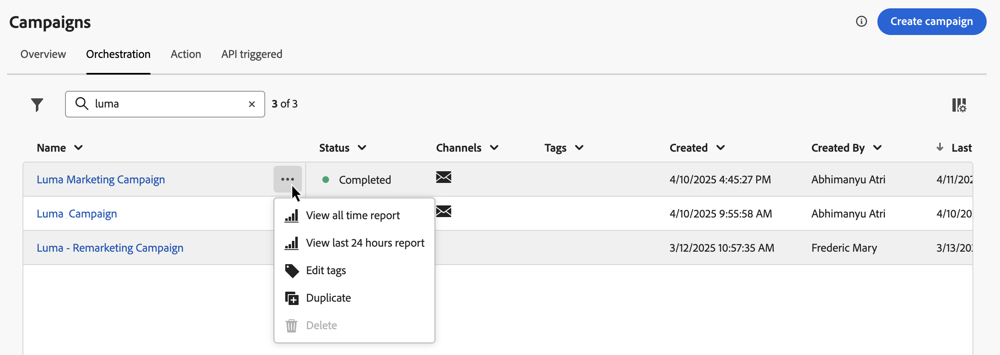

# 存取及管理協調的行銷活動 {#orchestrated-campaign-creation}

>[!CONTEXTUALHELP]
>id="ajo_targeting_workflow_list"
>title="協調的行銷活動"
>abstract="在此畫面中，您可以存取協調行銷活動的完整清單、檢查其目前狀態、上次/下次執行日期，以及建立新的協調行銷活動。"

>[!CONTEXTUALHELP]
>id="ajo_orchestration_campaign_action"
>title="動作"
>abstract="本節列出協調行銷活動內使用的所有動作。"

+++ 目錄

| 歡迎使用協調的行銷活動 | 啟動您的第一個協調行銷活動 | 查詢資料庫 | 協調行銷活動 |
|---|---|---|---|
| [開始使用協調的行銷活動](gs-orchestrated-campaigns.md)  建立和管理關聯式結構描述和資料集：  <ul><li>[開始使用結構描述和資料集](gs-schemas.md)</li><li>[手動結構描述](manual-schema.md)</li><li>[檔案上傳結構描述](file-upload-schema.md)</li><li>[擷取資料](ingest-data.md)</li></ul>  <b>[存取及管理協調的行銷活動](access-manage-orchestrated-campaigns.md)</b>  [建立協調行銷活動的重要步驟](gs-campaign-creation.md) | [建立並排程行銷活動](create-orchestrated-campaign.md)  [協調活動](orchestrate-activities.md)  [開始並監視行銷活動](start-monitor-campaigns.md)  [報告](reporting-campaigns.md) | [使用規則產生器](orchestrated-rule-builder.md)  [建立您的第一個查詢](build-query.md)  [編輯運算式](edit-expressions.md)  [重定向](retarget.md) | [開始使用活動](activities/about-activities.md)  活動： [同時加入](activities/and-join.md) - [建立客群](activities/build-audience.md) - [變更維度](activities/change-dimension.md) - [頻道活動](activities/channels.md) - [合併](activities/combine.md) - [重複資料刪除](activities/deduplication.md) - [擴充](activities/enrichment.md) - [分支](activities/fork.md) - [調和](activities/reconciliation.md) - [儲存客群](activities/save-audience.md) - [分割](activities/split.md) - [等待](activities/wait.md) |

{style="table-layout:fixed"}

+++

 

>[!BEGINSHADEBOX]

 

此頁面上的內容不是最終內容，可能會有變動。

>[!ENDSHADEBOX]

## 存取協調的行銷活動

導覽至&#x200B;**[!UICONTROL 行銷活動]**&#x200B;功能表，並選取&#x200B;**[!UICONTROL 協調流程]**&#x200B;索引標籤以存取協調行銷活動的完整清單。

{zoomable="yes"}{zoomable="yes"}

清單中每個已協調的行銷活動都會顯示資訊，例如行銷活動的目前[狀態](#status)、相關頻道和標籤，或上次修改行銷活動的時間。 您可以按一下「」按鈕來自訂顯示的欄。

此外，還可使用搜尋列和篩選器，以便在清單中輕鬆搜尋。例如，您可以篩選「已協調的行銷活動」，以僅顯示與指定頻道或標籤相關聯的行銷活動，或顯示在特定日期範圍內建立的行銷活動。

行銷活動詳細目錄中的「」按鈕，可讓您執行各種作業，詳情如下。

* **[!UICONTROL 檢視所有時間報告]**/**[!UICONTROL 檢視過去 24 小時的報告]** — 存取報告以測量並視覺化協調的行銷活動的影響和效能。[進一步瞭解協調的行銷活動報告](../orchestrated/reporting-campaigns.md)
* **[!UICONTROL 編輯標籤]** — 編輯與行銷活動相關聯的標籤。
* **[!UICONTROL 複製]** — 在某些情況下，您可能需要複製協調的行銷活動，例如執行已停止的行銷活動，或變更排程行銷活動的執行頻率。
* **[!UICONTROL 刪除]** — 刪除行銷活動。此動作僅適用於&#x200B;**[!UICONTROL 草稿]**&#x200B;行銷活動。
* **[!UICONTROL 封存]** — 封存行銷活動。所有已封存的行銷活動都會在其上次修改日期後的 30 天內，以滾動重新排程方式刪除。此動作適用於除&#x200B;**[!UICONTROL 草稿]**&#x200B;行銷活動以外的所有行銷活動。

## 策劃的行銷活動內含哪些內容？ {#gs-ms-campaign-inside}

「協調的行銷活動」畫布可呈現預期的情形。 其會說明要執行的各種任務以及任務如何連結在一起。

每個協調的行銷活動包含：

* **活動**：活動指要執行的任務。各種活動在圖表中會以圖示表示。每種活動都有特定屬性和所有活動共有的其他屬性。

  在「已協調」行銷活動圖表中，指定活動可產生多個任務，尤其是當有回圈或重複執行動作時。

* **轉變**：轉變會將來源活動連結到目標活動並定義其序列。

* **工作表**：工作表包含轉變攜帶的所有資訊。每個「協調流程」行銷活動都使用數個工作表。 這些表格中傳送的資料可在整個協調行銷活動的生命週期中使用。

## 行銷活動狀態 {#status}

協調的行銷活動可以有多種狀態：

* **[!UICONTROL 草稿]**：已建立協調的行銷活動。 行銷活動尚未發佈。
* **[!UICONTROL 發佈]**：正在發佈協調的行銷活動。
* **[!UICONTROL 即時]**：已發佈且正在執行協調的行銷活動。
* **[!UICONTROL 已排程]**：已排程協調的行銷活動執行。
* **[!UICONTROL 已完成]**：協調的行銷活動執行已完成。 行銷活動完成傳送訊息且沒有出錯後，系統最多在 3 天內自動指派「已完成」狀態。
* **[!UICONTROL 已關閉]**：當週期性行銷活動已關閉時，會顯示此狀態。行銷活動會繼續執行直到其所有活動完成，但無法再有設定檔進入行銷活動。
* **[!UICONTROL 已封存]**：已封存協調的行銷活動。 所有已封存的行銷活動都會在上次修改日期後的 30 天內，以滾動重新排程方式刪除。您可以複製已封存的行銷活動 (如有必要)，以繼續處理。
* **[!UICONTROL 已停止]**：已停止協調的行銷活動執行。 若要再次啟動行銷活動，您必須複製它。
