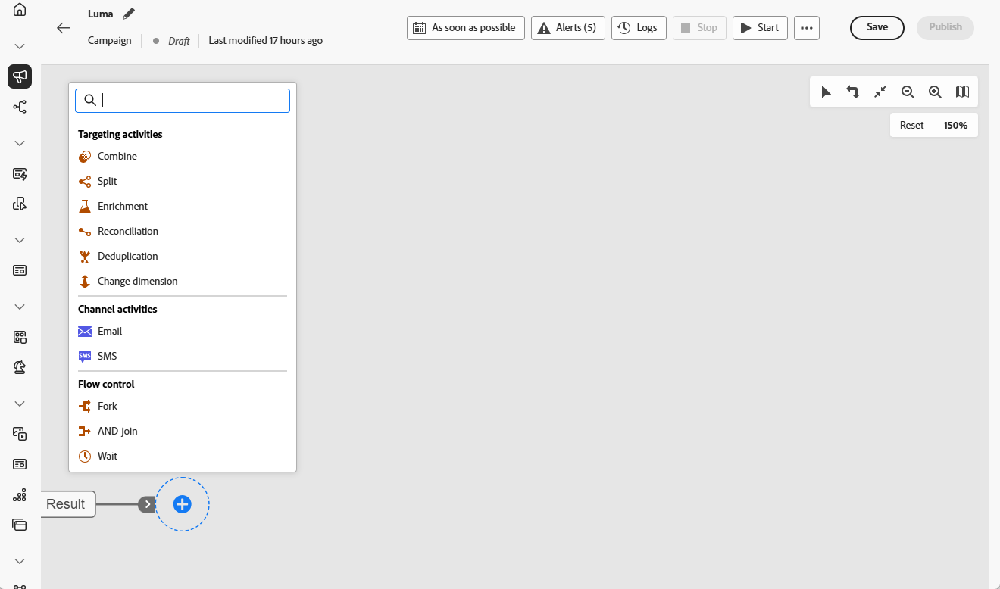
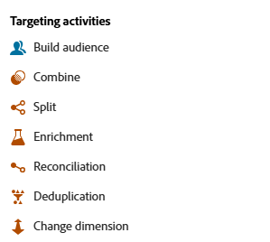

# 關於協調的行銷活動 {#orchestrated-campaign-activities}

可將協調行銷活動歸類成三大類別。可用的活動可能會依據內容而有所不同。

以下各節會詳細介紹所有活動：

* [目標定位活動](#targeting)
* [頻道活動](#channel)
* [流量控制活動](#flow-control)

{width="80%" align="left"}

>[!NOTE]
>
>* 根據您的授權模式、許可權和實施，可用活動可能會有所不同。
>
>* 已協調的行銷活動中的活動數限製為500。

## 目標定位活動 {#targeting}

這些活動會鎖定目標定位。 這些活動可讓您使用交集、聯合或排除作業定義客群，同時對其進行分割或結合，從而建置一個或多個目標。

{width="40%" align="left"}

可用的目標定位活動包括：

* [建立客群](build-audience.md)：定義目標族群。 您可以選取現有客群或使用規則建置器定義自己的查詢。
* [變更維度](change-dimension.md)：在建置您的協調行銷活動時變更目標維度。
* [合併](combine.md)：針對傳入族群，執行細分。 您可以使用聯合、交集或排除。
* [重複資料刪除](deduplication.md)：刪除傳入活動結果中的重複項目。
* [擴充](enrichment.md)：定義要在您的協調行銷活動中處理的其他資料。 透過此活動，您可以利用傳入轉變並設定活動，以使用其他資料完成傳出轉變。
* [調和](reconciliation.md)：定義 Journey Optimizer資料中的資料與工作表中資料之間的連結，例如從外部檔案載入的資料。
* [分割](split.md)：將傳入族群分割成許多子集。

## 頻道活動 {#channel}

Adobe Journey Optimizer 讓您能夠跨越多重管道，自動執行行銷活動。您可以將[頻道活動](channels.md)結合到畫布中，以建立可依據客戶行為觸發動作的跨頻道協調行銷活動。

瞭解如何[在協調的行銷活動中](channels.md)建立管道動作。

## 流量控制活動 {#flow-control}

>[!CONTEXTUALHELP]
>id="ajo_orchestration_end"
>title="結束活動"
>abstract="**結束**&#x200B;活動讓您可以用圖形方式標記協調式行銷活動之結束。此活動並不會造成功能性影響，因此為選用。"

下列活動是組織和執行「協調的行銷活動」專屬的活動。 他們的主要任務是協調其他活動。

{width="20%" align="left"}

可用的流量控制活動包括：

* [並加入](and-join.md)：同步處理協調行銷活動的多個執行分支。
* [分支](fork.md)：可讓您建立傳出轉變，以便同時啟動許多活動。
* [等待](wait.md)：暫時暫停執行部分協調的行銷活動。
  <!--* [Test](test.md): Enable transitions based on specified conditions.-->

>[!NOTE]
>**End**&#x200B;活動會以圖形方式標示已協調行銷活動的結尾。 此活動並不會造成功能性影響，因此為選用
