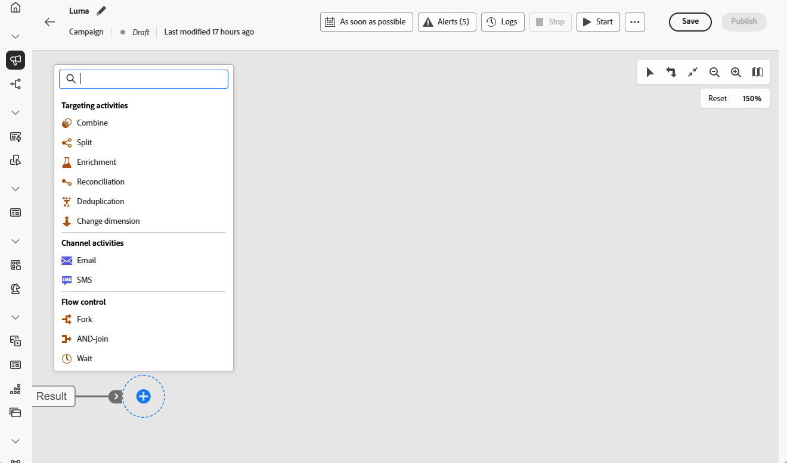

# 關於協調的行銷活動 {#orchestrated-campaign-activities}

可將協調行銷活動歸類成三大類別。 可用的活動可能會依據內容而有所不同。

以下各節會詳細介紹所有活動：

* [目標定位活動](#targeting)
* [管道活動](#channel)
* [流量控制活動](#flow-control)

{width="80%" align="left"}

>[!NOTE]
>
>根據您的授權模式、許可權和實施，可用活動可能會有所不同。

## 護欄與限制 {#activity-guardrails}

* **頻道活動限制** — 協調的行銷活動在發佈時支援最多10個頻道活動（電子郵件、簡訊、推播或直接郵件）。 鎖定目標和流量控制活動不會計入此限制。

* **畫布活動限制** — 畫布上的活動數限製為500。 針對可維護性和效能，請將工作流程保持在實踐中的100個活動以下。

如需所有協調的行銷活動護欄和限制，請參閱[護欄和限制](../guardrails.md)。

## 目標定位活動 {#targeting}

這些活動會鎖定目標定位。 這些活動可讓您使用交集、聯合或排除作業定義客群，同時對其進行分割或結合，從而建置一個或多個目標。

{width="40%" align="left"}

可用的目標定位活動包括：

* [建立客群](build-audience.md)：定義目標族群。 您可以選取現有客群或使用規則建置器定義自己的查詢。
* [變更維度](change-dimension.md)：在建置您的協調行銷活動時變更目標維度。
* [合併](combine.md)：針對傳入族群，執行細分。 您可以使用聯合、交集或排除。
* [重複資料刪除](deduplication.md)：刪除傳入活動結果中的重複項目。
* [擴充](enrichment.md)：定義要在您的協調行銷活動中處理的其他資料。 透過此活動，您可以利用傳入轉變並設定活動，以使用其他資料完成傳出轉變。
* [調和](reconciliation.md)：定義 Journey Optimizer資料中的資料與工作表中資料之間的連結，例如從外部檔案載入的資料。
* [分割](split.md)：將傳入族群分割成許多子集。

## 管道活動 {#channel}

Adobe Journey Optimizer 讓您能夠跨越多重管道，自動執行行銷活動。 您可以將[頻道活動](channels.md)結合到畫布中，以建立可依據客戶行為觸發動作的跨頻道協調行銷活動。

瞭解如何[在協調的行銷活動中](channels.md)建立管道動作。

## 流量控制活動 {#flow-control}

>[!CONTEXTUALHELP]
>id="ajo_orchestration_end"
>title="結束活動"
>abstract="**結束**&#x200B;活動會在畫布上標記分支的結束。 您也可以使用&#x200B;**外部訊號**&#x200B;來開始下游協調行銷活動，並在分支完成時傳遞參數。 [了解更多](../trigger-orchestrated-campaign.md#signal-end)"

>[!CONTEXTUALHELP]
>id="ajo_orchestration_signal"
>title="外部訊號"
>abstract="選取此分支結束時要開始的下游協調行銷活動，並對應參數名稱和值以在訊號中傳送。 下游行銷活動必須設定為&#x200B;**由訊號觸發**，並在此行銷活動到達「結束」活動之前發佈。 [了解更多](../trigger-orchestrated-campaign.md#signal-end)"

下列活動是組織和執行「協調的行銷活動」專屬的活動。 他們的主要任務是協調其他活動。

{width="20%" align="left"}

可用的流量控制活動包括：

* [並加入](and-join.md)：同步處理協調行銷活動的多個執行分支。
* [分支](fork.md)：可讓您建立傳出轉變，以便同時啟動許多活動。
* [等待](wait.md)：暫時暫停執行部分協調的行銷活動。
  <!--* [Test](test.md): Enable transitions based on specified conditions.-->

* **[!UICONTROL End]**：標籤畫布上分支的結尾。 您可以選擇使用它來傳送訊號給另一個以訊號開始的「協調流程」行銷活動。 [了解更多](../trigger-orchestrated-campaign.md#signal-end)
