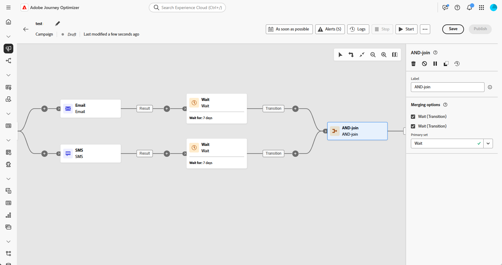
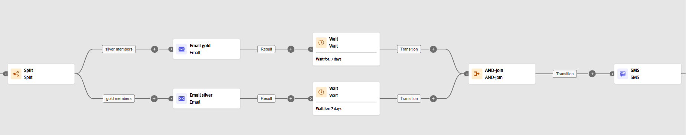

# 合併連結 {#join}

>[!CONTEXTUALHELP]
>id="ajo_orchestration_and-join"
>title="合併連結活動"
>abstract="**合併連結**&#x200B;活動讓您可以同步處理協調式行銷活動的多個執行分支。所有前面的活動完成後即會觸發此活動。這讓您可以確保特定活動完成後才繼續執行協調式行銷活動。"

「**[!UICONTROL 合併連結]**」活動是一種&#x200B;**[!UICONTROL 流程控制]**&#x200B;活動。它可讓您同步處理協調行銷活動的多個執行分支。

此活動只會在所有傳入轉變啟動後，才會觸發其傳出轉變，換句話說，會在所有之前的活動完成後觸發。這可讓您在繼續執行「協調流程」行銷活動之前，確定特定活動已完成。

## 設定合併連結活動{#and-join-configuration}

>[!CONTEXTUALHELP]
>id="ajo_orchestration_and-join_merging"
>title="合併選項"
>abstract="選取您要參加的活動。在「**主要集合**」下拉選單中，選擇您要保留的傳入轉變群體。"

請按照以下步驟設定&#x200B;**[!UICONTROL 合併連結]**&#x200B;活動：

1. 新增許多活動，例如頻道活動，以便建立至少兩種不同的執行分支。

1. 請將&#x200B;**[!UICONTROL 合併連結]**&#x200B;活動新增至任何分支。

1. 請在&#x200B;**[!UICONTROL 合併選項]**&#x200B;區段下，選取您想加入的所有之前活動。

1. 請在「**[!UICONTROL 主要集合]**」下拉選單中，選擇您想保留的傳入轉變族群。

## 範例{#and-join-example}

此範例會說明兩個協調行銷活動分支，每個分支都經由電子郵件傳送、一個會以金牌會員為目標，另一個以銀牌會員為目標。 觸發兩個傳入轉換後，就會啟用&#x200B;**[!UICONTROL 合併連結]**，只會在傳遞完兩個電子郵件後，再傳送簡訊，大概會往後延遲 7 天左右。

{zoomable="yes"}
