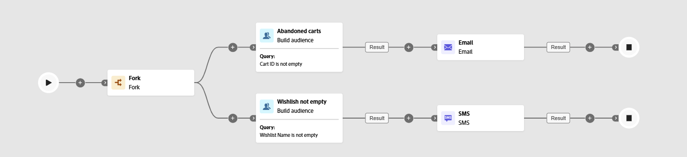

# 建置客群 {#build-audience}

>[!CONTEXTUALHELP]
>id="ajo_orchestration_build_audience"
>title="建置客群活動"
>abstract="**建立對象**&#x200B;活動可讓您定義將進入協調行銷活動的對象。 在協調的行銷活動內容中傳送訊息時，訊息對象未定義於頻道活動中，而是定義於&#x200B;**建立對象**&#x200B;活動中。"

身為行銷人員，您可以透過直覺式介面，建立複雜的客群細分，讓您可以根據廣泛條件和行為，鎖定使用者，以便更有效地量身打造行銷活動。

若想這麼做，請使用&#x200B;**[!UICONTROL 建置客群]**&#x200B;目標定位活動。 此活動會定義進入協調行銷活動的對象。 當傳送訊息做為協調行銷活動的一部分時，對象定義在&#x200B;**[!UICONTROL 建立對象]**&#x200B;活動中，而不是在協調行銷活動中。

## 設定建置對象活動 {#build-audience-configuration}

>[!CONTEXTUALHELP]
>id="ajo_orchestration_build_audience_audienceselector"
>title="客群"
>abstract="選取您的對象，與您設計新傳遞時使用對象的方式相同。"

請按照以下步驟設定「**[!UICONTROL 建置客群]**」活動：

1. 新增「**[!UICONTROL 建置客群]**」活動。

   

1. 定義&#x200B;**[!UICONTROL 標籤]**。

1. 請依照下列標籤中詳述的步驟，設定您的客群。

1. 選擇「**[!UICONTROL 目標定位維度]**」。目標市場選擇維度可讓您定義作業的目標群體：收件者、合約受益人、操作者、訂閱者等。預設情況下，會從收件者中選取目標。

1. 按一下&#x200B;**[!UICONTROL 繼續]**。

1. 使用規則產生器來定義您的查詢。 [在本節中進一步瞭解規則產生器](../orchestrated-rule-builder.md)

1. 指定客群為空時，是否應產生傳出轉變。

## 範例{#build-audience-examples}

以下是含有兩個&#x200B;**[!UICONTROL 建立對象]**&#x200B;活動的協調行銷活動範例。 首要目標是購物車中有加入專案的設定檔，然後才是電子郵件傳遞。 次要目標鎖定含有願望清單的設定檔，然後才是簡訊傳遞。

