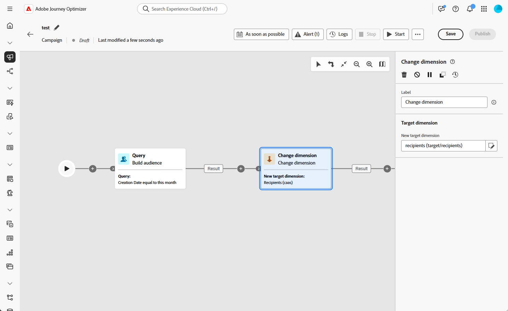
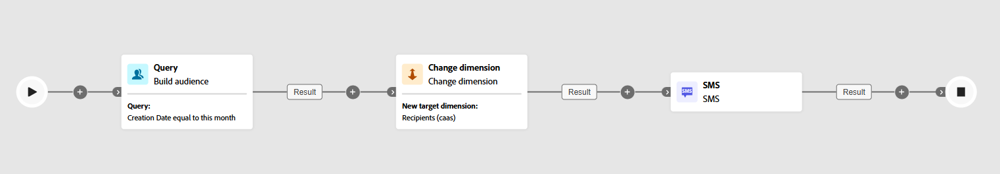

# 變更維度 {#change-dimension}

>[!CONTEXTUALHELP]
>id="ajo_orchestration_dimension_complement"
>title="產生補集"
>abstract="您可以使用剩餘群體 (其已因重複而排除) 產生額外的傳出轉變。若要這樣做，請開啟「**產生補集**」選項"

>[!CONTEXTUALHELP]
>id="ajo_orchestration_change_dimension"
>title="變更維度活動"
>abstract="此活動可讓您在建立對象時變更目標市場選擇維度。其會根據資料範本和輸入維度來移動軸。例如，您可以從「合約」維度切換到「用戶端」維度。"

行銷人員可在協調的行銷活動中，從一個資料實體變更為相關的資料實體，藉此增強受眾目標定位。 這可讓您超越使用者輪廓，並專注於特定行為，例如購買、預訂或其他互動。

若要達成此目的，請使用&#x200B;**[!UICONTROL 變更維度]**&#x200B;活動。它可讓您在協調的行銷活動期間調整目標維度。

<!--
>[!IMPORTANT]
>
>Please note that the **[!UICONTROL Change Dimension]** and **[!UICONTROL Change Data source]** activities should not be added in one row. If you need to use both activities consecutively, make sure you include an **[!UICONTROL Enrichement]** activity in between them. This ensures proper execution and prevents potential conflicts or errors.-->

## 設定變更維度活動 {#configure}

請按照以下步驟設定&#x200B;**[!UICONTROL 變更維度]**&#x200B;活動：

1. 新增&#x200B;**[!UICONTROL 變更維度]**&#x200B;活動至您的協調行銷活動。

   

1. 定義&#x200B;**[!UICONTROL 新目標維度]**。在維度變更期間，會保留所有記錄。

## 範例 {#example}

此使用案例著重於傳送簡訊給在過去一個月內建立願望清單的輪廓。

從&#x200B;**[!UICONTROL 建立客群]**&#x200B;活動開始，使用&#x200B;**[!UICONTROL 願望清單]**&#x200B;目標維度來識別所有相關的願望清單。

接著，新增&#x200B;**[!UICONTROL 變更維度]**&#x200B;活動，以將目標維度從&#x200B;**[!UICONTROL 願望清單]**&#x200B;切換為&#x200B;**[!UICONTROL 收件者]。**&#x200B;此步驟會確保協調行銷活動將目標設定為連結至這些願望清單的正確設定檔，以便將SMS傳送至預期的設定檔。

