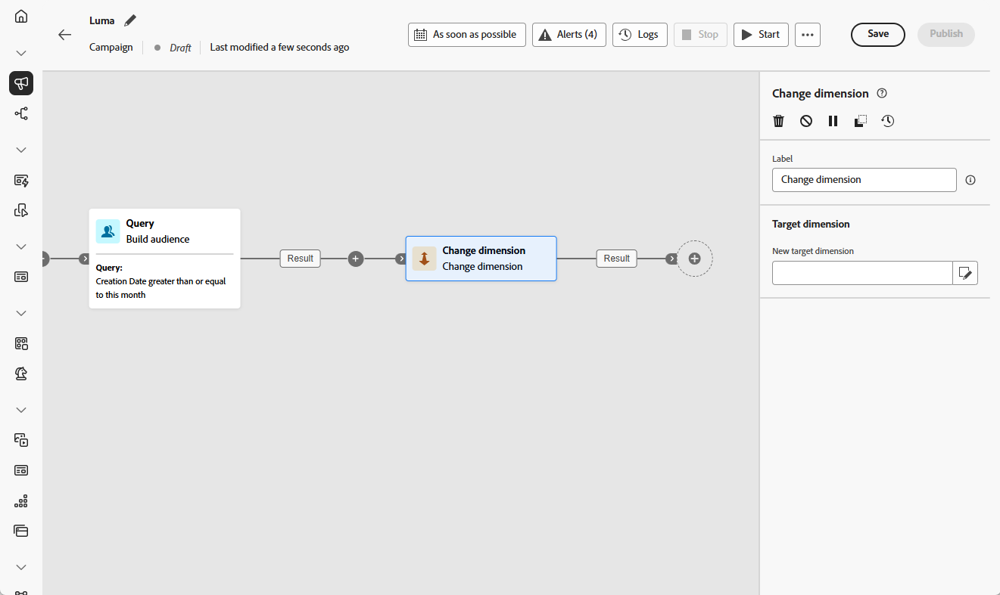
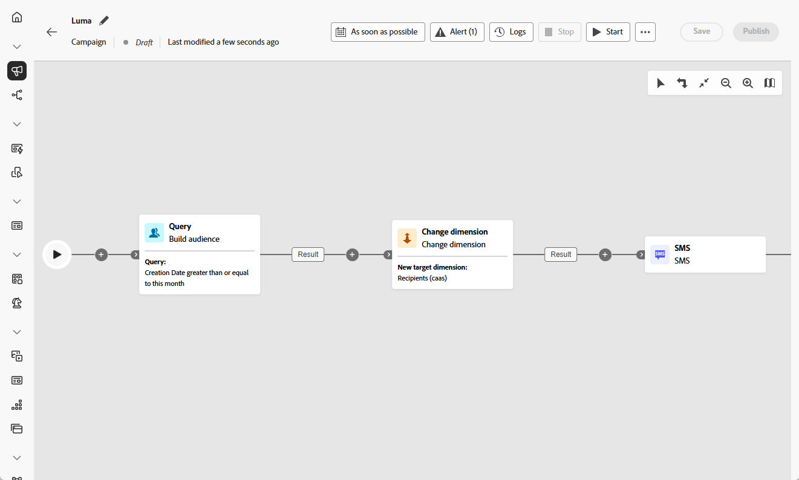

# 變更維度 {#change-dimension}

>[!CONTEXTUALHELP]
>id="ajo_orchestration_dimension_complement"
>title="產生補集"
>abstract="您可以使用剩餘族群 (其已因重複而排除) 產生額外的傳出轉變。若要這樣做，請開啟「**產生補集**」選項"

>[!CONTEXTUALHELP]
>id="ajo_orchestration_change_dimension"
>title="變更維度活動"
>abstract="此活動可讓您在建立對象時變更目標市場選擇維度。其會根據資料範本和輸入維度來移動軸。例如，您可以從「合約」維度切換到「用戶端」維度。"

+++ 目錄

| 歡迎使用協調的行銷活動 | 首次建立協調的行銷活動 | 查詢資料庫 | 協調的行銷活動 |
|---|---|---|---|
| [開始使用協調的行銷活動](../gs-orchestrated-campaigns.md)  [設定步驟](../configuration-steps.md)  [建立協調行銷活動的重要步驟](../gs-campaign-creation.md) | [建立協調的行銷活動](../create-orchestrated-campaign.md)  [協調活動](../orchestrate-activities.md)  [使用協調的行銷活動傳送訊息](../send-messages.md)  [開始並監視行銷活動](../start-monitor-campaigns.md)  [報告](../reporting-campaigns.md) | [使用查詢Modeler](../orchestrated-rule-builder.md)  [建置您的第一個查詢](../build-query.md)  [編輯運算式](../edit-expressions.md) | [開始使用活動](about-activities.md)  活動： [並加入](and-join.md) - [建置對象](build-audience.md) - [變更維度](change-dimension.md) - [合併](combine.md) - [重複資料刪除](deduplication.md) - [擴充](enrichment.md) - [分支](fork.md) - [調解](reconciliation.md) - [分割](split.md) - [等待](wait.md) |

{style="table-layout:fixed"}

+++

 

行銷人員可在協調的行銷活動中，從一個資料實體切換至另一個連結的實體，藉此縮小對象鎖定目標的範圍。 這可讓您從目標定位使用者設定檔移至聚焦於特定動作，例如購買、預訂或其他互動。

若要這麼做，請使用&#x200B;**[!UICONTROL 變更維度]**&#x200B;活動。 它可讓您根據資料模型的結構和輸入維度，在協調的行銷活動期間變更目標維度。

例如，您可能會將目標維度從&#x200B;**&#x200B;**&#x200B;[!UICONTROL 設定檔]&#x200B;**&#x200B;移至**&#x200B;**[!UICONTROL 合約]**，以便直接傳送訊息給與您所選對象相關聯的合約擁有者。

<!--
>[!IMPORTANT]
>
>Please note that the **[!UICONTROL Change Dimension]** and **[!UICONTROL Change Data source]** activities should not be added in one row. If you need to use both activities consecutively, make sure you include an **[!UICONTROL Enrichement]** activity in between them. This ensures proper execution and prevents potential conflicts or errors.-->

## 設定變更維度活動 {#configure}

請依照下列步驟設定&#x200B;**&#x200B;**&#x200B;[!UICONTROL 變更維度]**&#x200B;活動：

1. 將&#x200B;**&#x200B;**&#x200B;[!UICONTROL 變更維度]**&#x200B;活動新增至您協調的行銷活動。

   

1. 定義&#x200B;**&#x200B;**&#x200B;[!UICONTROL 新目標維度]**。 在維度變更期間，會保留所有記錄。

1. 執行協調的行銷活動以檢視結果。 比較變更維度活動前後表格中的資料，以及比較協調的行銷活動表格結構。

## 範例 {#example}

此使用案例涉及傳送SMS給在上個月建立願望清單的設定檔。

開始使用&#x200B;**[!UICONTROL 建立對象]**&#x200B;活動，使用&#x200B;**&#x200B;**&#x200B;[!UICONTROL 願望清單]**&#x200B;目標維度來選取所有相關的願望清單。

接著，插入&#x200B;**[!UICONTROL 變更維度]**&#x200B;活動，將目標維度從&#x200B;**&#x200B;**&#x200B;[!UICONTROL 願望清單&#x200B;]&#x200B;**切換為**&#x200B;**[!UICONTROL 收件者]**。 這可讓協調的行銷活動傳送SMS至與這些願望清單相關聯的設定檔。

