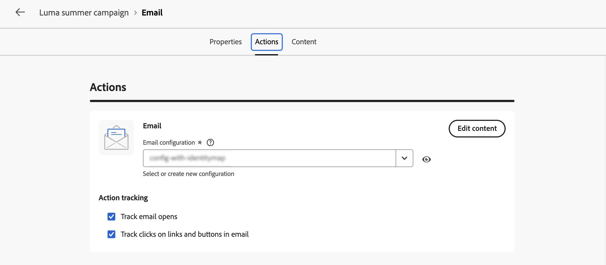
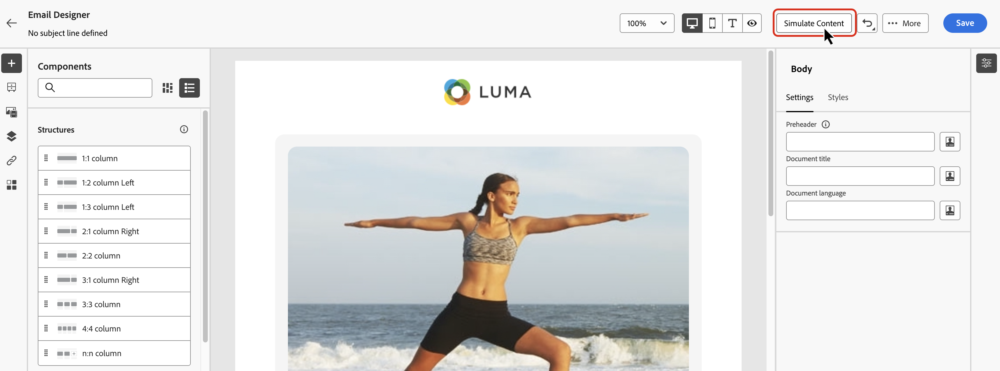

# 管道活動 {#channel}

>[!CONTEXTUALHELP]
>id="ajo_orchestration_email"
>title="電子郵件活動"
>abstract="電子郵件活動讓您在協調式行銷活動中傳送電子郵件，單次訊息和定期訊息兩者均適用。此活動會自動執行傳送電子郵件至相同協調式行銷活動內計算的某個目標的流程。您可以將管道活動結合至多步驟行銷活動畫布中，建立可根據客戶行為和資料觸發動作的跨管道行銷活動。"

>[!CONTEXTUALHELP]
>id="ajo_orchestration_sms"
>title="簡訊活動"
>abstract="簡訊活動讓您在協調式行銷活動中傳送簡訊，單次訊息和定期訊息兩者均適用。此活動會自動執行傳送簡訊至相同協調式行銷活動內計算的某個目標的流程。您可以將管道活動與多步驟行銷活動版面結合，建立可根據客戶行為和資料觸發動作的跨管道行銷活動。"

>[!CONTEXTUALHELP]
>id="ajo_orchestration_push"
>title="推播活動"
>abstract="推播活動讓您在協調式行銷活動當中傳送推播。推播活動可以傳送單次和定期的協調式行銷活動訊息，自動傳送推播至相同協調式行銷活動內預先定義的目標。您可以將管道活動與行銷活動版面結合，建立可根據客戶行為和資料觸發動作的跨管道行銷活動。"

<!--
UNUSED IDs in BJ

>[!CONTEXTUALHELP]
>id="ajo_orchestration_push_ios"
>title="Push iOS activity"
>abstract="The Push iOS activity let you send iOS Push notifications as part of your orchestrated campaign. It enables the delivery of both one-time and recurring orchestrated campaigns, automating the sending iOS Push notifications to a predefined target within the same workflow. You can combine channel activities into the campaign canvas to create cross-channel campaigns that can trigger actions based on customer behavior and data."

>[!CONTEXTUALHELP]
>id="ajo_orchestration_push_android"
>title="Push Android activity"
>abstract="The Push Android activity ket you send Android Push notifications as part of your orchestrated campaign. It enables the delivery of both one-time and recurring messages, automating the sending Android Push notifications to a predefined target within the same orchestrated campaign. You can combine channel activities into the orchestrated campaign canvas to create cross-channel campaigns that can trigger actions based on customer behavior and data."

-->

>[!CONTEXTUALHELP]
>id="ajo_orchestration_directmail"
>title="直接郵件活動"
>abstract="直接郵件活動讓您在協調式行銷活動中傳送直接郵件更加方便，單次訊息和定期訊息兩者均適用。此類活動會自動執行產生直接郵件提供者所需之摘取檔案的流程。您可以將管道活動與協調式行銷活動版面結合，建立可根據客戶行為和資料觸發動作的跨管道行銷活動。"

+++ 目錄

| 歡迎使用協調的行銷活動 | 首次建立協調的行銷活動 | 查詢資料庫 | 協調的行銷活動 |
|---|---|---|---|
| [開始使用協調的行銷活動](gs-orchestrated-campaigns.md)  建立和管理關聯式結構描述和資料集：  <ul><li>[手動結構描述](manual-schema.md)</li><li>[檔案上傳結構描述](file-upload-schema.md)</li><li>[擷取資料](ingest-data.md)</li></ul>  [存取及管理協調的行銷活動](../access-manage-orchestrated-campaigns.md) | [建立協調行銷活動的關鍵步驟](../gs-campaign-creation.md)  [建立並排程行銷活動](../create-orchestrated-campaign.md)  [協調活動](../orchestrate-activities.md)  [開始並監視行銷活動](../start-monitor-campaigns.md)  [報告](../reporting-campaigns.md) | [使用規則產生器](../orchestrated-rule-builder.md)  [建立您的第一個查詢](../build-query.md)  [編輯運算式](../edit-expressions.md)  [重新鎖定目標](../retarget.md) | [開始使用活動](about-activities.md)  活動： [並加入](and-join.md) - [建立對象](build-audience.md) - [變更維度](change-dimension.md) - <b>[頻道活動](channels.md)</b> - [合併](combine.md) - [重複資料刪除](deduplication.md) - [擴充](enrichment.md) - [分支](fork.md) - [調解](reconciliation.md) - [儲存對象](save-audience.md) - [分割](split.md) - [等待](wait.md) |

{style="table-layout:fixed"}

+++

 

>[!BEGINSHADEBOX]

此頁面上的內容不是最終內容，可能會有變動。

>[!ENDSHADEBOX]

[!DNL Adobe Journey Optimizer]可讓您跨管道（電子郵件、簡訊和推播通知）自動執行行銷活動。 您可以將這些頻道活動結合至行銷活動畫布，以建立跨頻道協調的行銷活動，其可根據客戶行為和資料觸發動作。

例如：
* 透過電子郵件、簡訊和推播傳送歡迎系列。
* 在購買後提供後續電子郵件。
* 透過簡訊傳送個人化生日問候。

使用管道活動，您即可建立全面性和個人化的行銷活動，從多個接觸點和客戶互動並提升轉換率。

>[!PREREQUISITES]
>
>在新增管道活動之前，請使用[建置對象活動](build-audience.md)來定義目標對象。

## 新增管道活動並定義其屬性 {#add}

1. 將管道活動新增至畫布。 可用的頻道活動包括&#x200B;**[!UICONTROL 電子郵件]**、**[!UICONTROL 簡訊]**&#x200B;和&#x200B;**[!UICONTROL 推播]**。

   

1. 選取活動並按一下&#x200B;**[!UICONTROL 編輯電子郵件]**、**[!UICONTROL 編輯簡訊]**&#x200B;或&#x200B;**[!UICONTROL 編輯推播]** （視選取的頻道而定）。

   

1. 在&#x200B;**[!UICONTROL 屬性]**&#x200B;索引標籤中，輸入說明，然後切換至&#x200B;**[!UICONTROL 動作]**&#x200B;索引標籤以設定活動。

## 設定管道組態和設定 {#configuration}

使用&#x200B;**[!UICONTROL 動作]**&#x200B;索引標籤選取訊息的通道設定，並設定其他設定，例如追蹤、內容實驗或多語言內容。

1. 選取通道設定。

   設定是由[系統管理員](../../start/path/administrator.md)所定義。 它包含所有用於傳送訊息的技術參數，如標頭參數、子網域、行動應用程式等等。[瞭解如何設定頻道設定](../../configuration/channel-surfaces.md)。

   顯示[動作]區段的

1. 追蹤參與（適用於電子郵件和簡訊）。

   使用&#x200B;**[!UICONTROL 動作追蹤]**&#x200B;區段來追蹤收件者對您的電子郵件或簡訊傳遞的反應。 執行行銷活動後，即可從行銷活動報表存取追蹤結果。 [進一步瞭解行銷活動報告](../../reports/campaign-global-report-cja.md)

1. 啟用快速傳送模式（針對推播）。

   快速傳送模式是[!DNL Journey Optimizer]附加元件，允許透過行銷活動以非常快的速度傳送大量推送訊息。 當您想要在行動電話上傳送緊急推播警報（例如傳送重大新聞給已安裝您新聞頻道應用程式的使用者）時，如果訊息傳送延遲對業務至關重要，則會使用快速傳送。 如需使用快速傳遞模式時效能的詳細資訊，請參閱[Adobe Journey Optimizer產品說明](https://helpx.adobe.com/tw/legal/product-descriptions/adobe-journey-optimizer.html)。

1. 建立內容實驗。

   使用&#x200B;**[!UICONTROL 內容實驗]**&#x200B;區段來定義多個傳遞處理，以測量哪個傳遞處理對目標對象執行得最好。 按一下&#x200B;**[!UICONTROL 建立實驗]**&#x200B;按鈕，然後依照本節詳述的步驟進行： [建立內容實驗](../../content-management/content-experiment.md)。

1. 新增多語言內容。

   使用&#x200B;**[!UICONTROL 語言]**&#x200B;區段在您的行銷活動中以多種語言建立內容。 若要這麼做，請按一下&#x200B;**[!UICONTROL 新增語言]**&#x200B;按鈕，然後選取所需的&#x200B;**[!UICONTROL 語言設定]**。 本節提供如何設定及使用多語言功能的詳細資訊： [開始使用多語言內容](../../content-management/multilingual-gs.md)

   

設定您的頻道活動後，請選取&#x200B;**[!UICONTROL 內容]**&#x200B;索引標籤以定義其內容。

## 定義內容 {#content}

切換至&#x200B;**[!UICONTROL Content]**&#x200B;標籤以建立您的訊息。 步驟程式會因所選的管道而有所不同。 在以下頁面瞭解建立訊息內容的詳細步驟。

<table style="table-layout:fixed"><tr style="border: 0; text-align: center;" >
<td> <a href="../../email/create-email.md"><strong>建立電子郵件</strong></a></td>
<td> <a href="../../sms/create-sms.md"><strong>建立簡訊</strong></a></td>
<td><a href="../../push/create-push.md"><strong>建立推播通知</strong></a></td>
</tr></table>

內容建立後，請使用&#x200B;**[!UICONTROL 模擬內容]**&#x200B;按鈕，以從CSV / JSON檔案上傳或手動新增的測試設定檔或範例輸入資料來預覽和測試您的內容。 [了解更多](../../content-management/preview-test.md)

顯示[模擬內容]按鈕的

## 後續步驟 {#next}

當訊息內容準備就緒時，請使用&#x200B;**[!UICONTROL 上一步]**&#x200B;箭頭返回您精心安排的行銷活動。 然後，您可以在畫布中完成活動協調，並發佈行銷活動以開始傳送訊息。 [瞭解如何開始及監視協調的行銷活動](../start-monitor-campaigns.md)

<!--
## Examples {#cross-channel-workflow-sample}

Here is a cross-channel orchestrated campaign example with a segmentation and two deliveries. The orchestrated campaign targets all customers who live in Paris and who are interested in coffee machines. Among this population, an email is sent to the regular customers and an SMS is sent to the VIP clients.

<!--
description, which use case you can perform (common other activities that you can link before of after the activity)

how to add and configure the activity

example of a configured activity within a workflow
The Email delivery activity allows you to configure the sending an email in a workflow. 

-->

<!--You can also create a recurring orchestrated campaign to send a personalized SMS every first day of the month at 8 PM to all customers living in Paris.

-->

<!-- Scheduled emails available?

This can be a single send email and sent just once, or it can be a recurring email.
* Single send emails are standard emails, sent once.
* Recurring emails allow you to send the same email multiple times to different targets over a defined period. You can aggregate the deliveries per period in order to get reports that correspond to your needs.

When linked to a scheduler, you can define recurring emails.
Email recipients are defined upstream of the activity in the same workflow, via an Audience targeting activity.

-->

<!--The message preparation is triggered according to the workflow execution parameters. From the message dashboard, you can select whether to request or not a manual confirmation to send the message (required by default). You can start the workflow manually or place a scheduler activity in the workflow to automate execution.-->
