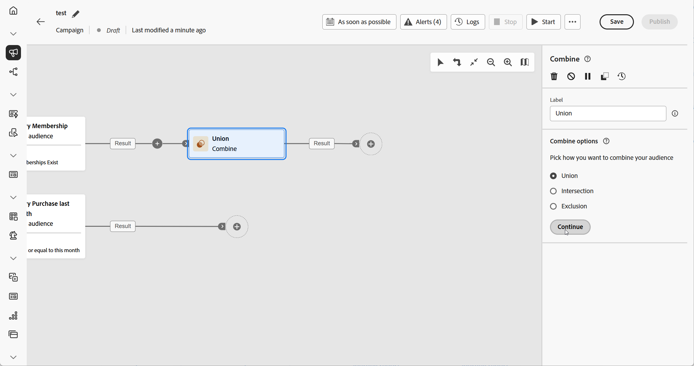
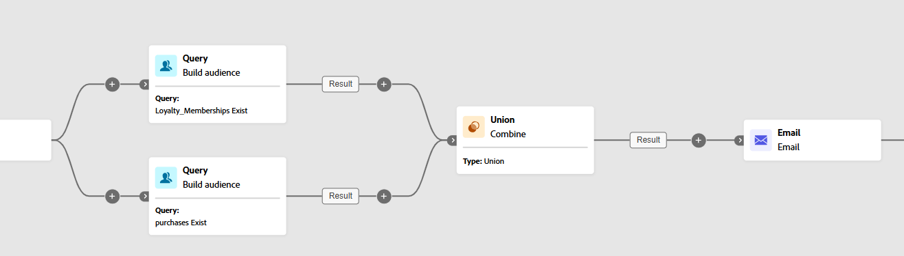
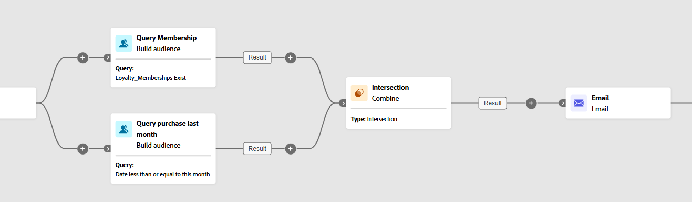

# 合併 {#combine}

>[!CONTEXTUALHELP]
>id="ajo_orchestration_combine"
>title="組合活動"
>abstract="「**組合**」活動可讓您對傳入群體執行分段。您因此可以組合好幾個群體、排除其中的一部分或僅保留幾個目標通用資料。"

+++ 目錄

| 歡迎使用協調的行銷活動 | 啟動您的第一個協調行銷活動 | 查詢資料庫 | 協調行銷活動 |
|---|---|---|---|
| [開始使用協調的行銷活動](../gs-orchestrated-campaigns.md)  建立和管理關聯式結構描述和資料集：  <ul><li>[開始使用結構描述和資料集](../gs-schemas.md)</li><li>[手動結構描述](../manual-schema.md)</li><li>[檔案上傳結構描述](../file-upload-schema.md)</li><li>[擷取資料](../ingest-data.md)</li></ul>[存取及管理協調的行銷活動](../access-manage-orchestrated-campaigns.md) | [建立協調行銷活動的關鍵步驟](../gs-campaign-creation.md)  [建立並排程行銷活動](../create-orchestrated-campaign.md)  [協調活動](../orchestrate-activities.md)  [開始並監視行銷活動](../start-monitor-campaigns.md)  [報告](../reporting-campaigns.md) | [使用規則產生器](../orchestrated-rule-builder.md)  [建立您的第一個查詢](../build-query.md)  [編輯運算式](../edit-expressions.md)  [重定向](../retarget.md) | [開始使用活動](about-activities.md)  活動： [同時加入](and-join.md) - [建立客群](build-audience.md) - [變更維度](change-dimension.md) - [頻道活動](channels.md) - <b>[合併](combine.md)</b> - [重複資料刪除](deduplication.md) - [擴充](enrichment.md) - [分支](fork.md) - [調和](reconciliation.md) - [儲存客群](save-audience.md) - [分割](split.md) - [等待](wait.md) |

{style="table-layout:fixed"}

+++

 

>[!BEGINSHADEBOX]

 

此頁面上的內容不是最終內容，可能會有變動。

>[!ENDSHADEBOX]

**[!UICONTROL 合併]**&#x200B;活動是一種&#x200B;**[!UICONTROL 目標定位]**&#x200B;活動，可讓您有效地劃分傳入群體。它可讓您合併多個群體、排除特定區段，或僅保留在數個目標間共用的資料。

下列細分選項可供使用：

* **[!UICONTROL 聯合]**：將多個活動的結果合併成單一目標。

* **[!UICONTROL 交集]**：僅保留所有傳入群體共用的元素。

* **[!UICONTROL 排除]**：根據指定的條件從一個群體中移除元素。

## 設定合併活動 {#combine-configuration}

>[!CONTEXTUALHELP]
>id="ajo_orchestration_intersection_merging_options"
>title="交集合併選項"
>abstract="交集讓您僅保留活動中不同輸入群體的通用元素。在「要加入的集合」區段中，勾選您之前希望加入的所有活動。"

>[!CONTEXTUALHELP]
>id="ajo_orchestration_exclusion_merging_options"
>title="排除合併選項"
>abstract="「排除」讓您根據特定條件排除一個群體中的元素。在「要加入的集合」區段中，勾選您之前希望加入的所有活動。"

>[!CONTEXTUALHELP]
>id="ajo_orchestration_combine_options"
>title="選取分段類型"
>abstract="選取如何結合對象。「**聯合**」讓您將多個活動的結果重新組合成單一目標。「**交集**」讓您僅保留活動中不同輸入群體的通用元素。「**排除**」讓您根據特定條件排除一個群體中的元素。 "

請按照以下常見步驟開始設定「**[!UICONTROL 組合]**」活動：

1. 新增多個活動，例如「**[!UICONTROL 建置客群]**」活動，以形成至少兩個不同的執行分支。
1. 對上述的任一個分支新增「**[!UICONTROL 組合]**」活動。
1. 選取分段類型：[聯合](#union)、[交集](#intersection)或是[排除](#exclusion)。
1. 按一下&#x200B;**[!UICONTROL 繼續]**。
1. 在「**[!UICONTROL 要加入的集合]**」一節中，勾選您之前希望加入的所有活動。

## 聯合 {#combine-union}

>[!CONTEXTUALHELP]
>id="ajo_orchestration_combine_reconciliation"
>title="調和選項"
>abstract="選取「**調和類型**」，以定義處理重複項目的方式。「**金鑰**」選項預設為啟用，表示當來自不同輸入轉變的元素具有相同金鑰時，活動僅保留一個元素。使用「**欄的選取範圍**」選項來定義已套用資料調和的欄清單。"

在&#x200B;**[!UICONTROL 合併]**&#x200B;活動中，您可以選取&#x200B;**[!UICONTROL 調和類型]**&#x200B;來設定&#x200B;**[!UICONTROL 聯合]**，以決定如何管理重複記錄：

* **[!UICONTROL 僅金鑰]** (預設)：當多個傳入轉變共用相同的金鑰時，會保留單一記錄。僅限傳入群體是同質時，才能使用此選項。

* **[!UICONTROL 選取的資料欄]**：可讓您指定用於資料調和的資料欄。選取「**[!UICONTROL 新增屬性]**」。

在下列範例中，**[!UICONTROL 合併]**&#x200B;活動與&#x200B;**[!UICONTROL 聯合]**&#x200B;搭配使用，以將兩個查詢的結果 (**忠誠會員**&#x200B;和&#x200B;**購買者**) 合併為單一、較大的客群，其中包含兩個區段中的所有輪廓。

## 交集 {#combine-intersection}

>[!CONTEXTUALHELP]
>id="ajo_orchestration_intersection_reconciliation_options"
>title="交集調和選項"
>abstract="選取「**調和類型**」，以定義處理重複項目的方式。「**金鑰**」選項預設為啟用，表示當來自不同輸入轉變的元素具有相同金鑰時，活動僅保留一個元素。使用「**欄的選取範圍**」選項來定義已套用資料調和的欄清單。"

在&#x200B;**[!UICONTROL 合併]**&#x200B;活動中，您可以設定&#x200B;**[!UICONTROL 交集]**。為此，您需要遵循以下額外步驟：

1. 選取「**[!UICONTROL 調節類型]**」，以定義處理重複項目的方式。

   * **[!UICONTROL 僅金鑰]** (預設)：當多個傳入轉變共用相同的金鑰時，會保留單一記錄。僅限傳入群體是同質時，才能使用此選項。

   * **[!UICONTROL 選取的資料欄]**：可讓您指定用於資料調和的資料欄。選取「**[!UICONTROL 新增屬性]**」。

1. 若要處理剩餘群體，請啟用「**[!UICONTROL 產生補集]**」。補集包含所有傳入活動結果的聯合，但不包括交集。然後，額外的傳出轉變會新增到活動中。

以下範例會顯示如何使用兩個查詢活動之間的&#x200B;**[!UICONTROL 交集]**。用於識別身分為&#x200B;**忠誠會員**&#x200B;且曾在過去一個月內購買的輪廓。

## 排除 {#combine-exclusion}

>[!CONTEXTUALHELP]
>id="ajo_orchestration_exclusion_options"
>title="排除規則"
>abstract="如有必要，您可以操控傳入表格。事實上，若要從另一個維度排除目標，必須將此目標傳回主要目標的同一目標市場選擇維度。為了進行此步驟，請按一下「排除規則」一節中的「新增規則」，並指定維度變更條件。資料調和會透過屬性或加入執行。"

>[!CONTEXTUALHELP]
>id="ajo_orchestration_combine_sets"
>title="選取要組合的集合"
>abstract="在「**要加入的集合**」一節中，從傳入轉變中選取「**主要集合**」。這是從中排除元素的集。其他集會先設定相符的元素，然後才會從主要集予以排除。"

>[!CONTEXTUALHELP]
>id="ajo_orchestration_combine_exclusion"
>title="排除規則"
>abstract="如有必要，您可以操控傳入表格。事實上，若要從另一個維度排除目標，必須將此目標傳回主要目標的同一目標市場選擇維度。為了進行此步驟，請按一下「排除規則」一節中的「新增規則」，並指定維度變更條件。資料調和會透過屬性或加入執行。"

>[!CONTEXTUALHELP]
>id="ajo_orchestration_combine_complement"
>title="合併產生補集"
>abstract="切換開啟「產生補集」選項，在額外轉變中處理其餘的群體。"

在&#x200B;**[!UICONTROL 合併]**&#x200B;活動中，您可以設定&#x200B;**[!UICONTROL 排除]**。為此，您需要遵循以下額外步驟：

1. 在「**[!UICONTROL 要加入的集合]**」一節中，選取代表主要群體的「**[!UICONTROL 主要集合]**」。在其他集合中找到的記錄會從此主要集合中排除。

1. 如有需要，您可以調整傳入表格，以對齊不同維度的目標。若要排除另一個維度的目標，必須將此目標傳回與主要群體相同的目標維度。若要這麼做，請按一下「**[!UICONTROL 新增規則]**」並定義變更維度的條件。然後使用屬性或加入進行調和。

1. 若要處理剩餘群體，請啟用「**[!UICONTROL 產生補集]**」。補集包含所有傳入活動結果的聯合，但不包括交集。然後，額外的傳出轉變會新增到活動中。

下列&#x200B;**[!UICONTROL 排除]**&#x200B;範例顯示被設定來篩選購買產品的輪廓的兩個查詢。之後，會從第一個集合中排除沒有忠誠會籍的輪廓。

