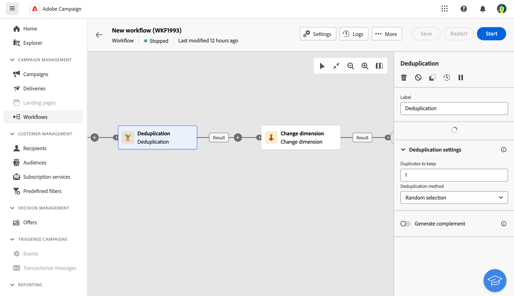

# 重複資料刪除 {#deduplication}

>[!CONTEXTUALHELP]
>id="ajo_orchestration_deduplication_fields"
>title="用於識別重複資料的欄位"
>abstract="在&#x200B;**&#x200B;用於識別重複資料的欄位&#x200B;**&#x200B;區段，按一下&#x200B;**&#x200B;新增屬性**&#x200B;按鈕以指定可允許識別重複資料之相同值的欄位，例如：電子郵件地址、名字、姓氏等。欄位的順序可讓您指定首要處理的條件。"

>[!CONTEXTUALHELP]
>id="ajo_orchestration_deduplication"
>title="重複資料刪除活動"
>abstract="「**重複資料刪除**」活動可讓您刪除傳入活動結果中的重複資料。其主要在目標市場選擇活動之後和允許使用目標資料的活動之前使用。"

>[!CONTEXTUALHELP]
>id="ajo_orchestration_deduplication_complement"
>title="產生補集"
>abstract="您可以使用剩餘族群 (其已因重複而排除) 產生額外的傳出轉變。若要這樣做，請開啟「**產生補集**」選項"

>[!CONTEXTUALHELP]
>id="ajo_orchestration_deduplication_settings"
>title="重複項目刪除設定"
>abstract="若要刪除傳入資料中的重複項目，請在以下欄位中定義重複項目刪除方法。預設只會保留一筆記錄。您還應該根據運算式或屬性選取重複項目刪除模式。預設會隨機選取要避免重複的記錄。"

+++ 目錄

| 歡迎使用協調的行銷活動 | 啟動您的第一個協調行銷活動 | 查詢資料庫 | 協調的行銷活動活動 |
|---|---|---|---|
| [開始使用協調的行銷活動](gs-orchestrated-campaigns.md)  [設定步驟](configuration-steps.md)  [建立協調行銷活動的重要步驟](gs-campaign-creation.md) | [建立協調的行銷活動](create-orchestrated-campaign.md)  [協調活動](orchestrate-activities.md)  [使用協調的行銷活動傳送訊息](send-messages.md)  [開始並監視行銷活動](start-monitor-campaigns.md)  [報告](reporting-campaigns.md) | [使用查詢Modeler](orchestrated-query-modeler.md)  [建置您的第一個查詢](build-query.md)  [編輯運算式](edit-expressions.md) | [開始使用活動](activities/about-activities.md)  活動： [並加入](activities/and-join.md) - [建置對象](activities/build-audience.md) - [變更維度](activities/change-dimension.md) - [合併](activities/combine.md) - [重複資料刪除](activities/deduplication.md) - [擴充](activities/enrichment.md) - [分支](activities/fork.md) - [調解](activities/reconciliation.md) - [分割](activities/split.md) - [等待](activities/wait.md) |

{style="table-layout:fixed"}

+++

  

**重複資料刪除**&#x200B;活動是&#x200B;**鎖定目標**&#x200B;活動。 此活動可讓您刪除入站活動結果中的重複專案，例如收件者清單中的重複設定檔。 **重複資料刪除**&#x200B;活動通常用於目標定位活動之後，以及允許使用目標定位資料的活動之前。

## 設定重複資料刪除活動{#deduplication-configuration}

請依照下列步驟設定&#x200B;**重複資料刪除**&#x200B;活動：

1. 將&#x200B;**重複資料刪除**&#x200B;活動新增至您協調的行銷活動。

1. 在&#x200B;**&#x200B;用於識別重複資料的欄位&#x200B;**&#x200B;區段，按一下&#x200B;**&#x200B;新增屬性**&#x200B;按鈕以指定可允許識別重複資料之相同值的欄位，例如：電子郵件地址、名字、姓氏等。欄位的順序可讓您指定首要處理的條件。

1. 在&#x200B;**重複資料刪除設定**&#x200B;區段中，選取要保留的不重複&#x200B;**重複專案數目**。 此欄位的預設值為 1。如果值為 0 則可讓您保留所有重複項目。

   例如，如果記錄 A 和 B 被視為記錄 Y 的重複項目，而記錄 C 被視為記錄 Z 的重複項目：

   * 如果該欄位的值為 1：僅保留 Y 和 Z 記錄。
   * 如果該欄位的值為 0：會保留所有記錄。
   * 如果該欄位的值為 2：會保留記錄 C 和 Z，並且將保留 A、B 和 Y 中的兩條記錄，這是偶然的或取決於之後所選取的重複資料刪除方法。

1. 選取要使用的&#x200B;**重複資料刪除方法**：

   * **隨機選取**：隨機選取要保留在重複專案外的記錄。
   * **使用運算式**：保留所輸入運算式的值最小或最大的記錄。
   * **非空白值**：保留運算式不是空白的記錄。
   * **依循值清單**：定義一或多個欄位的值優先順序。 若要定義值，請按一下&#x200B;**屬性**&#x200B;來選取欄位或建立運算式，然後將值新增至適當的資料表。 若要定義新欄位，請按一下值清單上方的&#x200B;**新增按鈕**。

1. 如果要利用剩餘母體，請核取&#x200B;**產生補充**&#x200B;選項。 補充包含所有重複專案。 隨後會將其他轉變新增至活動。

## 範例{#deduplication-example}

在下列範例中，使用重複資料刪除活動，在傳送傳遞之前從目標中排除重複專案。 識別的重複設定檔會新增到專用受眾，必要時可重複使用。 選擇&#x200B;**電子郵件**&#x200B;地址以識別重複專案。 保留1個專案，並選取&#x200B;**隨機**&#x200B;重複資料刪除方法。

