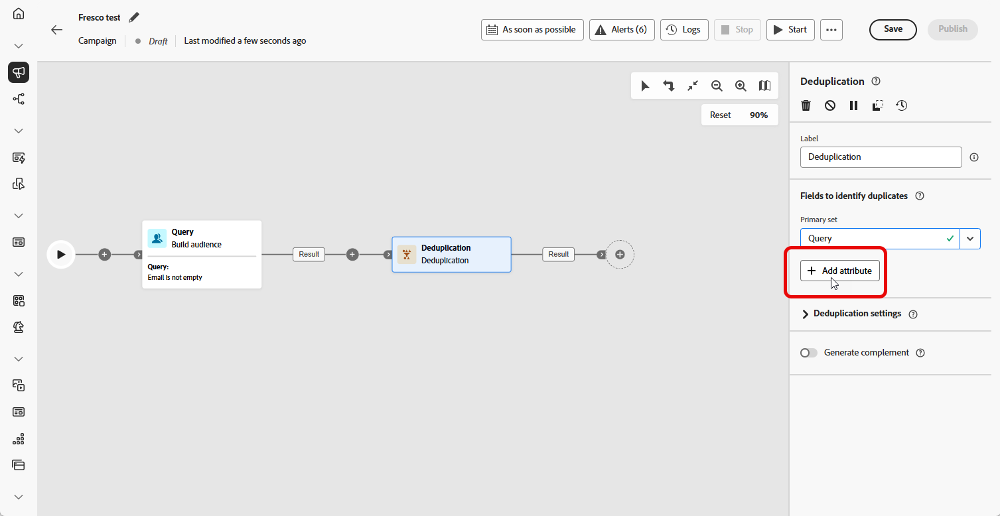
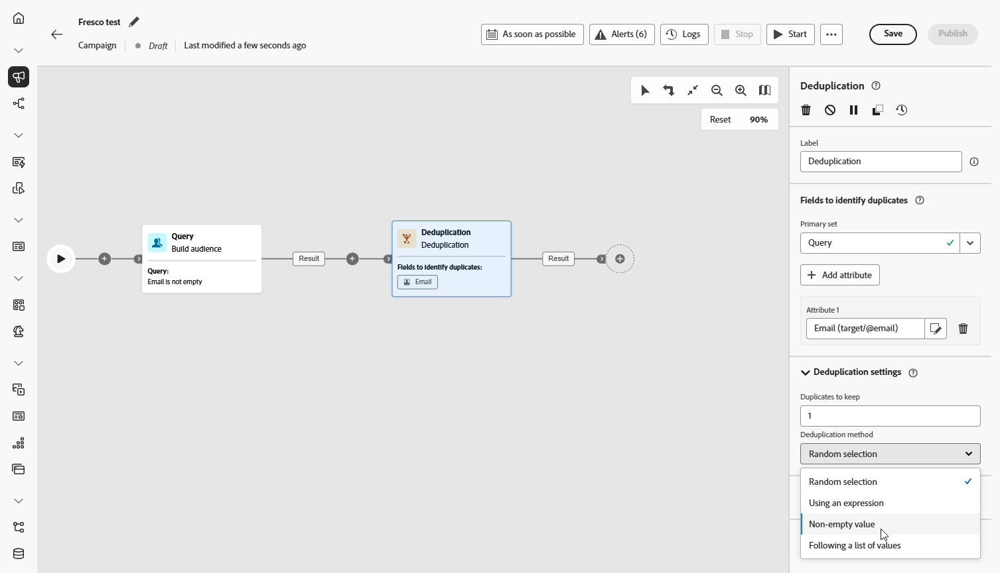
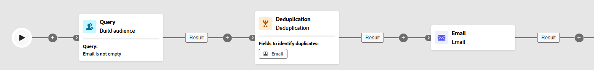

# 重複資料刪除 {#deduplication}

>[!CONTEXTUALHELP]
>id="ajo_orchestration_deduplication_fields"
>title="用於識別重複資料的欄位"
>abstract="在&#x200B;**&#x200B;用於識別重複資料的欄位&#x200B;**&#x200B;區段，按一下&#x200B;**&#x200B;新增屬性**&#x200B;按鈕以指定可允許識別重複資料之相同值的欄位，例如：電子郵件地址、名字、姓氏等。欄位的順序可讓您指定首先處理的資料。"

>[!CONTEXTUALHELP]
>id="ajo_orchestration_deduplication"
>title="重複資料刪除活動"
>abstract="「**重複資料刪除**」活動可讓您刪除傳入活動結果中的重複資料。其主要在目標市場選擇活動之後和允許使用目標資料的活動之前使用。"

>[!CONTEXTUALHELP]
>id="ajo_orchestration_deduplication_complement"
>title="產生補集"
>abstract="您可以使用剩餘群體 (其已因重複而排除) 產生額外的傳出轉變。若要這樣做，請開啟「**產生補集**」選項"

>[!CONTEXTUALHELP]
>id="ajo_orchestration_deduplication_settings"
>title="重複資料刪除設定"
>abstract="若要刪除傳入資料中的重複項目，請在以下欄位中定義重複資料刪除方法。預設只會保留一筆記錄。您還應該根據運算式或屬性選取重複資料刪除模式。預設情況下會隨機選取要避免重複的記錄。"

**[!UICONTROL 重複資料刪除]**&#x200B;活動是一種&#x200B;**[!UICONTROL 目標定位]**&#x200B;活動。此活動可讓您刪除傳入活動結果中的重複資料，例如收件者清單中的重複輪廓。**[!UICONTROL 重複資料刪除]**&#x200B;活動主要在目標市場選擇活動之後和允許使用目標資料的活動之前使用。

## 設定重複資料刪除活動{#deduplication-configuration}

請按照以下步驟設定&#x200B;**[!UICONTROL 重複資料刪除]**&#x200B;活動：

1. 將&#x200B;**[!UICONTROL 重複資料刪除]**&#x200B;活動新增至您的協調行銷活動。

1. 在&#x200B;**[!UICONTROL &#x200B;用於識別重複資料的欄位&#x200B;]**&#x200B;區段，按一下&#x200B;**[!UICONTROL &#x200B;新增屬性]**&#x200B;按鈕以指定可允許識別重複資料之相同值的欄位，例如：電子郵件地址、名字、姓氏等。欄位的順序可讓您指定首先處理的資料。

   

1. 在&#x200B;**[!UICONTROL 重複資料刪除設定]**&#x200B;區段中，選擇要使用 [要保留的重複資料] 欄位保留多少不重複記錄。預設值為 1，這會在每個重複群組保留一個記錄。將其設為 0 可保留所有重複資料。

   例如，如果記錄 A 和 B 是記錄 Y 的重複項目，而記錄 C 是記錄 Z 的重複項目：

   * **如果該欄位的值為 1**：僅保留 Y 和 Z 記錄。
   * **如果該欄位的值為 0**：會保留所有記錄 (A、B、C、Y、Z)。
   * **如果該欄位的值為 2**：會保留 C 和 Z，再加上 A、B 和 Y 中的兩個值，這是隨機選取或取決於您的重複資料刪除方法。

1. 選擇&#x200B;**[!UICONTROL 重複資料刪除方法]**，這會定義系統如何決定要保留每組重複資料中的哪些記錄：

   * **[!UICONTROL 隨機選取]**：隨機選取要保留在重複項目外的記錄。
   * **[!UICONTROL 使用運算式]**：根據您定義的運算式，保留具有最高或最低值的記錄。
   * **[!UICONTROL 非空白值]**：保留所選欄位非空白的記錄，例如，僅保留具有電話號碼的輪廓。
   * **[!UICONTROL 依循值清單]**：可讓您優先處理一或多個欄位的特定值，例如，您可以優先處理「國家/地區」設定為「法國」的記錄。按一下「**[!UICONTROL 屬性]**」以選擇欄位或建立自訂運算式。使用&#x200B;**[!UICONTROL 新增按鈕]**&#x200B;以優先順序輸入偏好的值。

   

1. 如果您希望利用剩餘的群體，可核取「**[!UICONTROL 產生補集]**」選項。補集包含所有重複項目。然後，額外的轉變會新增到活動中。

## 範例{#deduplication-example}

在下列範例中，**[!UICONTROL 重複資料刪除]**&#x200B;活動用於在傳送傳遞前，從目標客群中移除重複記錄。系統會先篩選客群，僅納入具有非空白電子郵件欄位的輪廓。然後，**[!UICONTROL 重複資料刪除]**&#x200B;活動會使用電子郵件地址來識別和排除重複項目。

