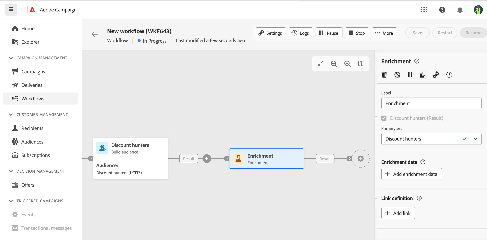
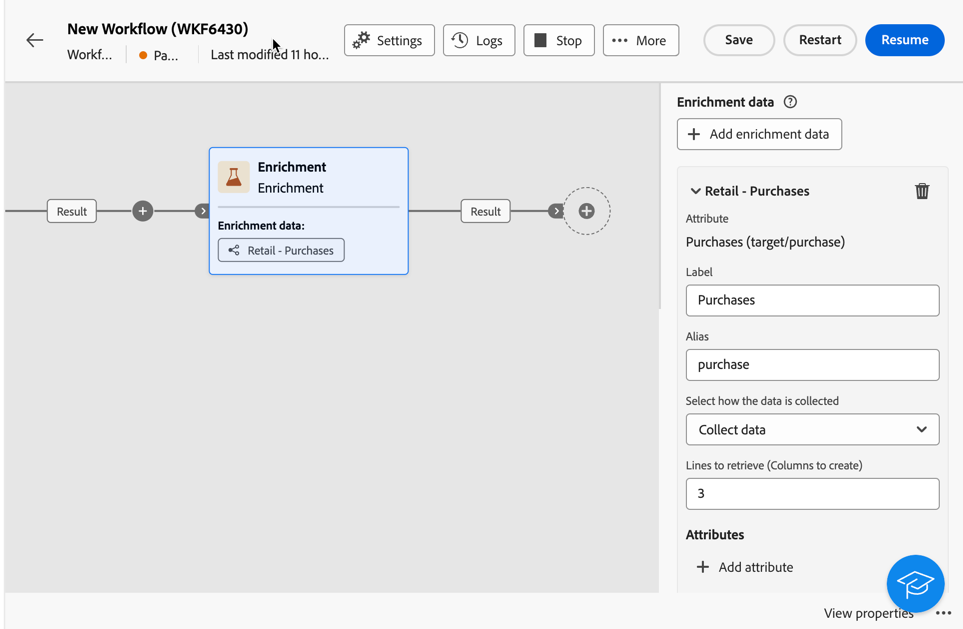
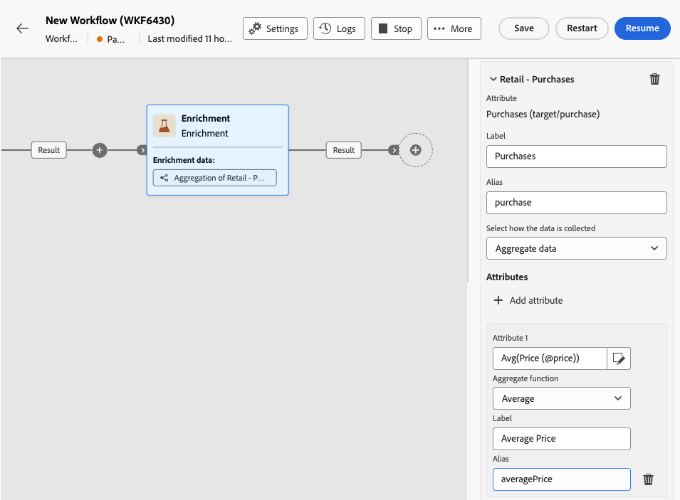
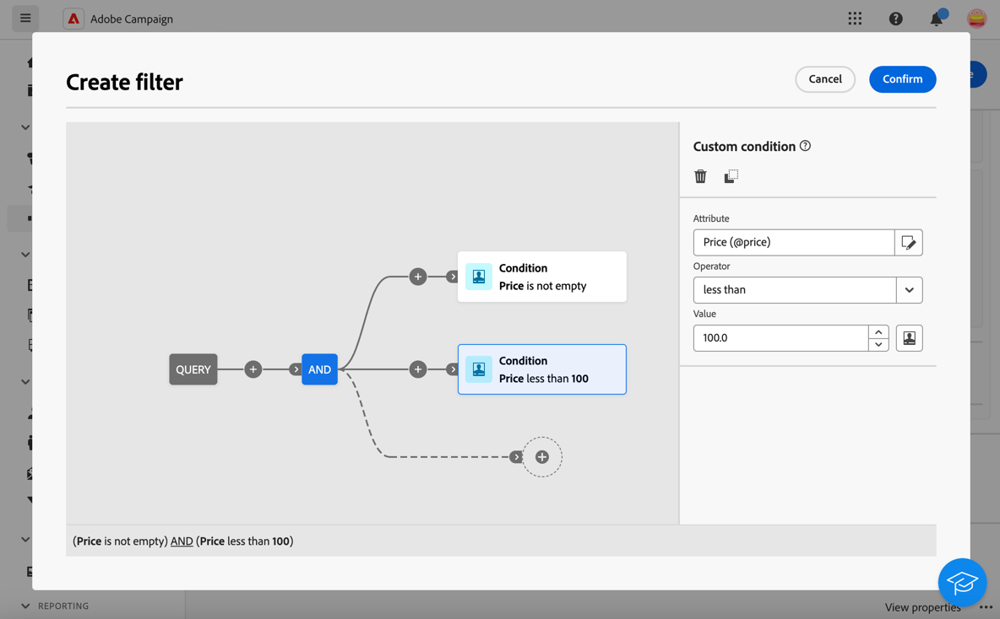

# 擴充 {#enrichment}

>[!CONTEXTUALHELP]
>id="ajo_orchestration_enrichment"
>title="擴充活動"
>abstract="「**擴充活動**」可讓您使用資料庫中的其他資訊來增強目標資料。這通常會用於分段活動之後的工作流程。"

+++ 目錄

| 歡迎使用協調的行銷活動 | 啟動您的第一個協調行銷活動 | 查詢資料庫 | 協調的行銷活動活動 |
|---|---|---|---|
| [開始使用協調的行銷活動](../gs-orchestrated-campaigns.md)  [設定步驟](../configuration-steps.md)  [建立協調行銷活動的重要步驟](../gs-campaign-creation.md) | [建立協調的行銷活動](../create-orchestrated-campaign.md)  [協調活動](../orchestrate-activities.md)  [使用協調的行銷活動傳送訊息](../send-messages.md)  [開始並監視行銷活動](../start-monitor-campaigns.md)  [報告](../reporting-campaigns.md) | [使用查詢Modeler](../orchestrated-query-modeler.md)  [建置您的第一個查詢](../build-query.md)  [編輯運算式](../edit-expressions.md) | [開始使用活動](about-activities.md)  活動： [並加入](and-join.md) - [建置對象](build-audience.md) - [變更維度](change-dimension.md) - [合併](combine.md) - [重複資料刪除](deduplication.md) - [擴充](enrichment.md) - [分支](fork.md) - [調解](reconciliation.md) - [分割](split.md) - [等待](wait.md) |

{style="table-layout:fixed"}

+++

  

「**擴充**」活動是一種「**目標定位**」活動。此活動可讓您使用資料庫中的其他資訊來增強目標資料。這通常會用於分段活動之後的工作流程。

擴充資料可以：

* **來自與您的協調行銷活動目標相同的工作表**：

  *鎖定一組客戶，並將[出生日期]欄位新增至目前的工作表*。

* **來自另一個工作表**：

  *以一組客戶為目標，並新增來自「購買」表格的「數量」和「產品類型」欄位*。

擴充資料新增至協調的行銷活動後，即可用於&#x200B;**擴充**&#x200B;活動後新增的活動，根據客戶的行為、偏好和需求將客戶細分為不同的群組，或建立更可能引起目標對象共鳴的個人化行銷訊息和行銷活動。

例如，您可以將客戶購買的相關資訊新增至精心安排的行銷活動工作表資訊，並使用此資料來個人化電子郵件，其中包含客戶最近一次購買或這些購買的花費金額。

## 新增擴充活動 {#enrichment-configuration}

請按照以下步驟設定&#x200B;**擴充**&#x200B;活動：

1. 新增活動，例如「**建置客群**」和「**組合**」活動。
1. 新增「**擴充**」活動。
1. 如果您的協調行銷活動中已設定多個轉變，您可以使用&#x200B;**[!UICONTROL 主要集]**&#x200B;欄位來定義應該使用哪個轉變作為主要集以擴充資料。

## 新增擴充資料 {#enrichment-add}

>[!CONTEXTUALHELP]
>id="ajo_targetdata_personalization_enrichmentdata"
>title="擴充資料"
>abstract="選取要用於擴充協調的行銷活動的資料。您可以選取兩種類型的擴充資料：目標維度中的單一擴充屬性，或集合連結 (即表格之間具有 1-N 基數的連結)。"

>[!CONTEXTUALHELP]
>id="ajo_orchestration_enrichment_data"
>title="擴充活動"
>abstract="將擴充資料新增至協調的行銷活動後，在擴充活動之後新增的活動中便可以使用擴充資料，根據客戶的行為、偏好和需求將客戶細分成不同群組，或是用於建立最有可能讓目標客群產生共鳴的個人化行銷訊息和行銷活動。"

1. 按一下&#x200B;**新增擴充資料**，並選取要用來擴充資料的屬性。

   您可以選取兩種擴充資料：來自目標維度的單一擴充屬性，或集合連結。 以下範例詳細說明了每種型別：
   * [單一擴充屬性](#single-attribute)
   * [集合連結](#collection-link)

   >[!NOTE]
   >
   >屬性選取畫面中的&#x200B;**編輯運算式按鈕**&#x200B;可讓您建置進階運算式以選取屬性。

   

## 建立表格之間的連結 {#create-links}

>[!CONTEXTUALHELP]
>id="ajo_orchestration_enrichment_simplejoin"
>title="連結定義"
>abstract="在工作表資料和 Adobe Journey Optimizer 資料庫之間建立連結。例如，如果您從包含收件者的帳號、國家/地區和電子郵件的檔案載入資料，您必須建立指向國家/地區表的連結，才能更新其設定檔中的此資訊。"

**[!UICONTROL 連結定義]**&#x200B;區段可讓您在工作表格資料與Adobe Journey Optimizer之間建立連結。 例如，如果您從包含收件者的帳號、國家/地區和電子郵件的檔案載入資料，您必須建立指向國家/地區表的連結，才能更新其設定檔中的此資訊。

有數種可用的連結型別：

* **[!UICONTROL 1基數簡易連結]**：來自主要集的每個記錄都可以與來自連結資料的一個及唯一一個記錄相關聯。
* **[!UICONTROL 0或1個基數簡單連結]**：來自主要集的每個記錄都可以與來自連結資料的0或1個記錄相關聯，但不能與多個記錄相關聯。
* **[!UICONTROL N個基數集合連結]**：來自主要集的每個記錄都可以與來自連結資料的0、1或更多(N)個記錄相關聯。

若要建立連結，請依照下列步驟進行：

1. 在&#x200B;**[!UICONTROL 連結定義]**&#x200B;區段中，按一下&#x200B;**[!UICONTROL 新增連結]**&#x200B;按鈕。

   

1. 在&#x200B;**關聯型別**&#x200B;下拉式清單中，選擇要建立的連結型別。

1. 識別您要將主要集連結到的目標：

   * 若要連結資料庫中現有的資料表，請選擇&#x200B;**[!UICONTROL 資料庫綱要]**，然後從&#x200B;**[!UICONTROL 目標綱要]**&#x200B;欄位中選取所要的資料表。
   * 若要與輸入轉變中的資料連結，請選擇&#x200B;**暫存結構描述**，並選取您要使用其資料的轉變。

1. 定義調解准則，將來自主要集的資料與連結的結構描述相符。 可用的聯結型別有兩種：

   * **簡單聯結**：選取特定屬性，以比對兩個結構描述中的資料。 按一下&#x200B;**新增聯結**，然後選取要用來作為調解條件的&#x200B;**Source**&#x200B;和&#x200B;**目的地**&#x200B;屬性。
   * **進階聯結**：使用進階條件建立聯結。 按一下&#x200B;**新增聯結**，然後按一下&#x200B;**建立條件**&#x200B;按鈕以開啟查詢模型工具。

[範例](#link-example)區段提供使用連結的工作流程範例。

## 資料調和 {#reconciliation}

>[!CONTEXTUALHELP]
>id="ajo_orchestration_enrichment_reconciliation"
>title="調和"
>abstract="您可使用「**擴充**」活動將 Journey Optimizer 結構描述中的資料與其他結構描述中的資料，或來自臨時結構描述的資料 (例如使用「載入」檔案活動上傳的資料) 用於調和資料。此類型的連結定義對唯一記錄的調和。Journey Optimizer 透過在其中新增外來金鑰以建立目標表格的連結，來儲存對唯一記錄的參考。"

您可使用「**擴充**」活動將 Campaign 資料庫結構描述中的資料與其他結構描述中的資料，或來自臨時結構描述的資料 (例如使用「載入」檔案活動上傳的資料) 進行調和。此類型的連結定義對唯一記錄的調和。Journey Optimizer 透過在其中新增外來金鑰以建立目標表格的連結，來儲存對唯一記錄的參考。

例如，您可以使用此選項將上傳檔案中指定的輪廓所在國家/地區與 Campaign 資料庫專用表中可用的國家/地區之一進行調和。

請依照下列步驟，使用調解連結設定&#x200B;**擴充**&#x200B;活動：

1. 按一下&#x200B;**調解**&#x200B;區段中的&#x200B;**新增連結**&#x200B;按鈕。
1. 識別您要建立調解連結的資料。

   * 若要使用Campaign資料庫中的資料建立調解連結，請選取&#x200B;**資料庫綱要**，然後選擇儲存目標的綱要。
   * 若要使用來自輸入轉變的資料建立調解連結，請選取&#x200B;**暫時綱要**，然後選擇儲存目標資料之協調行銷活動轉變。

1. **標籤**&#x200B;和&#x200B;**名稱**&#x200B;欄位會根據所選的目標結構描述自動填入。 您可以視需要變更其值。

1. 在&#x200B;**調解條件**&#x200B;區段中，指定您要如何調解來源資料表和目的地資料表的資料：

   * **簡單聯結**：調解來源資料表中的特定欄位與目的地資料表中的另一個欄位。 若要這麼做，請按一下&#x200B;**新增聯結**&#x200B;按鈕，並指定要用於調解的&#x200B;**Source**&#x200B;和&#x200B;**目的地**&#x200B;欄位。

     >[!NOTE]
     >
     >您可使用一或多個&#x200B;**簡單聯結**&#x200B;條件，在此情況下，這些條件都必須經過驗證，才能將資料連結在一起。

   * **進階聯結**：使用查詢模組化程式來設定調解條件。 若要這麼做，請按一下&#x200B;**建立條件**&#x200B;按鈕，然後使用AND和OR作業建立您自己的規則，以定義調解條件。

以下範例顯示一個協調的行銷活動，其設定為在Journey Optimizer設定檔表格與產生&#x200B;**載入檔案**&#x200B;活動的暫存表格之間建立連結。 在此範例中，**擴充**&#x200B;活動會使用電子郵件地址作為調解條件來調解兩個表格。

## 新增產品建議 {#add-offers}

>[!CONTEXTUALHELP]
>id="ajo_orchestration_enrichment_offer_proposition"
>title="產品建議提議"
>abstract="擴充活動可讓您為每個客戶設定檔新增產品建議。"

**[!UICONTROL 擴充]**&#x200B;活動可讓您為每個設定檔新增優惠。

若要這麼做，請依照步驟使用選件設定&#x200B;**[!UICONTROL 擴充]**&#x200B;活動：

1. 在&#x200B;**[!UICONTROL 擴充]**&#x200B;活動中，在&#x200B;**[!UICONTROL 優惠方案主張]**&#x200B;區段，按一下&#x200B;**[!UICONTROL 新增優惠方案]**&#x200B;按鈕

   

1. 您有兩個選項可選取優惠方案：

   * **[!UICONTROL 搜尋類別中的最佳優惠方案]** ：勾選此選項並指定優惠方案引擎呼叫引數（優惠方案空間、類別或主題、聯絡日期、要保留的優惠方案數目）。 引擎將根據這些引數計算要新增的最佳選件。 我們建議填寫「類別」或「主題」欄位，而不是同時填寫兩者。

     

   * **[!UICONTROL 預先定義的優惠方案]** ：核取此選項，並指定優惠方案空間、特定優惠方案和聯絡日期，以直接設定您要新增的優惠方案，而不呼叫優惠方案引擎。

     

1. 選取您的選件後，按一下&#x200B;**[!UICONTROL 確認]**&#x200B;按鈕。

您現在可以在傳送活動中使用選件。

### 使用擴充活動的選件

在協調的行銷活動中，如果您想要使用在傳送中從擴充活動取得的選件，請遵循下列步驟：

1. 開啟傳送活動，然後前往內容版本。 按一下&#x200B;**[!UICONTROL 優惠方案設定]**&#x200B;按鈕，然後在下拉式清單中選取與您的優惠方案對應的&#x200B;**[!UICONTROL 優惠方案空間]**。
如果您只想檢視擴充活動的優惠方案，請將**[!UICONTROL 建議]**&#x200B;的數目設為0，然後儲存修改。

   

1. 在電子郵件設計工具中，新增包含優惠方案的個人化時，按一下&#x200B;**[!UICONTROL 主張]**&#x200B;圖示，將顯示您從&#x200B;**[!UICONTROL 擴充]**&#x200B;活動取得的優惠。 按一下選件，開啟您要選擇的選件。

   

   進入&#x200B;**[!UICONTROL 演算函式]**，並根據您的需求選擇&#x200B;**[!UICONTROL HTML演算]**&#x200B;或&#x200B;**[!UICONTROL 文字演算]**。

   

>[!NOTE]
>
>如果您選擇在&#x200B;**[!UICONTROL 擴充]**&#x200B;活動中於&#x200B;**[!UICONTROL 要保留的優惠方案數目]**&#x200B;選項處有多個優惠方案，則按一下&#x200B;**[!UICONTROL 主張]**&#x200B;圖示時，會顯示所有優惠方案。

## 範例 {#example}

### 單一擴充屬性 {#single-attribute}

在這裡，我們只新增單一擴充屬性，例如出生日期。請按照以下步驟操作：

1. 按一下「**屬性**」欄位內部。
1. 在目標定位維度中選取一個簡單的欄位，在範例中是出生日期。
1. 按一下「**確認**」。

### 集合連結 {#collection-link}

在這個較複雜的使用案例中，我們要選取集合連結，這是表格之間具有 1-N 基數的連結。讓我們擷取最近三筆低於 100 美元的購買。為了這麼做，您需要定義：

* 擴充屬性： **價格**&#x200B;欄位
* 要擷取的行數：3
* 篩選：篩除大於 100 美元的項目
* 排序： **排序日期**&#x200B;欄位的降序排序。

#### 新增此屬性 {#add-attribute}

您可以在此處選取用作擴充資料的集合連結。

1. 按一下「**屬性**」欄位內部。
1. 按一下「**顯示進階屬性**」。
1. 從&#x200B;**購買**&#x200B;資料表中選取&#x200B;**價格**&#x200B;欄位。

<!--  -->

#### 定義集合設定{#collection-settings}

然後，定義收集資料的方式以及要擷取的記錄數。

1. 選取「**集合資料**」(從「**選取收集資料的方式**」下拉選單)。
1. 在「**要擷取的行 (要建立的欄)**」欄位輸入「3」。

例如，如果您想要取得某個客戶的平均購買金額，請改為選取「**彙總資料**」，然後選取「**平均**」(從「**彙總函數**」下拉選單)。

請使用您屬性的&#x200B;**標籤**&#x200B;和&#x200B;**別名**&#x200B;欄位，使其更易於理解，如下所示。

#### 定義篩選條件{#collection-filters}

在這裡，我們可定義擴充屬性的最大值。我們會篩除大於 100 美元的項目。
1. 按一下&#x200B;**建立篩選器**。
1. 新增下列兩個篩選器： **Price**&#x200B;存在且&#x200B;**Price**&#x200B;小於100。 第一個會篩選出 NULL 值，因為這會顯示為最大值。
1. 按一下「**確認**」。

#### 定義排序{#collection-sorting}

我們現在需要套用排序，以擷取三筆&#x200B;**最近的**&#x200B;購買。

1. 啟動「**啟用排序**」選項。
1. 按一下「**屬性**」欄位內部。
1. 選取「**訂購日期**」欄位。
1. 按一下「**確認**」。
1. 選取「**遞減**」(從「**排序**」下拉選單)。

### 使用連結的資料擴充 {#link-example}

以下範例顯示一個協調的行銷活動，其設定為在兩個轉變之間建立連結。 第一個轉變目標為使用&#x200B;**查詢**&#x200B;活動的設定檔資料，而第二個轉變包括儲存在透過「載入檔案」活動載入的檔案中的購買資料。

* 第一個&#x200B;**擴充**&#x200B;活動會將主要集（來自&#x200B;**查詢**&#x200B;活動的資料）與&#x200B;**載入檔案**&#x200B;活動的結構描述連結。 這可讓我們將查詢定位的每個設定檔與對應的購買資料進行比對。

  

* 已新增第二個&#x200B;**擴充**&#x200B;活動，以便使用來自&#x200B;**載入檔案**&#x200B;活動的購買資料，擴充來自協調行銷活動表格的資料。 這可讓我們在後續活動中使用這些資料，例如，個人化傳送給客戶的訊息，其中包含客戶購買的相關資訊。

  
