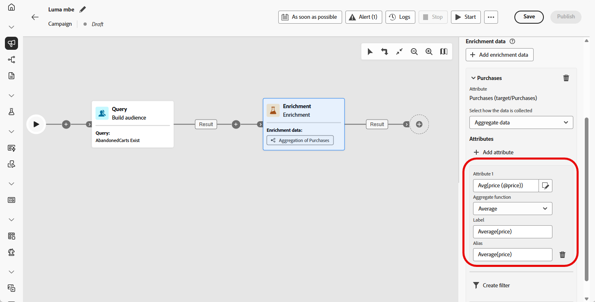
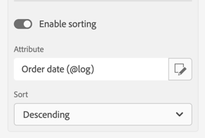
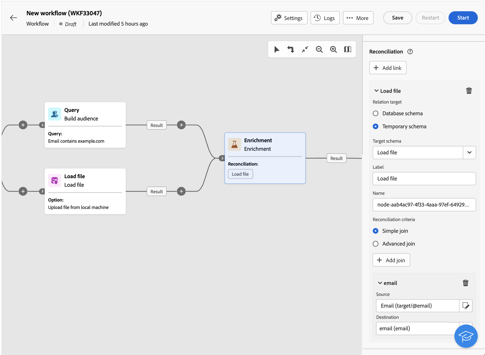
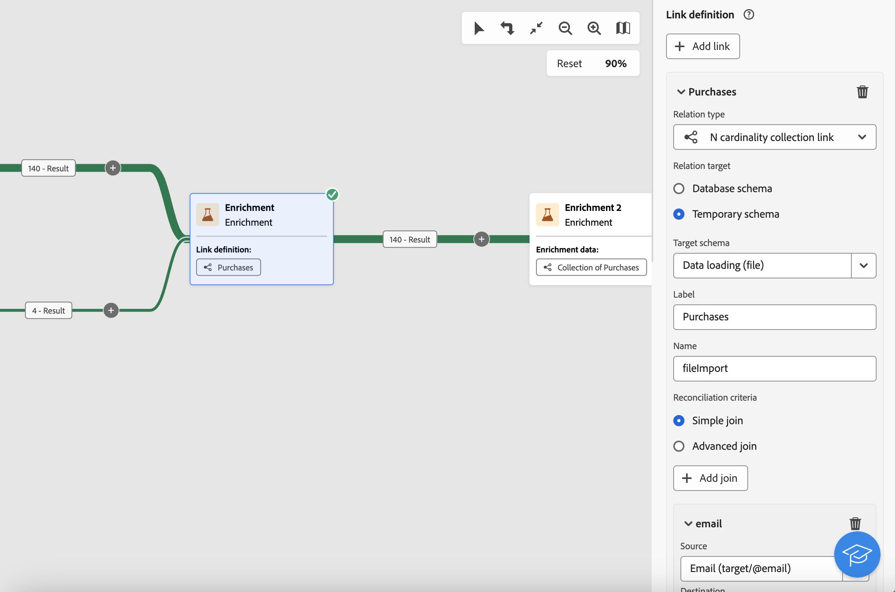
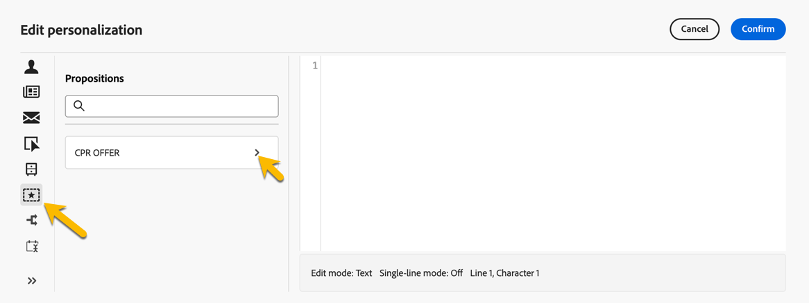

# 擴充 {#enrichment}

>[!BEGINSHADEBOX]

**在此頁面上：**&#x200B;瞭解如何在協調的行銷活動中使用擴充目標定位活動，以使用其他屬性、連結的表格資料及選件來增強您的對象，以實現更精確的目標定位和個人化。

>[!ENDSHADEBOX]

>[!CONTEXTUALHELP]
>id="ajo_orchestration_enrichment"
>title="擴充活動"
>abstract="「**擴充活動**」可讓您使用資料庫中的其他資訊來增強目標資料。 這通常會用於分段活動之後的行銷活動。"

**[!UICONTROL 擴充]**&#x200B;活動是&#x200B;**[!UICONTROL 目標定位]**&#x200B;活動，可讓您使用其他屬性增強您的客群資料。

您可以善用此資訊，根據行為、偏好或需求更精確地劃分客群，並製作個人化訊息，以便與每個輪廓更密切地連結。

## 新增擴充活動 {#enrichment-configuration}

>[!CONTEXTUALHELP]
>id="ajo_targetdata_personalization_enrichmentdata"
>title="擴充資料"
>abstract="選取要用於擴充協調的行銷活動的資料。 您可以選取兩種類型的擴充資料：目標維度中的單一擴充屬性，或集合連結 (即表格之間具有 1-N 基數的連結)。"

>[!CONTEXTUALHELP]
>id="ajo_orchestration_enrichment_data"
>title="擴充活動"
>abstract="將擴充資料新增至協調的行銷活動後，在擴充活動之後新增的活動中便可以使用擴充資料，根據客戶的行為、偏好和需求將客戶細分成不同群組，或是用於建立最有可能讓目標客群產生共鳴的個人化行銷訊息和行銷活動。"

請按照以下步驟設定&#x200B;**擴充**&#x200B;活動：

1. 新增「**擴充**」活動。

1. 按一下「**新增擴充資料**」，並選取要用來擴充資料的屬性。

   您可以選取兩種類型的擴充資料：來自目標維度的單一擴充屬性，或是集合連結。 以下範例詳細說明了每種類型：

   * [單一擴充屬性](#single-attribute)
   * [集合連結](#collection-link)

   

1. 按一下&#x200B;**[!UICONTROL 新增連結]**，在工作表格資料與Adobe Journey Optimizer之間建立連結。 [了解更多](#create-links)

   例如，如果您從包含客戶忠誠度等級和上次購買日期的檔案載入資料，則需要建立設定檔表格的連結，以利用這些屬性擴充收件者記錄，並將這些記錄用於個人化或目標定位。

   

## 建立表格之間的連結 {#create-links}

>[!CONTEXTUALHELP]
>id="ajo_orchestration_enrichment_simplejoin"
>title="連結定義"
>abstract="在工作表資料和 Adobe Journey Optimizer 資料庫之間建立連結。 例如，如果您從包含收件者的帳號、國家/地區和電子郵件的檔案載入資料，您必須建立指向國家/地區表的連結，才能更新其輪廓中的這些資訊。"

使用&#x200B;**[!UICONTROL 連結定義]**&#x200B;區段來定義工作資料表與其他資料來源之間的關係。 例如，如果您匯入包含客戶忠誠度等級和上次購買日期的檔案，您可以建立設定檔表格的連結，以便這些屬性可用於個人化和目標定位。

若要建立連結：

1. 在&#x200B;**[!UICONTROL 連結定義]**&#x200B;區段中，按一下&#x200B;**[!UICONTROL 新增連結]**。

   

1. 從&#x200B;**[!UICONTROL 關聯型別]**&#x200B;下拉式清單中，選取主要集和連結資料之間的關聯型別：

   * **[!UICONTROL 1基數簡單連結]**：主要集中的每個記錄都對應到連結資料中的一個記錄。
   * **[!UICONTROL 0或1個基數簡單連結]**：主要集中的每個記錄都對應到連結資料中的零個或一個記錄。
   * **[!UICONTROL N基數集合連結]**：主要集中的每個記錄都可以對應到連結資料中的多個記錄。

   

1. 選取要將主要集連結到的目標：

   * **[!UICONTROL 資料庫結構描述]**：連結到資料庫中現有的資料表。 從&#x200B;**[!UICONTROL 目標結構描述]**&#x200B;欄位中選取資料表。
   * **[!UICONTROL 暫存結構描述]**：連結到從輸入轉變到達的資料。 從清單中選取相關的轉變。

1. 定義用於比對主要集和連結結構描述之間記錄的聯結條件：

   * **[!UICONTROL 簡單聯結]**：符合特定屬性配對上的記錄。 按一下&#x200B;**[!UICONTROL 新增聯結]**，然後選取要當作相符條件使用的&#x200B;**[!UICONTROL Source]**&#x200B;和&#x200B;**[!UICONTROL 目的地]**&#x200B;屬性。
   * **[!UICONTROL 進階聯結]**：使用規則產生器建置自訂比對邏輯。 按一下&#x200B;**[!UICONTROL 建立條件]**&#x200B;以開始。

## 範例 {#example}

### 單一擴充屬性 {#single-attribute}

在此範例中，您會使用目前目標維度的單一屬性 (例如出生日期) 來擴充客群。

操作步驟：

1. 按一下「**[!UICONTROL 新增擴充資料]**」。

1. 從目前維度中選取簡單欄位，例如&#x200B;**[!UICONTROL 出生日期]**。

   

1. 按一下「**[!UICONTROL 確認]**」。

### 集合連結 {#collection-link}

此使用案例利用連結表格的資料來擴充您的客群。 例如，您想要擷取最近三次金額低於美金 100 元的購買。

若要達成此目的，請依照以下方式設定擴充：

* **擴充屬性**：**[!UICONTROL 價格]**

* **要擷取的記錄數**：3

* **篩選器**：僅包含&#x200B;**[!UICONTROL 價格]**&#x200B;低於美金 100 元的購買

#### 新增此屬性 {#add-attribute}

首先，選取包含您要擴充之資料的集合連結。

1. 按一下「**[!UICONTROL 新增擴充資料]**」。

1. 從&#x200B;**[!UICONTROL 購買]**&#x200B;表格中，選取「**[!UICONTROL 價格]**」欄位。

   

#### 定義集合設定{#collection-settings}

接下來，設定應如何收集資料，還有該加入多少專案。

1. 請在&#x200B;**[!UICONTROL 選取資料收集方式]**&#x200B;下拉式清單中，選擇&#x200B;**[!UICONTROL 收集資料]**。

   

1. 請在&#x200B;**[!UICONTROL 想擷取 (想建立的資料行)]** 欄位中，輸入`3`。

1. 若想執行彙總 (例如，平均購買金額)，請選取&#x200B;**[!UICONTROL 彙總資料]**，然後從&#x200B;**[!UICONTROL 彙總函數]**&#x200B;下拉式清單中選擇&#x200B;**[!UICONTROL 平均]**。

   

1. 使用&#x200B;**[!UICONTROL 標籤]**&#x200B;和&#x200B;**[!UICONTROL 別名]**&#x200B;欄位，就能在後續活動中更容易識別出擴充屬性。

#### 定義篩選條件{#collection-filters}

最後，套用篩選條件，以便確保只會加入相關記錄：

1. 按一下「**[!UICONTROL 建立篩選條件]**」。

1. 新增以下兩種條件：

   * **[!UICONTROL 價格]**&#x200B;依然存在 (將 NULL 排除在外)

   * **[!UICONTROL 價格]**&#x200B;不超過 100

   

1. 按一下「**[!UICONTROL 確認]**」。

<!--
#### Define the sorting{#collection-sorting}

We now need to apply sorting in order to retrieve the three **latest** purchases.

1. Activate the **Enable sorting** option.
1. Click inside the **Attribute** field.
1. Select the **Order date** field.
1. Click **Confirm**. 
1. Select **Descending** from the **Sort** drop-down.

## Data reconciliation {#reconciliation}

>[!CONTEXTUALHELP]
>id="ajo_orchestration_enrichment_reconciliation"
>title="Reconciliation"
>abstract="The **Enrichment** activity can be used to reconcile data from the Journey Optimizer schema with data from another schema, or with data coming from a temporary schema such as data uploaded using a Load file activity. This type of link defines a reconciliation towards a unique record. Journey Optimizer creates a link to a target table by adding a foreign key in it for storing a reference to the unique record."

The **Enrichment** activity can be used to reconcile data from the the Campaign database schema with data from another schema, or with data coming from a temporary schema such as data uploaded using a Load file activity. This type of link defines a reconciliation towards a unique record. Journey Optimizer creates a link to a target table by adding a foreign key in it for storing a reference to the unique record.

For example, you can use this option to reconcile a profile's country, specified in an uploaded file, with one of the countries available in the dedicated table of the Campaign database. 

Follow the steps to configure an **Enrichment** activity with a reconciliation link: 

1. Click the **Add link** button in the **Reconciliation** section.
1. Identify the data you want to create a reconciliation link with.

    * To create a reconciliation link with data from the Campaign database, select **Database schema** and choose the schema where the target is stored. 
    * To create a reconciliation link with data coming from the input transition, select **Temporary schema** and choose the Orchestrated campaign transition where the target data is stored. 

1. The **Label** and **Name** fields are automatically populated based on the selected target schema. You can change their values if necessary.

1. In the **Reconciliation criteria** section, specify how you want to reconcile data from the source and destination tables:

    * **Simple join**: Reconcile a specific field from the source table with another field in the destination table. To do this, click the **Add join** button and specify the **Source** and **Destination** fields to use for the reconciliation.

        >[!NOTE]
        >
        >You can use one or more **Simple join** criteria, in which case they must all be verified so that the data can be linked together.

    * **Advanced join**: Use the rule builder to configure the reconciliation criteria. To do this, click the **Create condition** button then define your reconciliation criteria by building your own rule using AND and OR operations.

The example below shows an Orchestrated campaign configured to create a link between Journey Optimizer profiles table and a temporary table generated a **Load file** activity. In this example, the **Enrichment** activity reconciliates both tables using the email address as reconciliation criteria.

### Enrichment with linked data {#link-example}

The example below shows an Orchestrated campaign configured to create a link between two transitions. The first transitions targets profile data using a **Query** activity, while the second transition includes purchase data stored into a file loaded through a Load file activity.

* The first **Enrichment** activity links the primary set (data from the **Query** activity) with the schema from the **Load file** activity. This allows us to match each profile targeted by the query with the corresponding purchase data.

    

* A second **Enrichment** activity is added in order to enrich data from the Orchestrated campaign table with the purchase data coming from the **Load file** activity. This allows us to use those data in further activities, for example, to personalize messages sent to the customers with information on their purchase.

    

## Add offers {#add-offers}

>[!CONTEXTUALHELP]
>id="ajo_orchestration_enrichment_offer_proposition"
>title="Offer proposition"
>abstract="The Enrichment activity allows you to add offers for each profile."

The **[!UICONTROL Enrichment]** activity allows you to add offers for each profile.

To do so, follow the steps to configure an **[!UICONTROL Enrichment]** activity with an offer: 

1. In the **[!UICONTROL Enrichment]** activity, at the **[!UICONTROL Offer proposition]** section, click on the **[!UICONTROL Add offer]** button

    

1. You have two choices for the offer selection :

    * **[!UICONTROL Search for the best offer in category]** : check this option and specify the offer engine call parameters (offer space, category or theme(s), contact date, number of offers to keep). The engine will calculate the best offer(s) to add according to these parameters. We recommend completing either the Category or the Theme field, rather than both at the same time.

        

    * **[!UICONTROL A predefined offer]** : check this option and specify an offer space, a specific offer, and a contact date to directly configure the offer that you would like to add, without calling the offer engine.

        

1. After selecting your offer, click on **[!UICONTROL Confirm]** button.

You can now use the offer in the delivery activity.

### Using the offers from Enrichment activity

Within an Orchestrated campaign, if you want to use the offers you get from an enrichment activity in your delivery, follow the steps below:

1. Open the delivery activity and go in the content edition. Click on **[!UICONTROL Offers settings]** button and select in the drop-down list the **[!UICONTROL Offers space]** corresponding to your offer. 
If you want to to view only offers from the enrichment activity, set the number of **[!UICONTROL Propositions]** to 0, and save the modifications.

     

1. In the Email Designer, when adding a personalization with offers, click on the **[!UICONTROL Propositions]** icon, it will display the offer(s) you get from the **[!UICONTROL Enrichment]** activity. Open the offer you want to choose by clicking on it.

     

    Go in **[!UICONTROL Rendering functions]** and choose **[!UICONTROL HTML rendering]** or **[!UICONTROL Text rendering]** according to your needs.

     

>[!NOTE]
>
>If you choose to have more than one offer in the **[!UICONTROL Enrichment]** activity at the **[!UICONTROL Number of offers to keep]** option, all the offers are displayed when clicking on the **[!UICONTROL Propositions]** icon.
-->