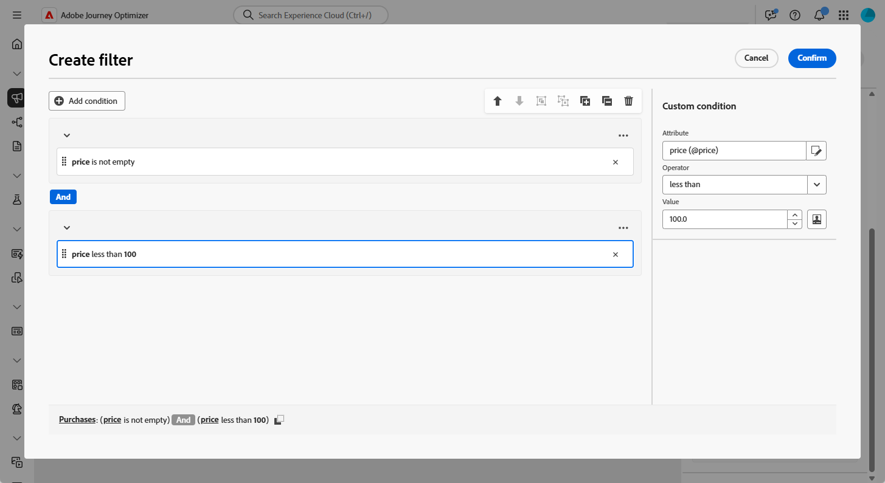
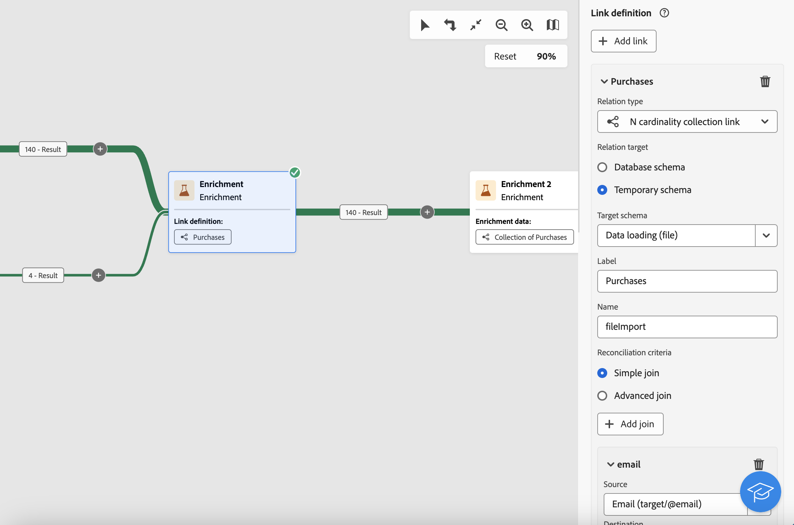
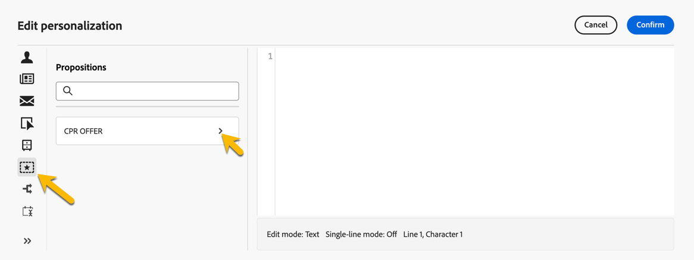

# 擴充 {#enrichment}

>[!CONTEXTUALHELP]
>id="ajo_orchestration_enrichment"
>title="擴充活動"
>abstract="「**擴充活動**」可讓您使用資料庫中的其他資訊來增強目標資料。這通常會用於分段活動之後的工作流程。"

+++ 目錄

| 歡迎使用協調的行銷活動 | 啟動您的第一個協調行銷活動 | 查詢資料庫 | 協調行銷活動 |
|---|---|---|---|
| [開始使用協調的行銷活動](../gs-orchestrated-campaigns.md)  建立和管理關聯式結構描述和資料集：  <ul><li>[開始使用結構描述和資料集](../gs-schemas.md)</li><li>[手動結構描述](../manual-schema.md)</li><li>[檔案上傳結構描述](../file-upload-schema.md)</li><li>[擷取資料](../ingest-data.md)</li></ul>[存取及管理協調的行銷活動](../access-manage-orchestrated-campaigns.md) | [建立協調行銷活動的關鍵步驟](../gs-campaign-creation.md)  [建立並排程行銷活動](../create-orchestrated-campaign.md)  [協調活動](../orchestrate-activities.md)  [開始並監視行銷活動](../start-monitor-campaigns.md)  [報告](../reporting-campaigns.md) | [使用規則產生器](../orchestrated-rule-builder.md)  [建立您的第一個查詢](../build-query.md)  [編輯運算式](../edit-expressions.md)  [重定向](../retarget.md) | [開始使用活動](about-activities.md)  活動： [同時加入](and-join.md) - [建立客群](build-audience.md) - [變更維度](change-dimension.md) - [頻道活動](channels.md) - [合併](combine.md) - [重複資料刪除](deduplication.md) - <b>[擴充](enrichment.md)</b> - [分支](fork.md) - [調和](reconciliation.md) - [儲存客群](save-audience.md) - [分割](split.md) - [等待](wait.md) |

{style="table-layout:fixed"}

+++

 

>[!BEGINSHADEBOX]

 

此頁面上的內容不是最終內容，可能會有變動。

>[!ENDSHADEBOX]

**[!UICONTROL 擴充]**&#x200B;活動是&#x200B;**[!UICONTROL 目標定位]**&#x200B;活動，可讓您使用其他屬性增強您的客群資料。

您可以善用此資訊，根據行為、偏好或需求更精確地劃分客群，並製作個人化訊息，以便與每個輪廓更密切地連結。

## 新增擴充活動 {#enrichment-configuration}

>[!CONTEXTUALHELP]
>id="ajo_targetdata_personalization_enrichmentdata"
>title="擴充資料"
>abstract="選取要用來擴充您的協調行銷活動的資料。 您可以選取兩種類型的擴充資料：目標維度中的單一擴充屬性，或集合連結 (即表格之間具有 1-N 基數的連結)。"

>[!CONTEXTUALHELP]
>id="ajo_orchestration_enrichment_data"
>title="擴充活動"
>abstract="擴充資料新增至協調行銷活動後，即可用於擴充活動後新增的活動，以根據客戶行為、偏好和需求將客戶分組成不同的群組，或建立更可能引起目標對象共鳴的個人化行銷訊息和行銷活動。"

請按照以下步驟設定&#x200B;**擴充**&#x200B;活動：

1. 新增「**擴充**」活動。

1. 按一下「**新增擴充資料**」，並選取要用來擴充資料的屬性。

   您可以選取兩種類型的擴充資料：來自目標維度的單一擴充屬性，或是集合連結。以下範例詳細說明了每種類型：

   * [單一擴充屬性](#single-attribute)
   * [集合連結](#collection-link)

   

## 範例 {#example}

### 單一擴充屬性 {#single-attribute}

在此範例中，您會使用目前目標維度的單一屬性 (例如出生日期) 來擴充客群。

操作步驟：

1. 按一下「**[!UICONTROL 新增擴充資料]**」。

1. 從目前維度中選取簡單欄位，例如&#x200B;**[!UICONTROL 出生日期]**。

   

1. 按一下「**[!UICONTROL 確認]**」。

### 集合連結 {#collection-link}

此使用案例利用連結表格的資料來擴充您的客群。例如，您想要擷取最近三次金額低於美金 100 元的購買。

若要達成此目的，請依照以下方式設定擴充：

* **擴充屬性**：**[!UICONTROL 價格]**

* **要擷取的記錄數**：3

* **篩選器**：僅包含&#x200B;**[!UICONTROL 價格]**&#x200B;低於美金 100 元的購買

#### 新增此屬性 {#add-attribute}

首先，選取包含您要擴充之資料的集合連結。

1. 按一下「**[!UICONTROL 新增擴充資料]**」。

1. 從&#x200B;**[!UICONTROL 購買]**&#x200B;表格中，選取「**[!UICONTROL 價格]**」欄位。

   

#### 定義集合設定{#collection-settings}

接下來，設定應如何收集資料，還有該加入多少專案。

1. 請在&#x200B;**[!UICONTROL 選取資料收集方式]**&#x200B;下拉式清單中，選擇&#x200B;**[!UICONTROL 收集資料]**。

   

1. 請在&#x200B;**[!UICONTROL 想擷取 (想建立的資料行)]** 欄位中，輸入`3`。

1. 若想執行彙總 (例如，平均購買金額)，請選取&#x200B;**[!UICONTROL 彙總資料]**，然後從&#x200B;**[!UICONTROL 彙總函數]**&#x200B;下拉式清單中選擇&#x200B;**[!UICONTROL 平均]**。

   

1. 使用&#x200B;**[!UICONTROL 標籤]**&#x200B;和&#x200B;**[!UICONTROL 別名]**&#x200B;欄位，就能在後續活動中更容易識別出擴充屬性。

#### 定義篩選條件{#collection-filters}

最後，套用篩選條件，以便確保只會加入相關記錄：

1. 按一下「**[!UICONTROL 建立篩選條件]**」。

1. 新增以下兩種條件：

   * **[!UICONTROL 價格]**&#x200B;依然存在 (將 NULL 排除在外)

   * **[!UICONTROL 價格]**&#x200B;不超過 100

   

1. 按一下「**[!UICONTROL 確認]**」。

<!--
#### Define the sorting{#collection-sorting}

We now need to apply sorting in order to retrieve the three **latest** purchases.

1. Activate the **Enable sorting** option.
1. Click inside the **Attribute** field.
1. Select the **Order date** field.
1. Click **Confirm**. 
1. Select **Descending** from the **Sort** drop-down.

## Data reconciliation {#reconciliation}

>[!CONTEXTUALHELP]
>id="ajo_orchestration_enrichment_reconciliation"
>title="Reconciliation"
>abstract="The **Enrichment** activity can be used to reconcile data from the Journey Optimizer schema with data from another schema, or with data coming from a temporary schema such as data uploaded using a Load file activity. This type of link defines a reconciliation towards a unique record. Journey Optimizer creates a link to a target table by adding a foreign key in it for storing a reference to the unique record."

The **Enrichment** activity can be used to reconcile data from the the Campaign database schema with data from another schema, or with data coming from a temporary schema such as data uploaded using a Load file activity. This type of link defines a reconciliation towards a unique record. Journey Optimizer creates a link to a target table by adding a foreign key in it for storing a reference to the unique record.

For example, you can use this option to reconcile a profile's country, specified in an uploaded file, with one of the countries available in the dedicated table of the Campaign database. 

Follow the steps to configure an **Enrichment** activity with a reconciliation link: 

1. Click the **Add link** button in the **Reconciliation** section.
1. Identify the data you want to create a reconciliation link with.

    * To create a reconciliation link with data from the Campaign database, select **Database schema** and choose the schema where the target is stored. 
    * To create a reconciliation link with data coming from the input transition, select **Temporary schema** and choose the Orchestrated campaign transition where the target data is stored. 

1. The **Label** and **Name** fields are automatically populated based on the selected target schema. You can change their values if necessary.

1. In the **Reconciliation criteria** section, specify how you want to reconcile data from the source and destination tables:

    * **Simple join**: Reconcile a specific field from the source table with another field in the destination table. To do this, click the **Add join** button and specify the **Source** and **Destination** fields to use for the reconciliation.

        >[!NOTE]
        >
        >You can use one or more **Simple join** criteria, in which case they must all be verified so that the data can be linked together.

    * **Advanced join**: Use the query modeler to configure the reconciliation criteria. To do this, click the **Create condition** button then define your reconciliation criteria by building your own rule using AND and OR operations.

The example below shows an Orchestrated campaign configured to create a link between Journey Optimizer profiles table and a temporary table generated a **Load file** activity. In this example, the **Enrichment** activity reconciliates both tables using the email address as reconciliation criteria.

### Enrichment with linked data {#link-example}

The example below shows an Orchestrated campaign configured to create a link between two transitions. The first transitions targets profile data using a **Query** activity, while the second transition includes purchase data stored into a file loaded through a Load file activity.

* The first **Enrichment** activity links the primary set (data from the **Query** activity) with the schema from the **Load file** activity. This allows us to match each profile targeted by the query with the corresponding purchase data.

    

* A second **Enrichment** activity is added in order to enrich data from the Orchestrated campaign table with the purchase data coming from the **Load file** activity. This allows us to use those data in further activities, for example, to personalize messages sent to the customers with information on their purchase.

    

## Create links between tables {#create-links}

>[!CONTEXTUALHELP]
>id="ajo_orchestration_enrichment_simplejoin"
>title="Link definition"
>abstract="Create a link between the working table data and Adobe Journey Optimizer. For example, if you load data from a file which contains the account number, country and email of recipients, you have to create a link towards the country table in order to update this information in their profiles."

The **[!UICONTROL Link definition]** section allows you to create a link between the working table data and Adobe Journey Optimizer. For example, if you load data from a file which contains the account number, country and email of recipients, you have to create a link towards the country table in order to update this information in their profiles.

There are several types of links available:

* **[!UICONTROL 1 cardinality simple link]**: Each record from the primary set can be associated with one and only one record from the linked data.
* **[!UICONTROL 0 or 1 cardinality simple link]**: Each record from the primary set can be associated with 0 or 1 record from the linked data, but not more than one.
* **[!UICONTROL N cardinality collection link]**: Each record from the primary set can be associated with 0, 1 or more (N) records from the linked data.

To create a link, follow these steps:

1. In the **[!UICONTROL Link definition]** section, click the **[!UICONTROL Add link]** button.

    

1. In the **Relation type** drop-down list, choose the type of link you want to create.

1. Identify the target you want to link the primary set to:

    * To link an existing table in the database, choose **[!UICONTROL Database schema]** and select the desired table from the **[!UICONTROL Target schema]** field.
    * To link with data from the input transition, choose **Temporary schema** and select the transition whose data you want to use.

1. Define the reconciliation criteria to match data from the primary set with the linked schema. There are two types of joins available:

    * **Simple join**: Select a specific attribute to match data from the two schemas. Click **Add join** and select the **Source** and **Destination** attributes to use as reconciliation criteria. 
    * **Advanced join**: Create a join using advanced conditions. Click **Add join** and click the **Create condition** button to open the query modeler.

A workflow example using links is available in the [Examples](#link-example) section.

## Add offers {#add-offers}

>[!CONTEXTUALHELP]
>id="ajo_orchestration_enrichment_offer_proposition"
>title="Offer proposition"
>abstract="The Enrichment activity allows you to add offers for each profile."

The **[!UICONTROL Enrichment]** activity allows you to add offers for each profile.

To do so, follow the steps to configure an **[!UICONTROL Enrichment]** activity with an offer: 

1. In the **[!UICONTROL Enrichment]** activity, at the **[!UICONTROL Offer proposition]** section, click on the **[!UICONTROL Add offer]** button

    

1. You have two choices for the offer selection :

    * **[!UICONTROL Search for the best offer in category]** : check this option and specify the offer engine call parameters (offer space, category or theme(s), contact date, number of offers to keep). The engine will calculate the best offer(s) to add according to these parameters. We recommend completing either the Category or the Theme field, rather than both at the same time.

        

    * **[!UICONTROL A predefined offer]** : check this option and specify an offer space, a specific offer, and a contact date to directly configure the offer that you would like to add, without calling the offer engine.

        

1. After selecting your offer, click on **[!UICONTROL Confirm]** button.

You can now use the offer in the delivery activity.

### Using the offers from Enrichment activity

Within an Orchestrated campaign, if you want to use the offers you get from an enrichment activity in your delivery, follow the steps below:

1. Open the delivery activity and go in the content edition. Click on **[!UICONTROL Offers settings]** button and select in the drop-down list the **[!UICONTROL Offers space]** corresponding to your offer. 
If you want to to view only offers from the enrichment activity, set the number of **[!UICONTROL Propositions]** to 0, and save the modifications.

     

1. In the Email Designer, when adding a personalization with offers, click on the **[!UICONTROL Propositions]** icon, it will display the offer(s) you get from the **[!UICONTROL Enrichment]** activity. Open the offer you want to choose by clicking on it.

     

    Go in **[!UICONTROL Rendering functions]** and choose **[!UICONTROL HTML rendering]** or **[!UICONTROL Text rendering]** according to your needs.

     

>[!NOTE]
>
>If you choose to have more than one offer in the **[!UICONTROL Enrichment]** activity at the **[!UICONTROL Number of offers to keep]** option, all the offers are displayed when clicking on the **[!UICONTROL Propositions]** icon.

-->