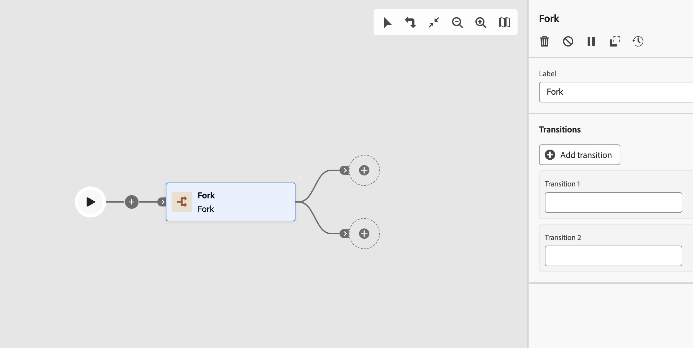

# 分支 {#fork}

>[!CONTEXTUALHELP]
>id="ajo_orchestration_fork"
>title="分支活動"
>abstract="**分支**&#x200B;活動可讓您建立傳出轉變，以同時啟動多個活動。"

>[!CONTEXTUALHELP]
>id="ajo_orchestration_fork_transitions"
>title="分支活動轉變"
>abstract="依預設，透過&#x200B;**分支**&#x200B;活動建立二個轉變。按一下&#x200B;**新增轉變**&#x200B;按鈕以定義額外的傳出轉變，並輸入其標籤。"

+++ 目錄

| 歡迎使用協調的行銷活動 | 啟動您的第一個協調行銷活動 | 查詢資料庫 | 協調行銷活動 |
|---|---|---|---|
| [開始使用協調的行銷活動](../gs-orchestrated-campaigns.md)  建立和管理關聯式結構描述和資料集：  <ul><li>[開始使用結構描述和資料集](../gs-schemas.md)</li><li>[手動結構描述](../manual-schema.md)</li><li>[檔案上傳結構描述](../file-upload-schema.md)</li><li>[擷取資料](../ingest-data.md)</li></ul>[存取及管理協調的行銷活動](../access-manage-orchestrated-campaigns.md) | [建立協調行銷活動的關鍵步驟](../gs-campaign-creation.md)  [建立並排程行銷活動](../create-orchestrated-campaign.md)  [協調活動](../orchestrate-activities.md)  [開始並監視行銷活動](../start-monitor-campaigns.md)  [報告](../reporting-campaigns.md) | [使用規則產生器](../orchestrated-rule-builder.md)  [建立您的第一個查詢](../build-query.md)  [編輯運算式](../edit-expressions.md)  [重定向](../retarget.md) | [開始使用活動](about-activities.md)  活動： [同時加入](and-join.md) - [建立客群](build-audience.md) - [變更維度](change-dimension.md) - [頻道活動](channels.md) - [合併](combine.md) - [重複資料刪除](deduplication.md) - [擴充](enrichment.md) - <b>[分支](fork.md)</b> - [調和](reconciliation.md) - [儲存客群](save-audience.md) - [分割](split.md) - [等待](wait.md) |

{style="table-layout:fixed"}

+++

 

>[!BEGINSHADEBOX]

 

此頁面上的內容不是最終內容，可能會有變動。

>[!ENDSHADEBOX]

**[!UICONTROL 分支]**&#x200B;活動是&#x200B;**[!UICONTROL 控制流量]**&#x200B;元件，讓可以您建立多個輸出轉變，並行執行多個活動。

## 設定分支活動{#fork-configuration}

請按照以下步驟設定「**[!UICONTROL 分支]**」活動：

1. 將&#x200B;**[!UICONTROL 分支]**&#x200B;活動新增至您的協調行銷活動。

1. 定義&#x200B;**[!UICONTROL 標籤]**。

1. 為每個傳出轉變指派標籤。 預設情況下，會提供兩種轉變。

1. 若想移除轉變，請按一下  圖示。

1. 如有需要，請按一下&#x200B;**[!UICONTROL 新增轉變]**，以便新增額外的輸出轉變。
